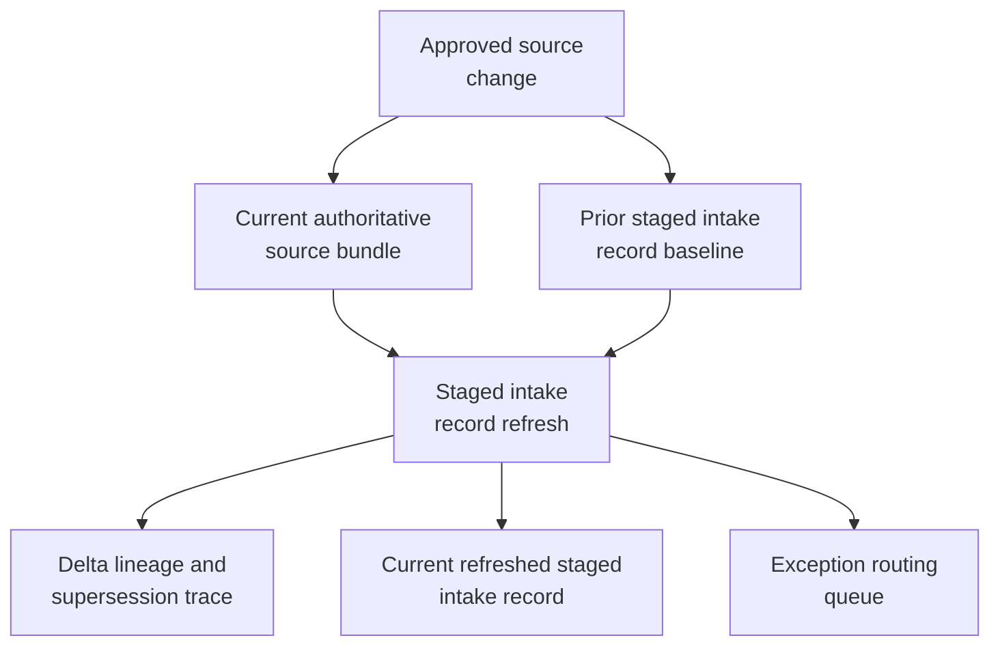

# Benchmark study research review intake record refresh after rerun manifest update

## Linked pattern(s)

- `change-triggered-representation-refresh`

## Domain

Research.

## Scenario summary

An applied research governance program already maintains a staged research-review intake record for an in-flight benchmark study so reproducibility, privacy, and publication-operations reviewers can inspect one current structured packet instead of reopening the experiment tracker, artifact registry, dataset notes, methods annexes, and prior intake exceptions every time source state changes. After that intake record is issued, authoritative updates still arrive: a signed rerun manifest supersedes a draft benchmark results bundle, a methods annex corrects hardware configuration notes, a dataset-version registry entry narrows which prompt-set release is in scope, or exception lineage is updated to show that one previously cited score table was withdrawn. Each approved source change should trigger refresh of the staged research-review intake record, preserving field-level delta lineage, explicit current-versus-superseded values, and exception routing whenever conflicting rerun provenance, unresolved dataset-version drift, or policy-disallowed overwrite logic would make the refreshed packet unsafe for downstream restricted review.

## Target systems / source systems

- Restricted research-review staging store holding the already-issued structured intake record used by reproducibility and governance reviewers
- Experiment tracker, signed rerun-manifest repository, benchmark artifact registry, methods-annex workspace, and dataset-version registry publishing authoritative study-source updates
- Controlled benchmark taxonomy, approved metric registry, and intake-schema policy tables used only to normalize identifiers, audience scope, and overwrite rules
- Lineage and audit store tracking prior staged-record versions, superseded field values, trigger ids, and refresh decisions
- Exception queue for reproducibility review, research-governance intake prep, or publication-operations follow-up before the refreshed record is treated as current

## Why this instance matters

This grounds the pattern in research work where the valuable artifact is one current staged intake record, not a publication recommendation, integrity verdict, or manuscript-submission action. Benchmark-study review packets often keep changing after intake starts, and a stale or silently overwritten record can mislead downstream reviewers about which rerun results, methods notes, or dataset versions are actually current. The instance shows how transform-family refresh remains family-safe when it re-materializes a governed staged representation with explicit supersession and lineage instead of drifting into recommendation, adjudication, collaboration-loop ownership, or external disclosure.

## Likely architecture choices

- Event-driven monitoring should listen only to approved rerun-manifest, methods-annex, dataset-registry, and exception-lineage updates that are authorized to refresh the staged research-review intake record.
- A tool-using single agent can re-read the changed benchmark-study bundle, compare the current authoritative source state against the prior staged version, rebuild the structured intake record, and emit a delta trace plus supersession markers.
- Automatic refresh should stay bounded to approved overwrite rules for staged research-review fields; conflicting rerun manifests, unresolved dataset-version changes, missing source lineage, or schema-breaking annex updates should route to exceptions instead of forcing a new current record.
- The workflow should stop at the refreshed staged intake record, lineage trace, and exception handling rather than issuing publication readiness advice, deciding publication integrity outcomes, submitting benchmark materials, or releasing results externally.

## Governance notes

- Every consequential field, especially study identifier, rerun-manifest reference, benchmark metric summary, dataset-version pointer, hardware-configuration note, methods-annex lineage, exception-state markers, and restricted audience markers, should retain prior and current source references across refreshes.
- Refresh should mark superseded staged values explicitly rather than silently replacing prior rerun or methods facts, so reviewers can see which authoritative update changed the record and which values were carried forward.
- The workflow should halt when rerun material arrives through an unapproved workspace, when dataset-version scope and methods-annex claims conflict, when the changed source would expose unpublished benchmark detail beyond the restricted audience, or when lineage is too weak to support overwrite.
- Research-governance owners should approve any expansion of trigger sources, field precedence rules, or schema revisions; the workflow ends before publication recommendation, publication integrity adjudication, manuscript submission, collaborator coordination, or external disclosure.

## Evaluation considerations

- Percentage of authoritative benchmark-study source changes that produce one current staged intake record with complete delta lineage and explicit supersession markers
- Rate of conflicting rerun manifests, incomplete provenance, or dataset-version mismatches correctly routed to exception review before restricted downstream use
- Reviewer ability to understand what changed between staged intake record versions without reopening the full rerun bundle, methods annex set, or exception history manually
- Reliability of idempotent refresh behavior when signed rerun manifests arrive after draft exports, dataset-version corrections land out of order, or the restricted intake schema adds a new required field
