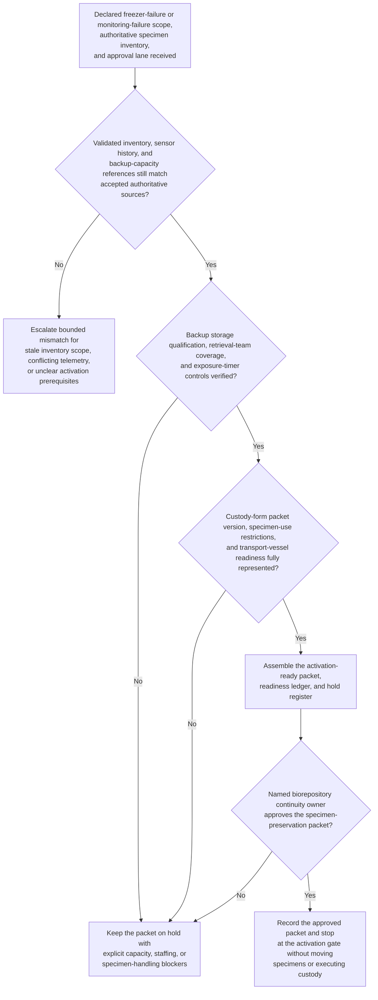

# Biorepository freezer-failure specimen-preservation continuity activation gate

## Linked pattern(s)

- `contingency-plan-activation-gate`

## Domain

Research.

## Scenario summary

After a freezer failure or freezer-monitoring failure is declared for one governed biorepository storage pod, biorepository continuity leadership has already identified the bounded fallback path and the accountable approval owner: a governed biospecimen-preservation continuity packet for controlled transfer into prequalified backup ultra-low or vapor-phase storage if the primary storage envelope cannot be trusted before specimen stability windows are exhausted. Upstream truth-restoration and authority-routing work has already established the trusted affected freezer scope, authoritative specimen inventory and rack map, specimen-priority cohorts, validated backup-capacity ledger, and approval lane, with validated laboratory information management system inventory, calibrated sensor history, and qualified backup-capacity records explicitly outranking handwritten shelf notes, local whiteboards, or informal message-thread updates. The planning workflow now has to prepare one activation-ready packet showing backup storage qualification state, dry-ice or liquid-nitrogen reserve readiness, retrieval-team and witness coverage, specimen-class handling rules, custody-form packet version, and exposure-timer controls. It should preserve explicit holds for any unresolved box-location mismatch, missing backup-capacity reservation, unqualified transport vessel, stale consent or material-transfer restriction mapping, unreadable label cohort, or packet-version lineage gap, and stop at the approval gate rather than selecting the authority lane, sending sponsor or campus communications, moving specimens, executing custody transfers, rescheduling assays, or performing downstream continuity actions.

## Target systems / source systems

- Biorepository continuity playbooks and incident workspace with the declared freezer scope, prior packet versions, supersession log, protected preservation boundaries, and previously unresolved holds.
- Authoritative source precedence should be explicit: validated laboratory information management system specimen inventory, freezer asset qualification records, calibrated alarm and probe telemetry, and qualified backup-capacity ledgers outrank handwritten rack notes, freezer-door printouts, bench notebooks, or informal chat confirmations.
- Approved specimen-preservation standard operating procedures, biosafety handling classes, consent-use restrictions, material-transfer limits, and maximum exposure-time rules that must already be in force before the packet can be marked activation-ready.
- On-call biobank operations rosters, witness schedules, dry-ice or liquid-nitrogen reserve commitments, prequalified transport-dewar records, barcode-scanner readiness checks, and custody-form templates for biorepository operations, laboratory operations, facilities, and quality teams.
- Approval-routing and audit systems that capture packet versions, open holds, source-refresh timestamps, reserved backup capacity, and human sign-off before any specimen-preservation continuity mode may start.
- Restricted communication-planning, specimen-movement scheduling, custody-execution, and assay-operations tooling that remain downstream of the planning gate.

## Why this instance matters

This grounds the pattern in research where the hard problem is not diagnosing the freezer failure, deciding whether specimens should be relocated, or executing the preservation fallback itself. The hard problem is keeping one approval-gated packet current while validated inventory scope, backup storage qualification, specimen-use restrictions, staffing coverage, and exposure-timer assumptions can all drift during a high-consequence preservation event. It shows why contingency planning deserves its own slice apart from incident truth restoration, authority recommendation, external notification, custody execution, and downstream study continuity: research leaders need a disciplined activation gate artifact before any biospecimen-preservation fallback can be approved safely.

## Likely architecture choices

- Approval-gated execution fits because the biospecimen-preservation continuity mode may be fully prepared while still blocked until named biorepository continuity leadership approves the packet.
- The readiness ledger should tie authoritative freezer scope, specimen-priority cohorts, backup-capacity reservations, dry-ice or liquid-nitrogen readiness, retrieval-team coverage, exposure-timer controls, and custody-form packet version to one current packet revision.
- Explicit holds should remain visible whenever rack-map alignment, label legibility, consent or material-transfer restrictions, backup-capacity qualification, or transport-vessel readiness is incomplete rather than being compressed into a nominally ready packet.
- Prerequisite product and policy state should be represented directly in the packet: validated backup storage locations, approved preservation SOPs, specimen-class handling rules, biosafety constraints, and use restrictions must already exist before the workflow can mark the contingency path ready.
- The workflow should stop at the packet and hold register rather than selecting authority, reconciling upstream freezer truth again, sending notifications, moving specimens, or rescheduling downstream assay work.

## Governance notes

- Protected prerequisites such as authoritative inventory scope, qualified backup storage, exposure-timer controls, specimen-use restriction mapping, transport-vessel qualification, and custody-form packet-version integrity should be encoded as non-waivable holds in the packet.
- Shared packets should expose timing, readiness, and blocker state without copying participant identifiers, specimen-level genomic findings, full freezer coordinates, or restricted study metadata outside governed biorepository, quality, and research-operations channels.
- Dr. Elena Marquez, Director of Biorepository Continuity, is the accountable human owner who must review packet lineage, unresolved blockers, and reserved-capacity evidence before the packet becomes the authoritative basis for any specimen-preservation continuity activation.
- Repeated packet revisions should preserve append-only lineage so audit, quality, and study-operations teams can reconstruct exactly which inventory references, telemetry snapshots, backup-capacity reservations, blocker dispositions, and custody-form packet versions changed before approval.

## Evaluation considerations

- Time from updated freezer-contingency preparation request to a human-reviewable activation packet with complete capacity, staffing, policy-state, and hold visibility.
- Percentage of rack-map mismatches, label-legibility gaps, backup-capacity shortages, or specimen-restriction blockers kept explicit in the hold register rather than hidden in a partially prepared preservation packet.
- Agreement between the workflow's packet and the final human-approved activation gate used for downstream biospecimen-preservation continuity.
- Stability of the readiness packet when telemetry confidence, affected freezer scope, backup-capacity reservations, or unresolved custody-form packet dependencies change within the same preservation window.
