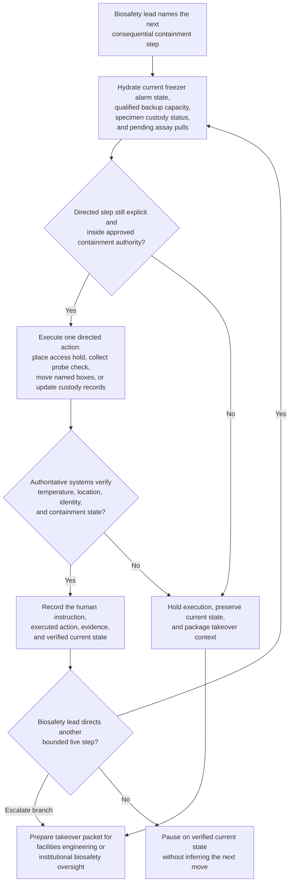
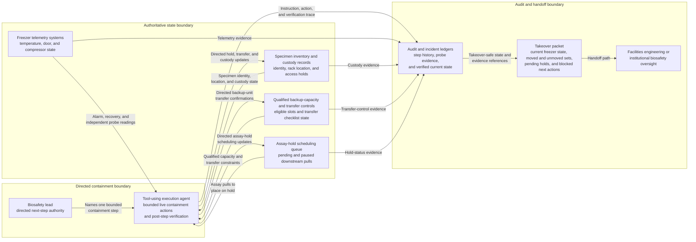

# BSL-3 cryostorage excursion supervised specimen containment task orchestration

## Linked pattern(s)

- `human-directed-task-orchestration`

## Domain

Research.

## Scenario summary

A biosafety lead is directing live containment work after a monitored cryostorage unit holding BSL-3 study specimens begins drifting above its approved temperature envelope during an overnight compressor failure. The agent may execute only the consequential steps the lead names: place specific specimen racks and downstream assay pulls on access hold, collect confirmation readings from the primary sensor and an independent probe, move named boxes into one qualified backup unit, update chain-of-custody and freezer-capacity records, and verify that each directed move preserved specimen identity, containment controls, and temperature recovery before continuing. Because the next safe action depends on what the last move actually changed and because the workflow must not infer a salvage plan, release specimens, or reinterpret biosafety policy on its own, it needs one authoritative step ledger, mandatory post-step verification, and a takeover-safe handoff if the lead transfers control to facilities engineering or institutional biosafety oversight.

## Target systems / source systems

- Cryostorage monitoring, freezer alarm, and environmental telemetry systems for authoritative temperature, door-open, and compressor-status signals
- Specimen inventory, rack-location, and chain-of-custody records covering BSL-3 materials, aliquot identifiers, and study-specific access restrictions
- Qualified backup-freezer capacity logs, transfer checklists, and restricted access rosters used to validate where named specimens may move
- Study-operations scheduling and assay-pull queues that must be placed on hold when specimen condition or location changes mid-run
- Audit and incident records storing the step ledger, probe evidence, executed holds, transfer confirmations, and takeover packets

## Why this instance matters

This grounds the pattern in consequential research operations where the workflow is not preparing a governance packet and not recommending a contingency plan. The work is live guided execution inside a restricted biosafety environment: the human lead decides which racks move, when to stop, and when to escalate, while the agent performs the directed system actions, preserves exact current state, and verifies every consequential step before the next one proceeds.

## Likely architecture choices

- A tool-using single agent can read freezer telemetry, place study and assay holds, update specimen-location records, capture probe results, and maintain the authoritative step ledger after each directed action.
- Human-in-the-loop control is mandatory because the biosafety lead decides which specimen groups remain in scope, whether backup capacity is acceptable for a given move, and when a branch must pause instead of continuing salvage activity.
- The workflow should emit takeover-ready state whenever facilities engineering must assume responsibility for equipment recovery or institutional biosafety oversight must take over because containment conditions or policy boundaries have changed.

## Governance notes

- Every significant transfer, hold, or release-prevention action should map to an explicit current instruction from the biosafety lead rather than being inferred from previous alarm history or standing freezer-failure playbooks.
- Post-step verification should confirm temperature readings, specimen identity, destination slot, custody signatures, and assay-hold status before the next directed move is accepted as safe.
- Shared workflow traces should minimize pathogen, participant, and protocol detail outside approved restricted systems while keeping full evidence references in governed audit stores.
- If backup capacity is no longer qualified, identity reconciliation fails, temperature recovery remains unstable, or the next requested step would cross biosafety authority boundaries, the workflow should stop and publish a takeover packet rather than improvising a broader salvage or disposal sequence.
- Handoff material should preserve the last directed step, current freezer and backup-unit state, moved and unmoved specimen sets, pending assay holds, and blocked next actions so successor teams do not repeat or skip containment work.

## Evaluation considerations

- Percentage of supervised containment runs completed or safely handed off without unauthorized specimen movement, lost chain-of-custody state, or unverified freezer transfers
- Rate of stale telemetry, identity mismatches, backup-capacity conflicts, or authority-boundary violations caught before the next directed live step
- Completeness of audit traces linking each biosafety instruction to the executed action, verification evidence, and current specimen-containment state
- Reliability of takeover packets when facilities engineering or biosafety oversight assumes control mid-incident
