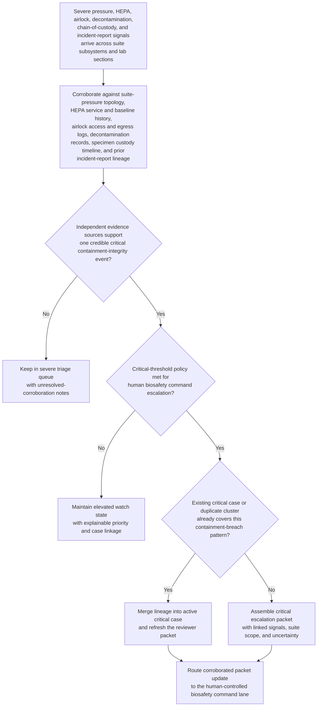
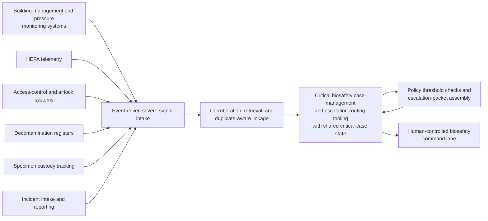

# BSL-3 containment integrity multi-signal critical corroboration triage

## Linked pattern(s)

- `critical-signal-corroboration-triage`

## Domain

Research.

## Scenario summary

A biosafety operations monitoring workflow watches for severe containment-integrity signals at a BSL-3 research facility running active select-agent studies: sustained pressure-differential failures reported by the building-management system in one suite, HEPA exhaust-filter resistance spikes that may indicate bypass or saturation events, airlock interlock faults logged by the access-control and egress-monitoring system, personnel decontamination shower usage recorded without a matching entry or egress event in the suite register, specimen chain-of-custody gaps where primary container check-ins are missing across two adjacent laboratories, and independent ad hoc incident reports filed separately by a research associate and a biosafety officer from different sections of the same corridor. The workflow must determine whether these signals corroborate one potentially critical containment-integrity breach affecting a common suite or egress path, preserve duplicate-aware linkage across subsystem alarms and overlapping incident filings, assemble an escalation packet with the linked evidence and unresolved uncertainty, and route that packet into a human-controlled biosafety safety command lane. It stops before any containment action selection, physical response dispatch, personnel outreach, experiment suspension, regulatory notification, or root-cause investigation.

## Target systems / source systems

- Building-management and room-pressure monitoring systems capturing differential-pressure baselines, sustained excursion events, ventilation cascade state, and affected suite or corridor scope
- HEPA exhaust and supply filtration telemetry capturing filter-resistance trends, bypass indicators, certification and service history, and recent maintenance or swap records for the affected ventilation zone
- Access-control, airlock-interlock, and egress-monitoring systems holding entry and exit sequences, interlock fault logs, badge-event timelines, and suite occupancy state
- Decontamination and shower-use registers recording activation timestamps, assigned personnel or area contexts, paired entry and exit attestation status, and unmatched usage flags
- Specimen chain-of-custody, inventory, and primary-container tracking systems exposing check-in and transfer records, container-seal status, and custody-gap markers for the study and suite in scope
- Laboratory incident-intake and biosafety-reporting systems holding ad hoc incident narratives, dual-filing detection, reporter identity and section context, and open safety-observation references
- Critical biosafety case-management and escalation-routing tooling used to preserve duplicate-aware lineage, packet revisions, policy checks, and human-controlled handoff to the biosafety officer and facility safety command

## Why this instance matters

This grounds the pattern in a research setting where the urgent problem is not one isolated alarm or one incident report, but a fast-moving convergence of independent severe signals across building infrastructure, personnel-decontamination state, specimen custody, and human observations that may indicate a critical containment-integrity failure in an active BSL-3 suite. The instance makes the family boundary concrete by focusing on multi-source corroboration across mechanical systems, chain-of-custody records, and overlapping incident filings, along with duplicate-aware case aggregation, escalation-packet assembly, and governed routing into a human biosafety command lane, rather than on containment action choice, personnel notification, experiment shutdown, regulator contact, or the engineering investigation that follows.

## Likely architecture choices

- Event-driven monitoring fits because pressure differentials, HEPA resistance trends, airlock faults, decontamination register entries, and specimen custody gaps can arrive asynchronously and materially change the corroboration picture within minutes of each other.
- Orchestrated multi-agent or staged service roles fit because building-system telemetry review, custody-gap retrieval, incident-report deduplication, policy threshold checks, and escalation-packet assembly are specialized tasks that must converge on one shared critical-case state without any single subsystem signal dominating prematurely.
- Human-in-the-loop review remains necessary because even a recommendation-only critical escalation packet can rapidly influence consequential containment, personnel, experiment, and facility decisions that the workflow must not trigger autonomously.

## Governance notes

- The escalation packet should show which pressure, HEPA, airlock, decontamination, custody, and incident-report signals were fused, what independent evidence linked them across subsystems and lab sections, and what uncertainty still prevents a definitive breach-scope determination.
- Duplicate handling must preserve lineage across overlapping incident filings, repeated alarm events from the same zone, and specimen custody gaps that span adjacent laboratories so reviewers can distinguish one expanding containment event from coincidental but unrelated subsystem faults or reporting anomalies.
- Policy thresholds for critical escalation, affected-suite scoping, and watch-state retention should be versioned and reviewable because overtuned logic can either miss a true safety-critical containment event or flood the biosafety command lane with false criticals that erode trust.
- Broad queue views should minimize named personnel data, specific agent identifiers, study protocol details, and sensitive facility-security configurations while preserving controlled references back to authoritative biosafety and building-operations records.
- The workflow must end at corroborated triage, packet assembly, and human-controlled routing rather than implying containment action, personnel outreach, experiment suspension, regulatory notification, or root-cause determination.

## Evaluation considerations

- Recall of historically critical containment-integrity clusters that should have reached human-controlled biosafety command escalation
- Median time from first severe multi-source signal burst to a corroborated escalation packet ready for biosafety-command review
- Accuracy of duplicate merging and lineage preservation when pressure alarms, airlock faults, and incident reports partially overlap across adjacent BSL-3 suites or shared ventilation zones
- Reviewer agreement that the packet distinguishes genuine cross-subsystem corroboration from coincidental co-occurrence in noisy building-management and personnel-activity telemetry
- Reliability of uncertainty escalation when evidence conflicts, such as strong pressure and HEPA telemetry with sparse incident-report corroboration, or strong decontamination-register anomalies with ambiguous chain-of-custody gaps
