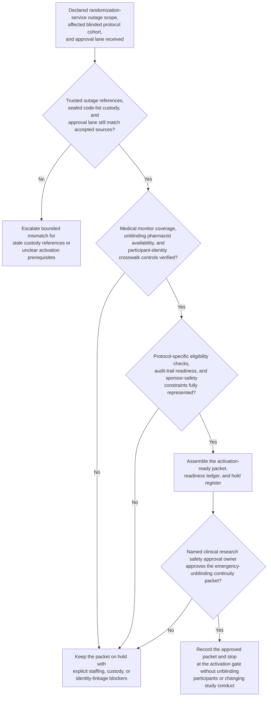
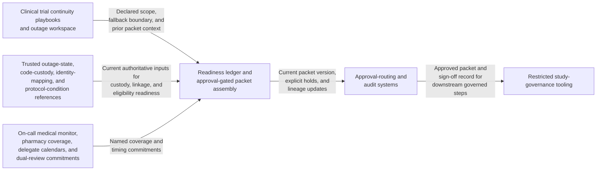

# Clinical trial emergency unblinding manual continuity activation gate

## Linked pattern(s)

- `contingency-plan-activation-gate`

## Domain

Research.

## Scenario summary

After an interactive randomization and treatment-allocation service outage is declared, clinical research safety governance has already identified the bounded fallback path and the accountable approval owner: a manual emergency unblinding continuity path for one active blinded study where participant-safety decisions may require access to treatment assignment before the primary service recovers. Upstream truth-restoration and authority-routing work has already established the trusted outage scope, affected protocol cohort, sealed code-list custody references, and approval lane. The planning workflow now has to prepare one activation-ready packet showing sealed-code custody, on-call medical monitor and unblinding pharmacist coverage, participant-identity crosswalk controls, protocol-specific eligibility checks, and audit-trail readiness for any emergency request. It should preserve explicit holds for any broken code-list custody chain, uncovered dual-review shift, stale participant crosswalk, unresolved protocol-specific unblinding condition, or sponsor-safety sign-off ambiguity, and stop at the approval gate rather than unblinding any participant, notifying sites, updating study records, or changing treatment conduct.

## Target systems / source systems

- Clinical trial continuity playbooks and outage workspace with the declared fallback scope, affected blinded-study cohort, prior packet versions, and protected emergency-unblinding boundaries
- Trusted randomization outage-state, treatment-code custody, participant identity-mapping, and protocol-condition systems already accepted as authoritative inputs for contingency preparation
- On-call medical monitor rosters, investigational pharmacy coverage schedules, delegate calendars, sealed-envelope or code-list custody logs, and dual-review commitments for clinical operations, drug supply, and sponsor safety teams
- Approval-routing and audit systems that capture packet versions, open holds, resource commitments, and human sign-off before any manual emergency unblinding continuity mode may start
- Restricted study-governance tooling for site escalation timing, sponsor coordination windows, and safety-case intake steps that remain downstream of the planning gate

## Why this instance matters

This grounds the pattern in research where the hard problem is not deciding whether an actual emergency unblinding request is clinically justified or carrying out the unblinding itself. The hard problem is keeping one approval-gated readiness packet current while code-list custody, participant-linkage integrity, protocol-specific conditions, and qualified coverage can all drift during a blinded-study systems outage. It shows why contingency planning deserves its own slice apart from outage truth restoration, authority recommendation, medical judgment, and protocol execution: research safety leaders need a disciplined activation gate artifact before any manual emergency unblinding continuity path can be approved safely.

## Likely architecture choices

- Approval-gated execution fits because the manual emergency-unblinding continuity mode may be technically prepared while still blocked until clinical research safety leadership approves the packet.
- The readiness ledger should tie code-list custody, medical monitor coverage, pharmacy availability, participant-identity controls, protocol-condition references, and audit-trail readiness to one current packet version.
- Explicit holds should remain visible whenever custody evidence, dual-review staffing, participant linkage, or sponsor-safety constraints are incomplete rather than being compressed into a nominally ready packet.
- The workflow should stop at the packet and hold register rather than recommending a different authority lane, re-establishing outage truth, adjudicating emergency criteria, or performing the unblinding.

## Governance notes

- Protected prerequisites such as sealed code-list custody, dual-review coverage, participant-identity crosswalk control, protocol-specific emergency-unblinding criteria, and audit-trail readiness should be encoded as non-waivable holds in the packet.
- Shared packets should expose timing, readiness, and blocker state without copying participant identifiers, treatment assignments, unblinded code values, adverse-event narratives, or other restricted study details outside governed safety channels.
- Human clinical research safety ownership is required before the packet becomes the authoritative basis for any manual emergency unblinding continuity activation.
- Repeated packet revisions should preserve append-only lineage so audit, quality, and sponsor oversight teams can reconstruct exactly which custody references, staffing commitments, protocol criteria, and protected holds changed before approval.

## Evaluation considerations

- Time from updated emergency-unblinding continuity preparation request to a human-reviewable activation packet with complete custody, staffing, protocol, and hold state
- Percentage of custody, protocol-condition, or dual-review blockers kept explicit in the hold register rather than hidden in a partially prepared continuity packet
- Agreement between the workflow's packet and the final human-approved activation gate used for downstream emergency-unblinding continuity
- Stability of the readiness packet when outage scope, pharmacy coverage, or participant-linkage references change within the same blinded-study outage window
