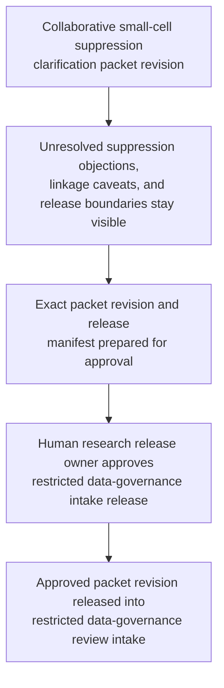

# Controlled cohort small-cell suppression clarification packet approved for restricted data-governance review intake

## Linked pattern(s)

- `approval-gated-collaborative-artifact-release`

## Domain

Research.

## Scenario summary

A research data steward, a statistical disclosure-control lead, and a manuscript operations partner are co-producing one governed controlled cohort small-cell suppression clarification packet because a manuscript-ready supplementary table set and companion cohort summary export now contain low-count slices, linked geography fields, and exception requests that may exceed the institution's approved disclosure boundary for controlled research data. Agents help reconcile table drafts, suppression-rule annotations, investigator objections, repository restrictions, and approved clarification wording into the shared packet while preserving which cells remain disputed, which utility-preserving exceptions exceed the approved disclosure threshold, which cohort-linkage caveats stay unresolved, and which residual caveats the human artifact owner accepted explicitly. The workflow ends only when the named research release owner approves that exact packet revision and its release manifest for one restricted data-governance review intake lane, where downstream reviewers may decide whether the packet is sufficient for formal controlled-data disclosure review or needs narrower table content and refreshed de-identification treatment. It does not adjudicate disclosure acceptability, provision the dataset, communicate with outside researchers or journals, submit supplementary materials, or decide the downstream review outcome.

## Target systems / source systems

- Governed research collaboration workspace holding the controlled cohort small-cell suppression clarification packet, revision history, objection ledger, and release-manifest draft
- Secure cohort-analysis repository, manuscript supplement workspace, statistical output registry, and disclosure-control rule library supplying authoritative table extracts, cohort stratification definitions, approved suppression thresholds, and attachment hashes for the exact governed packet revision
- Data-use agreement records, enclave export notes, investigator exception requests, prior disclosure-review findings, and unresolved reviewer comments supplying contested utility arguments, linkage-risk concerns, and open caveats
- Restricted data-governance intake-routing, approval, and access-control systems defining required signers, approved reviewer audience, and the one bounded downstream review lane
- Audit, supersession, and retention systems preserving held-release reasons, accepted residual objections, suppression-rule lineage, and downstream handoff traceability

## Why this instance matters

This grounds the pattern in research controlled-data governance rather than benchmark-claim integrity, participant consent language, publication-rights provenance, or sensitive-methods redaction. The reusable challenge is collaborative control of one exact disclosure-control clarification artifact whose revision must be explicitly approved before it can cross into a restricted data-governance review lane, while disagreement about small-cell suppression scope, cohort-linkage exposure, utility-preserving exceptions, and prior enclave-export assumptions remains inspectable instead of being normalized away. The example stays inside the pattern boundary because disclosure adjudication, dataset provisioning, journal or collaborator communication, and supplementary-material submission remain separate workflows. Controlled cohort tables are especially governance-heavy because the same packet must preserve analytic context while preventing hidden re-identification risk from crossing the intake boundary under stale approval.

## Likely architecture choices

- Approval-gated execution fits because the clarification packet can be collaboration-ready while still blocked from restricted data-governance intake until the human release owner approves the exact revision with its accepted residual caveats.
- Human-in-the-loop control is required because only accountable research and data-governance leaders may accept residual disclosure risk, confirm small-cell suppression boundaries, and authorize release of the packet itself into the bounded review lane.
- Agents may compare table revisions, flag threshold violations, cross-check cohort-linkage combinations, refresh rule citations, and maintain the release trace, but they must not decide whether the export is disclosure-safe, provision controlled data, or transmit supplementary artifacts outside the approved lane.

## Governance notes

- The release manifest should bind one exact packet revision, the named restricted data-governance review-intake lane, signer identities, the covered table and cohort-summary scope, approved suppression thresholds, included attachment hashes, and any residual objections the human release owner accepted explicitly.
- Disputes about small-cell suppression, linked geography granularity, rare-condition cohort slices, prior enclave-export assumptions, utility-preserving exception requests, and attachment lineage should remain visible in the packet or boundary ledger rather than being collapsed into a single reconciled narrative before release.
- Audience scope should stay limited to the approved data-governance intake lane; reuse of the packet for manuscript submission, collaborator circulation, dataset provisioning, repository deposit, or journal communication should require separate downstream approval.
- If cohort extracts change, suppression rules are updated, data-use restrictions shift, attachment scope expands, or reviewer assignments change materially during approval review, the workflow should hold release and supersede the prior packet revision rather than letting stale approval carry forward.

## Evaluation considerations

- Rate at which restricted data-governance intake accepts the released packet without discovering hidden re-identification risk, stale suppression evidence, unresolved linkage conflicts, or audience-boundary mistakes
- Time required to keep one collaborative controlled-data clarification packet synchronized as cohort extracts, suppression decisions, utility objections, rule thresholds, and signer state evolve near publication deadlines
- Reliability of binding between the released artifact revision, accepted residual disagreement, covered table scope, and the bounded restricted data-governance review-intake lane
- Frequency with which humans reject agent-assisted edits because they drifted into disclosure adjudication, dataset provisioning, manuscript submission, collaborator communication, or downstream review decisions
