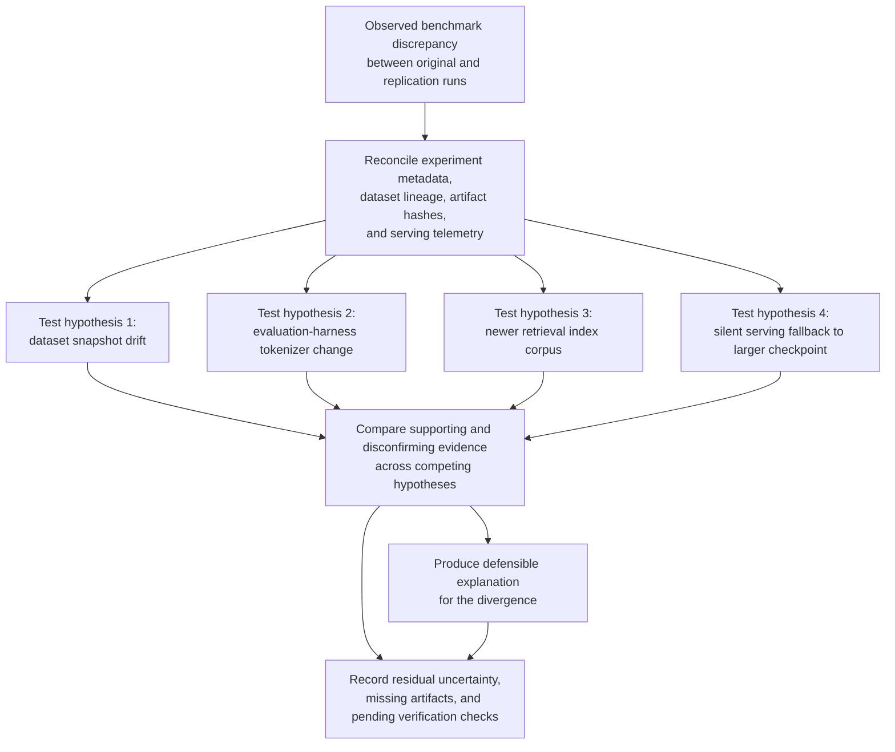

# Cross-lab benchmark replication discrepancy investigation

## Linked pattern(s)

- `incident-root-cause-analysis`

## Domain

Research.

## Scenario summary

Ahead of an internal model-governance review, a second evaluation team cannot reproduce a headline benchmark gain from a multimodal retrieval study comparing two model-serving configurations. The discrepancy could stem from dataset snapshot drift after a late redaction refresh, an evaluation-harness tokenizer change, a retrieval index built from a newer document corpus than the study packet recorded, or a silent serving fallback that routed the original run to a larger checkpoint than the one documented in the benchmark summary. The workflow reconciles experiment metadata, dataset lineage, artifact hashes, serving telemetry, and reviewer notes into a defensible explanation of why the results diverged, what remains uncertain, and which verification checks still require accountable human follow-through before anyone reuses, narrows, or withdraws the benchmark claim.

## Target systems / source systems

- Experiment tracker entries, run manifests, seed values, and benchmark summary tables for the original and replication runs
- Dataset registry snapshots, redaction-change records, corpus manifests, and document-ingestion lineage for the evaluated benchmark set
- Evaluation harness repository commits, container-image digests, tokenizer versions, and metric-calculation notebooks
- Retrieval index build logs, model registry records, model-serving telemetry, and checkpoint-resolution history for the incident window
- Research review comments, governance meeting notes, and internal issue tickets documenting when the replication concern was escalated

## Why this instance matters

This grounds `incident-root-cause-analysis` in research work where the central problem is not choosing what to publish or which platform to buy, but explaining why apparently solid benchmark evidence stopped reproducing. Research incidents like this can distort model selection, internal governance decisions, and later external claims if the first plausible explanation becomes accepted without disciplined evidence reconciliation. The instance keeps the family boundary clear by centering competing hypotheses, explicit uncertainty, and a defensible root-cause narrative before any human-owned correction, rerun, or closure decision is made.

## Likely architecture choices

- An orchestrated multi-agent workflow can separate experiment-artifact retrieval, dataset-lineage reconstruction, and serving-stack verification while preserving one normalized investigation record.
- Shared case memory should retain candidate explanations, confirming and disconfirming evidence, timestamp-normalization choices, and unresolved gaps across research engineering and evaluation-review handoffs.
- Human-in-the-loop review remains necessary before declaring the primary cause, deciding whether the benchmark claim is invalidated, or approving any rerun, study correction, or downstream communication based on the investigation.

## Governance notes

- Preserve immutable links to run ids, dataset manifests, container hashes, and review records so every causal claim can be audited back to the exact source artifact.
- Distinguish observed score divergence from inferred methodological error or misconduct; a missing artifact, unlogged override, or stale index should not be treated as intent without separate review.
- Keep embargoed datasets, prompt sets, unpublished benchmark results, and reviewer notes under least-privilege access in the investigation workspace, with broad summaries minimizing sensitive experimental details.
- Benchmark withdrawal, internal governance statements, rerun authorization, and any external correction or publication impact must remain explicitly human-owned.
- If log retention gaps or conflicting artifacts prevent a single explanation, the workflow should preserve that uncertainty rather than forcing premature closure.

## Evaluation considerations

- Time to first defensible replication-discrepancy hypothesis with cited experiment, dataset, code, and serving evidence
- Completeness of the reconciled timeline across dataset refreshes, harness changes, index builds, run execution, and escalation checkpoints
- Agreement between the workflow's ranked hypotheses and the final research-accepted explanation of the benchmark divergence
- Rate at which missing artifacts, ambiguous lineage, or conflicting replication evidence are surfaced as explicit uncertainty before any benchmark claim is retained or retired
