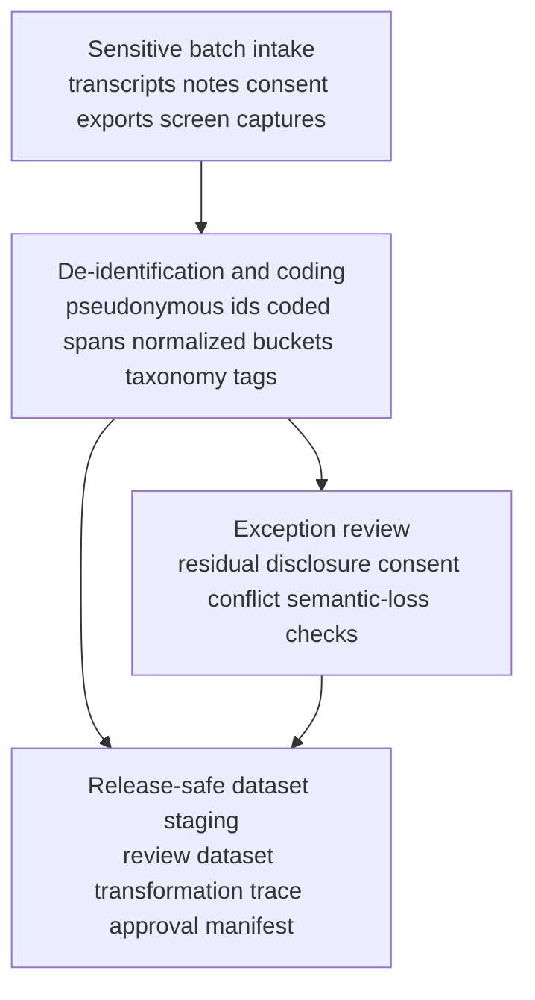

# De-identified participant interview batch to release-safe study dataset

## Linked pattern(s)

- `batch-content-transformation`

## Domain

Research.

## Scenario summary

An applied research team is preparing a cross-site methods review for a study on how enterprise developers evaluate model-generated code suggestions during secure software delivery. The raw batch includes interview transcripts, moderator notes, consent-status exports, annotation worksheets, screen-capture excerpts, and follow-up participant emails that mention employer names, team structures, incident examples, internal tool names, and a few accidental disclosures about production environments. Before any methods board review, cross-lab sharing, or publication-readiness discussion can occur, the workflow must transform that sensitive batch into a release-safe structured study dataset with pseudonymous participant ids, coded topic spans, normalized study-phase labels, allowed demographic buckets, issue taxonomy tags, disclosure-risk flags, and evidence links that stay inside the restricted boundary while making remaining ambiguity and suppressed content visible to reviewers.

## Target systems / source systems

- Restricted research repository holding transcripts, notes, consent records, and screen-capture excerpts
- De-identification and transcript-processing tooling that can detect names, employers, product references, environment tokens, and indirect identifiers across text and attachment metadata
- Study-operations schema registry defining the release-safe dataset contract, approved demographic buckets, and coded-issue taxonomy
- Reviewer workbench and governed staging store for the de-identified dataset, transformation trace, and approval manifest
- Exception queue for privacy, ethics, or reproducibility review before the batch can be shared outside the restricted transformation workspace

## Why this instance matters

This grounds the transform pattern in a research workflow where the central challenge is not extracting fields from one packet but converting a sensitive qualitative corpus into a structured dataset that preserves analytic value without exposing participant or employer identities. The useful handoff is a reviewed, release-safe representation for limited governance or methods review, not a recommendation, a publication decision, or external release. The instance shows why batch-level pseudonym consistency, disclosure-risk review, and explicit lossiness tracking are essential when research artifacts contain both direct identifiers and contextual clues that could re-identify subjects.

## Likely architecture choices

- An orchestrated multi-agent design can separate transcript segmentation, sensitive-entity detection, policy-constrained generalization, and release-package validation so each stage exposes its reasoning and residual-risk findings.
- Human reviewers should remain embedded in the loop to resolve borderline disclosures, assess whether a coded excerpt still reveals a participant or employer indirectly, and approve the final release-safe staging manifest.
- The workflow should stop at a restricted review dataset and manifest rather than creating publication assets, updating any public benchmark or paper workspace, or sending material to external collaborators automatically.
- Approved rules may generalize job titles, geography, and internal tool names into controlled buckets, but unsupported inference about participant attributes, team context, or incident severity should remain explicit or route to exception review.

## Governance notes

- Every coded excerpt or structured field should retain lineage to the original transcript span, note segment, or attachment reference inside the restricted boundary so ethics and methods reviewers can validate the transformation without broad raw-access expansion.
- The workflow should route exceptions instead of handing off when small combinations of harmless-looking details could re-identify a participant, when consent status does not cover the intended review audience, or when screen captures still reveal proprietary customer or employer information after masking.
- Lossy steps such as collapsing rich narrative descriptions into a limited issue taxonomy or generalizing precise roles into approved buckets should be visible in the trace and manifest rather than hidden behind a complete-looking dataset.
- Human privacy, ethics, or research-governance reviewers must decide whether the transformed batch is safe for the intended review audience; the workflow stops at the release-safe staging package.

## Evaluation considerations

- Percentage of transformed study records accepted by the methods or ethics review board without requesting broad access to raw transcripts
- Rate of residual identifier or indirect disclosure findings discovered during reviewer sampling after the batch is marked release-safe
- Consistency of pseudonymous participant mapping and coded topic tagging across transcripts, notes, and follow-up emails in the same batch
- Reliability of the handoff when transcripts contain code snippets, employer-specific jargon, screenshots with hidden metadata, or new policy rules about protected demographic detail
