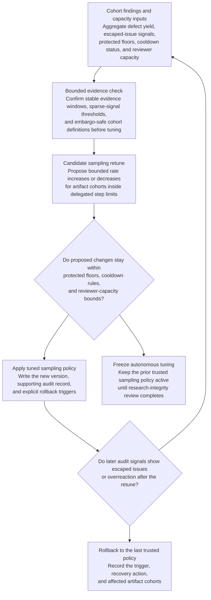
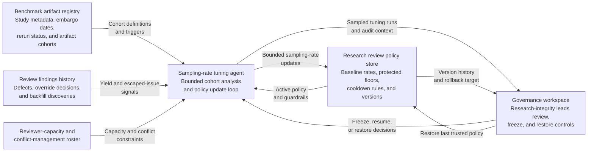

# Embargoed benchmark artifact spot-check sampling-rate tuning

## Linked pattern(s)

- `adaptive-review-sampling-rate-tuning`

## Domain

Research.

## Scenario summary

A research integrity team performs spot checks on benchmark-study artifacts, reproducibility packets, disclosure annexes, and claims tables before embargoed benchmark results are briefed to partners, leadership, or publication stakeholders. The fixed sampling policy has been efficient for routine internal studies, but recent findings show that lower-volume embargoed artifacts with rerun instability, disclosure-sensitive annexes, or negative-result replication disputes generate more meaningful review defects than the baseline sample captures. The workflow must autonomously retune bounded spot-check sampling rates so higher-risk artifact cohorts receive more oversight, while preserving protected floors for sensitive disclosure classes, keeping blinded or conflict-managed information contained, respecting reviewer-capacity limits, and rolling back quickly if the loop starts overreacting to a small number of atypical defects.

## Target systems / source systems

- Research review policy store with baseline and protected spot-check rates, cooldown rules, and versioned sampling history
- Benchmark artifact registry with study metadata, embargo dates, rerun status, disclosure restrictions, and candidate artifact cohorts
- Review findings history showing provenance defects, reproducibility misses, override decisions, and later backfill discoveries
- Reviewer-capacity and conflict-management roster covering artifact reviewers, statistical specialists, and restricted-annex access
- Governance workspace used by research-integrity leads to inspect sampled tuning runs, freeze autonomous changes, and restore the last trusted spot-check policy

## Why this instance matters

This grounds the pattern in research without drifting into publication disposition, review scheduling, or queue reprioritization. The hard problem is how much future spot-check coverage different artifact cohorts should receive as defect yield changes, not whether a given study passes review or who should review it next. The workflow stays in optimize/adapt territory because it ends at a reversible sampling-policy update with audit evidence and freeze controls.

## Likely architecture choices

- Event-driven monitoring should trigger reevaluation when rerun failures cluster, embargo milestones near, or backfill review discovers escaped artifact defects.
- A tool-using single agent can inspect cohort-level findings, compare candidate sampling changes against protected floors and reviewer-load ceilings, and apply only the moves that stay inside delegated bounds.
- Autonomous-with-audit fits because in-policy sampling adjustments can run automatically, while research-integrity leads review sampled tuning cycles and freeze the loop when regime changes make recent findings unreliable.
- Human owners should remain able to restore the prior trusted policy and order temporary backfill sweeps if a downward sampling move later coincides with escaped disclosure or reproducibility issues.

## Governance notes

- Embargo-sensitive studies, restricted disclosure annexes, and cohorts with unresolved rerun instability should maintain protected sample floors that autonomous tuning cannot reduce below the approved minimum.
- Tuning logs should use aggregated cohort evidence and restricted annexes where needed so the rationale is auditable without broadly exposing sensitive study details.
- Conflict-managed or blinded-review metadata should shape authorized cohort definitions without leaking investigator identity or partner-sensitive content into general review logs.
- The workflow must not decide publication readiness, assign reviewers, or alter study queues; it only updates the governed spot-check coverage policy for future artifact review.

## Evaluation considerations

- Change in meaningful artifact-defect yield per spot-check hour after tuned sampling is applied
- Rate of escaped disclosure, provenance, or reproducibility issues discovered after a cohort's sampling rate decreases
- Frequency of integrity-lead freezes or backfill sweeps that indicate the loop is misreading sparse findings
- Reviewer-load stability across protected and routine artifact cohorts during extended embargo periods
