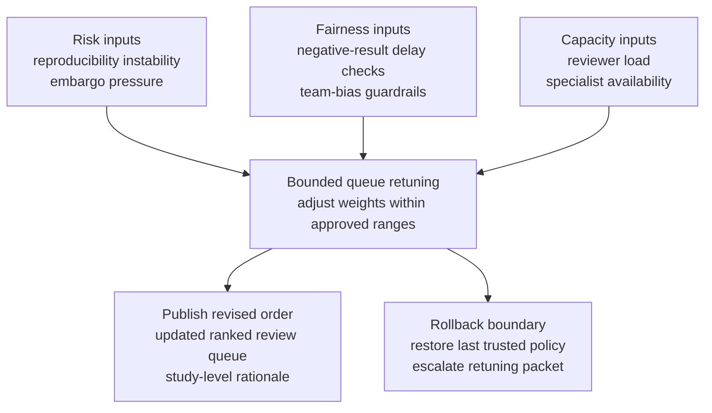

# Embargoed benchmark replication review queue reprioritization

## Linked pattern(s)

- `queue-prioritization-optimization`

## Domain

Research.

## Scenario summary

A central research-quality team manages a backlog of benchmark-study replication and validation packages before any externally visible paper, workshop submission, or leadership briefing can move forward. The queue mixes internal model-serving benchmarks, partner-funded evaluation studies, negative-result replications, and follow-up reviews triggered by earlier reproducibility defects. Recent outcome data shows that reviewers have been pulling forward polished submissions from well-resourced teams while packages with partial rerun failures, embargo-sensitive partner data, or statistically ambiguous negative findings sit longer and later require disruptive last-minute escalations. The optimization workflow must continuously retune queue order so studies with the highest external-claim risk, imminent embargo decisions, or reproducibility instability rise appropriately, while preserving fairness across teams, protecting blinded review norms where applicable, respecting finite reviewer capacity, and maintaining a fast rollback path if the feedback loop starts rewarding presentation quality over scientific risk.

## Target systems / source systems

- Research review intake system with active replication backlog, study metadata, embargo dates, reviewer assignments, and current queue order
- Experiment-tracking and artifact store with rerun outcomes, reproducibility checklists, variance thresholds, and unresolved validation defects
- Publication-governance register covering conference deadlines, partner embargo terms, disclosure restrictions, and escalation history
- Reviewer-capacity and expertise roster showing statistical reviewers, domain specialists, conflict-of-interest constraints, and current load
- Queue audit dashboard used by research governance leads to inspect reprioritization logic, freeze updates, and restore the last trusted ordering policy

## Why this instance matters

This grounds the optimization pattern in a research workflow where queue order shapes which claims are validated before disclosure pressure hardens into publication or executive-briefing risk. A naive reprioritization loop could favor studies from more visible teams, faster-to-review positive results, or cleaner artifact packages while letting negative findings, replication-challenged studies, or embargo-sensitive partner work age until reversibility becomes weak. The instance keeps the work squarely in optimize/adapt territory: the agent is not deciding whether to publish, coordinating calendars, or executing submissions; it is tuning backlog order using outcome feedback inside explicit fairness, embargo, capacity, and rollback guardrails.

## Likely architecture choices

- Event-driven monitoring should trigger queue reevaluation when rerun failures appear, embargo milestones approach, reviewer overrides accumulate, or specialist review capacity changes materially.
- A tool-using single agent can recompute bounded prioritization weights, simulate the effect on validation latency and reviewer load, and publish a revised ranked queue with study-level rationale.
- Exception-gated autonomy fits because in-policy tuning can adjust ordering automatically within approved ranges, but changes that materially alter fairness balancing, embargo buffers, or protected review classes should require research-governance approval.
- Research leads should remain able to freeze optimization updates and revert to the last trusted ranking policy when feedback quality drops, reviewer capacity becomes too thin, or a major policy shift makes recent outcome history unreliable.

## Governance notes

- Studies tied to hard embargo deadlines, partner disclosure restrictions, or unresolved reproducibility defects should remain protected classes that cannot be demoted for throughput or presentation-readiness reasons alone.
- Fairness checks should test for repeated deferral of negative-result studies, lower-profile labs, junior-led projects, or work from teams without dedicated publication support instead of letting historical polish or response speed become a proxy for priority.
- Queue logic should respect blinded or conflict-managed review boundaries by limiting which metadata can influence prioritization displays and audit packets for individual reviewers.
- Every reprioritization should log the feedback signals, embargo constraints, reviewer-capacity assumptions, override history, and guardrail checks that justified the ranking change so later audit can distinguish justified adaptation from prestige bias.
- Rollback should be explicit: if override rates spike, reproducibility-critical studies age longer, or fairness drift appears across teams or study types, the workflow should restore the prior trusted queue policy and escalate the tuning packet for review.

## Evaluation considerations

- Reduction in late-stage reproducibility escalations, missed embargo decision points, and urgent queue reshuffles after tuned ordering is applied
- Change in aging distribution for high-risk studies versus routine validation work, including whether fairness guardrails prevent systematic delay for negative-result or lower-visibility projects
- Frequency and pattern of research-lead overrides that indicate the optimized ranking conflicted with scientific-risk, fairness, embargo, or reviewer-capacity expectations
- Speed and clarity of rollback when updated tuning degrades queue stability, overweights cosmetic submission quality, or conflicts with new publication-governance guidance
