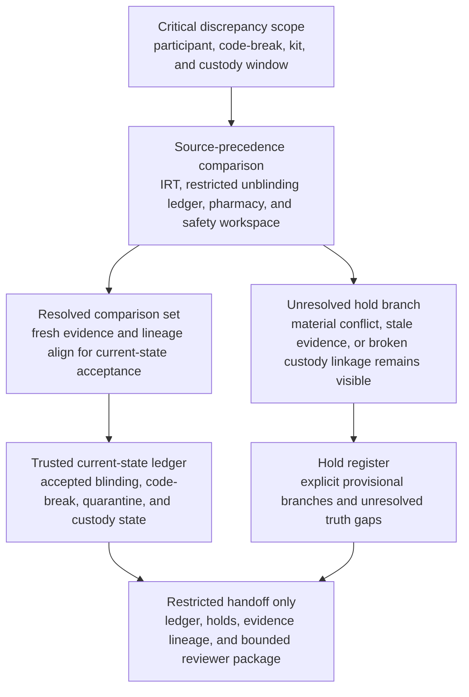

# Emergency unblinding and investigational product quarantine state truth restoration

## Linked pattern(s)

- `critical-authoritative-state-restoration`

## Domain

Research.

## Scenario summary

During a high-consequence serious adverse event bridge for a blinded multicenter trial, sponsor oversight finds that current emergency-unblinding and investigational-product quarantine state has diverged across the interactive response technology system, the restricted emergency code-break ledger, site pharmacy accountability records, and the safety command workspace. One source shows a participant emergency unblinding request as completed with a treatment assignment viewed by an authorized clinician, another still shows the participant as blinded, and the linked kit identifiers appear quarantined in one pharmacy record but still available for dispense in another. At the same time, one site's overnight manual custody note references a replacement kit move that does not align cleanly with the central chain-of-custody timeline. Before sponsor medical, data-management, pharmacy, and trial-operations leaders decide whether the current state is stable enough for any downstream dosing hold, site instruction, protocol deviation review, or authority-facing action, the workflow must restore the trusted current state of participant blinding status, emergency code-break usage, linked kit quarantine state, and specimen or kit custody dependencies while keeping every unresolved truth gap on explicit hold.

## Target systems / source systems

- Interactive response technology randomization and kit-allocation records, emergency-code access state, participant identifiers, and blinded-versus-unblinded status markers
- Restricted emergency unblinding ledger, medical-monitor authorization records, named approver attestations, and treatment-code access timestamps
- Site pharmacy accountability logs, kit quarantine registers, replacement-dispense notes, temperature or storage exception references, and local custody attestations
- Safety command workspace records, serious-adverse-event bridge notes, participant-event crosswalks, and protected reviewer annotations
- Audit, hold-register, and authoritative-state acceptance tooling used to preserve unresolved participant, kit, and custody conflicts for human review

## Why this instance matters

This grounds the pattern in a research workflow where the urgent need is one defensible picture of current blinded-state and investigational-product control status rather than an explanation of how the mismatch arose or a recommendation about what the trial should do next. In a blinded clinical study, false certainty about whether a participant has actually been unblinded, whether linked kits remain quarantined, or whether custody continuity still holds can create immediate safety, protocol-integrity, and governance harm. The instance stays inside the pattern boundary because it centers on trusted current-state restoration with explicit unresolved holds and a bounded handoff packet, stopping before site communication, dosing decisions, protocol deviation adjudication, authority notification, or broader study execution.

## Likely architecture choices

- An orchestrated multi-agent workflow can separate restricted unblinding-ledger retrieval, IRT and pharmacy state comparison, participant-kit linkage verification, hold classification, and handoff-packet assembly while preserving one shared trusted-state ledger.
- Human reviewers should remain embedded to confirm emergency source-precedence rules, accept the authoritative current-state view for participant and kit status, and adjudicate protected conflicts that cannot be resolved safely through delegated reconciliation alone.
- The workflow should stop at the reconciled current-state ledger, unresolved hold register, and restricted handoff packet rather than issuing site instructions, releasing or extending kit quarantines, updating randomization state, or deciding whether treatment may continue.
- Shared case memory should preserve superseded state claims, late-arriving site custody notes, identity-linkage warnings, and reviewer rationale for every authoritative-state acceptance or provisional hold.

## Governance notes

- Every participant-status field, emergency-code access marker, kit identifier, quarantine state, custody event, and effective timestamp should retain lineage to the exact restricted source record that supports it.
- The workflow should place participant and kit branches on explicit hold whenever IRT, emergency unblinding, pharmacy, and safety records disagree materially or when a local custody attestation cannot be reconciled inside approved freshness and precedence rules.
- Human sponsor medical, unblinding-governance, pharmacy, and trial-operations owners must approve any downstream use of the trusted-state packet for dosing holds, site instruction, deviation handling, data-cut treatment, or authority-facing communication.
- Treatment assignments, direct participant identifiers, and site-specific protected notes should stay minimized in the main handoff packet, with restricted evidence views used when broader reviewers only need aliased participant and kit references plus hold reasons.

## Evaluation considerations

- Time to first human-reviewable trusted blinding and kit-state ledger with complete source lineage, freshness visibility, and explicit unresolved-hold handling
- Agreement between the workflow's restored current-state picture and the final human-accepted participant, code-break, and kit-quarantine status view for the bridge window
- Percentage of materially ambiguous participant-kit branches preserved in the hold register rather than flattened into one asserted state
- Reliability of the workflow when late site pharmacy notes, replacement-kit movements, or restricted emergency-access logs arrive asynchronously during repeated critical updates
