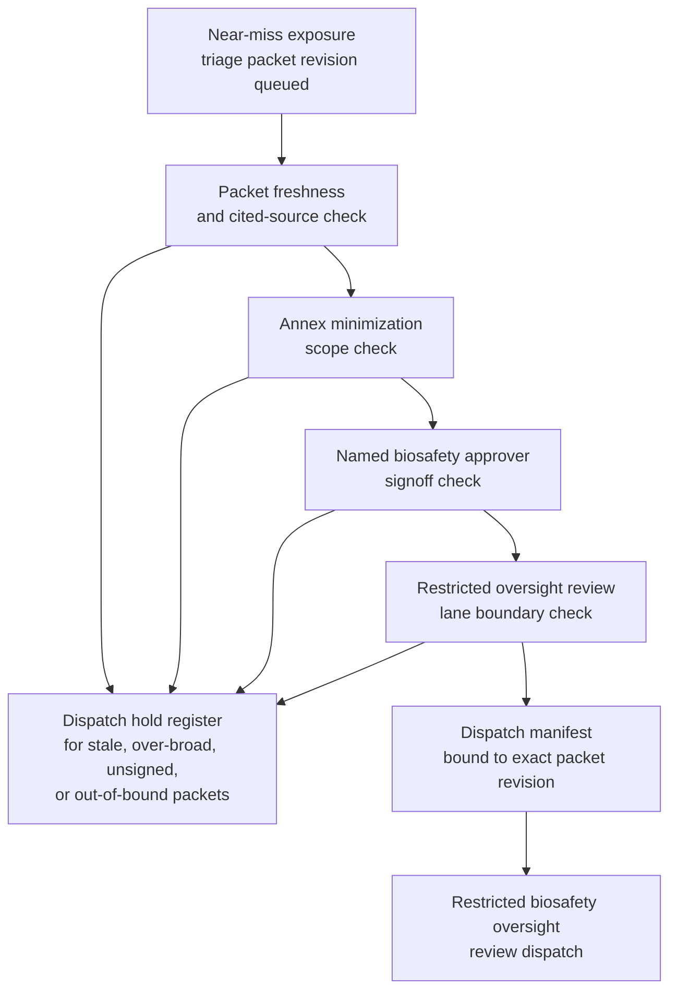
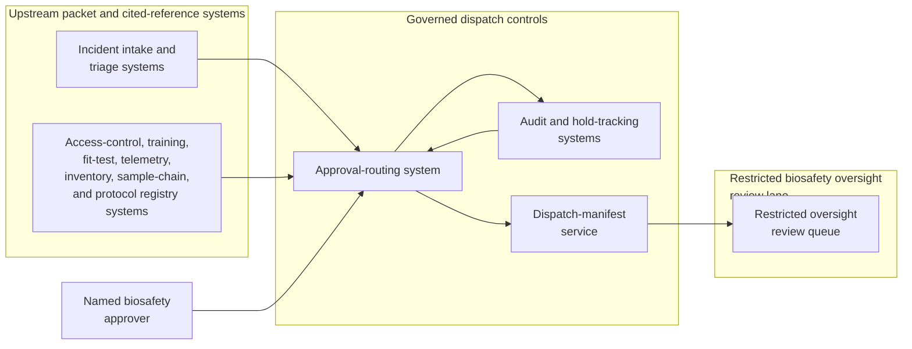

# High-consequence pathogen near-miss exposure triage packet approved for restricted biosafety oversight review dispatch

## Linked pattern(s)

- `approval-gated-triage-dispatch`

## Domain

Research.

## Scenario summary

A research biosafety office already has one evidence-backed triage packet assembled for a near-miss exposure event involving a high-consequence pathogen study. Earlier monitoring already merged badge-access logs, cabinet alarm telemetry, specimen inventory references, training and fit-test records, duplicate incident notices from the principal investigator and lab manager, and one recent containment-engineering clarification into a single bounded packet. The next step is not to determine whether an exposure occurred, classify severity, notify regulators, initiate medical surveillance, suspend experiments, or direct lab operations; it is to decide whether that exact triaged packet revision may cross into the restricted biosafety oversight review lane that handles high-consequence containment incidents. The workflow watches packet freshness, annex minimization, approval state, and lane-boundary rules, then releases the packet only when the named biosafety approver signs the dispatch manifest for that one protected downstream review queue.

## Target systems / source systems

- Laboratory incident intake and triage systems holding the already-triaged near-miss packet, duplicate lineage, facility identifiers, event timeline, and unresolved caveat markers
- Access-control, biosafety training, respirator fit-test, and containment telemetry systems supplying the authoritative references already cited in the packet for freshness and scope checks
- Pathogen inventory, sample-chain, and protocol registry systems recording agent tier, material custody, approved handling envelope, and experiment identifiers used to confirm bounded downstream review context
- Restricted biosafety oversight review queue and dispatch-manifest service used to release the exact packet revision into the protected containment-governance lane
- Approval-routing, audit, and hold-tracking systems preserving signer identity, blocked dispatch attempts, superseded packet revisions, manual overrides, and append-only hold and release lineage

## Why this instance matters

This grounds `approval-gated-triage-dispatch` in a research-governance setting that is clearly different from both secondary dataset access review and benchmark disclosure-risk review because the packet concerns a high-consequence biosafety near-miss rather than participant-data reuse or unpublished study claims. Research organizations may assemble a strong triage packet from incident telemetry, inventory references, training state, and containment context, yet still require explicit approval before that packet may enter a restricted oversight lane empowered to inspect sensitive pathogen-handling details. The instance keeps the family boundary clean because the workflow owns packet release, queue-boundary control, visible holds, and dispatch lineage only, not exposure adjudication, corrective-action planning, regulator notification, personnel communication, or laboratory execution.

## Likely architecture choices

- Event-driven monitoring fits because containment telemetry, inventory custody state, training currency, or packet freshness can change while the already-triaged near-miss waits at the dispatch gate.
- Approval-gated execution fits because the packet is prepared for one bounded biosafety oversight lane but remains concretely blocked until the required biosafety approver signs for that exact revision and queue boundary.
- Human-in-the-loop review should stay on the normal path because dispatch into a restricted containment-governance lane changes who may inspect sensitive pathogen and personnel context even though this workflow still stops short of deciding response or action.
- The workflow should emit only the released queue entry, dispatch manifest, hold register, and audit trail rather than an exposure determination, containment recommendation, staff outreach plan, regulator report, or operational handoff that would begin execution.

## Governance notes

- The manifest should bind approval to one exact near-miss triage packet revision, one restricted biosafety oversight queue identifier, one approved reviewer audience, and the facility and protocol boundary authorized for dispatch.
- Dispatch should remain held when containment telemetry or training references become stale, the packet is superseded by a newer duplicate-merge result, reviewer access would exceed the approved pathogen-information boundary, or personnel details are not minimized to the lane's minimum necessary view.
- Broad queue views should minimize named personnel data, agent-handling specifics, facility-control details, and specimen identifiers while preserving traceable references in governed biosafety systems.
- Biosafety governance owners must approve changes to signer roles, reviewer-roster boundaries, minimization policy, freshness rules, and hold-release logic; this workflow ends before exposure adjudication, containment action selection, medical follow-up, regulator communication, experiment suspension, or any downstream execution begins.

## Evaluation considerations

- Median time from packet readiness to approved restricted-lane dispatch or explicit placement into freshness, minimization, or scope hold state
- Rate of wrong-version, wrong-audience, or over-broad facility or protocol scope corrections detected after dispatch approval
- Completeness of audit lineage connecting packet revision, cited biosafety sources, signer approval, and the single downstream queue boundary
- Reliability of hold behavior when telemetry, custody, training, or duplicate-incident context changes during the approval window
