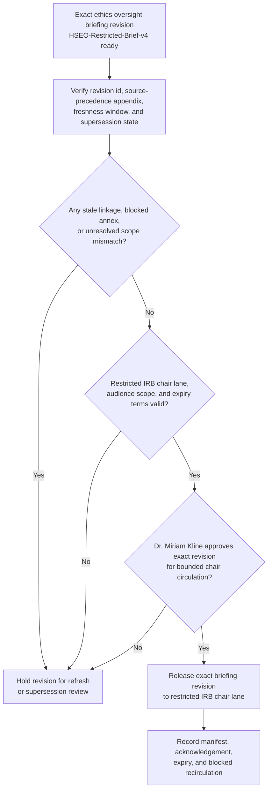

# Human-subjects ethics oversight briefing revision approved for restricted IRB chair circulation

## Linked pattern(s)

- `approval-gated-briefing-release`

## Domain

Research.

## Scenario summary

Dr. Miriam Kline, the named Director of Research Ethics Governance for the translational neurostimulation program, has already synthesized one inspectable oversight artifact: `HSEO-Restricted-Brief-v4`, a briefing revision summarizing protocol deviation clustering, consent-language caveats, participant complaint themes, DSMB note excerpts, site-monitor follow-ups, and unresolved chronology gaps across three active human-subjects studies. The prerequisite state is fixed before release review begins: IRB amendment register snapshot `IRB-Roster-2026-03-18` is the current authority for study and reviewer scope, ethics operations SOP `REO-SOP-12.7` defines the restricted chair-circulation lane, and the briefing's source-precedence appendix makes clear that approved protocol and consent records outrank site-monitor logs, which outrank study-team annotations and informal coordinator commentary. Brief revision v4 supersedes v3 after one participant complaint chronology and one consent-form version reference were refreshed, but visible blockers remain: one external site has not yet confirmed whether a translated consent insert was the active version during a reported deviation window, one DSMB excerpt still lacks final meeting-minute linkage, and one study coordinator note conflicts with the authoritative protocol deviation ledger. The workflow must decide only whether that exact briefing revision may enter the restricted IRB chair circulation lane under a manifest-bound freshness window; it does not reopen evidence synthesis, recommend protocol suspension, adjudicate noncompliance, schedule convened review, or trigger participant-contact actions.

## Target systems / source systems

- Research ethics briefing workspace holding `HSEO-Restricted-Brief-v4`, prior superseded revisions, source-precedence appendices, blocker annotations, and release-state history
- IRB amendment registry, approved protocol repository, and consent-document archive defining the authoritative study scope, active consent versions, and reviewer entitlements already cited by the prepared briefing
- Protocol deviation ledger, participant complaint case system, DSMB minute repository, and site-monitor follow-up tracker supplying the evidence references already synthesized into the briefing revision
- Restricted dissemination and acknowledgement tooling enforcing the named IRB chair lane, confidentiality banner, expiry window, and redistribution prohibitions for released ethics briefings
- Approval manifest and audit services recording the exact revision id, approver identity, lane scope, freshness deadline, and any blocked forwarding or stale-reuse attempts

## Why this instance matters

This grounds the pattern in research governance where the consequential act is controlled visibility of one already-synthesized ethics oversight brief rather than creation of the brief itself. Human-subjects oversight often depends on rapidly sharing a constrained but high-context artifact with a small accountable audience, yet even minor chronology corrections, consent-version updates, or scope changes can make one nearly identical draft materially different from the revision a leader actually reviewed. The instance keeps the family boundary clear by centering manifest-bound release of one exact briefing revision for awareness and oversight only, not recommendation of disciplinary action, noncompliance determination, review scheduling, or downstream study operations.

## Likely architecture choices

- Approval-gated execution fits because the briefing remains held until the named ethics governance owner authorizes one exact revision for the restricted IRB chair circulation lane.
- Human-in-the-loop review is necessary because only accountable research ethics leadership should accept residual uncertainty, confirm audience scope, and approve expiry for a high-consequence human-subjects oversight brief.
- A governed agent can compare revision lineage, assemble the release manifest, and block superseded or broadened distribution, but it should not reinterpret protocol compliance, recommend corrective action, or trigger downstream ethics workflow steps.

## Governance notes

- Approval should bind to immutable revision `HSEO-Restricted-Brief-v4`, the single restricted IRB chair lane, one freshness deadline, and the visible blocker set so later edits or audience expansion cannot inherit permission silently.
- Source precedence should remain explicit in both the briefing and manifest: approved protocol and consent records outrank site-monitor logs, those logs outrank study-team annotations, and informal coordinator commentary cannot override the higher-precedence record.
- The unresolved translated-consent question, missing DSMB minute linkage, and conflicting coordinator note should stay visible in the released brief rather than being flattened into a cleaner narrative for convenience.
- Audit records should preserve revision lineage from v3 to v4, approver identity, recipient acknowledgement, expiry timing, and any blocked redistribution attempts outside the approved research oversight lane.
- The workflow must stop at bounded briefing release; protocol deviation adjudication, corrective-action planning, IRB agenda setting, participant notification, or study execution remain outside this pattern.

## Evaluation considerations

- Percentage of restricted IRB chair circulations where the released ethics briefing revision, lane scope, expiry terms, and manifest metadata align exactly without later correction
- Rate at which stale, superseded, or broadened-scope ethics briefings are blocked before restricted oversight visibility
- Time required to move from briefing-ready status to approved bounded circulation when authoritative protocol, consent, and deviation references are already complete
- Reviewer correction rate for missing blockers, incorrect source-precedence handling, or wrong audience scope after the released briefing reaches the restricted IRB chair lane
