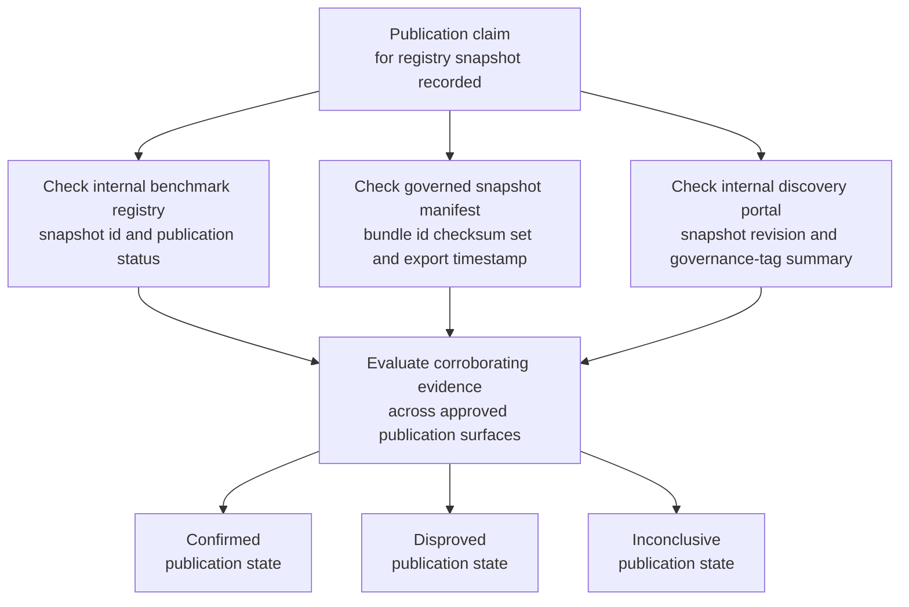
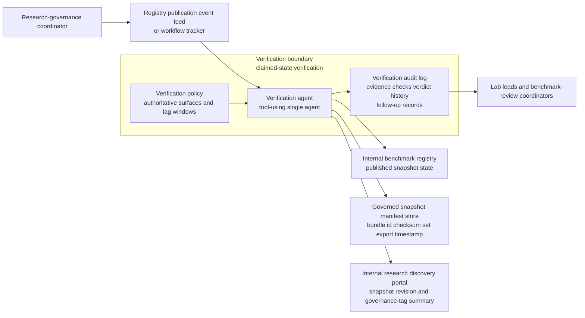

# Internal benchmark registry snapshot publication verification

## Linked pattern(s)

- `claimed-state-verification`

## Domain

Research.

## Scenario summary

A research-governance coordinator records that the monthly internal benchmark registry snapshot is published after the registry exporter, governed snapshot manifest, and internal discovery portal all report success for the new benchmark inventory cut. Lab leads and benchmark-review coordinators still need to know whether that claimed publication state is actually supported by the approved internal surfaces before they rely on the snapshot as the current reference for benchmark availability, lineage, and governance tags. The workflow verifies the claim against authoritative evidence and emits a bounded confirmed, disproved, or inconclusive verdict; it must not republish the snapshot, adjudicate benchmark quality, approve release of any benchmark, or launch broader remediation.

## Target systems / source systems

- Internal benchmark registry containing the approved snapshot identifier, publication status, benchmark inventory totals, and effective-at metadata
- Governed snapshot manifest store preserving the immutable snapshot bundle id, checksum set, and export timestamp for the registry cut
- Internal research discovery portal that exposes the current benchmark registry snapshot revision, catalog timestamp, and governance-tag summary to authorized researchers
- Registry publication event feed or workflow tracker recording the snapshot-publication-complete claim and any replayed propagation events
- Verification audit log preserving evidence checks, observed snapshot identifiers, verdict history, and bounded follow-up records

## Why this instance matters

This grounds the pattern in a research-governance workflow where a registry snapshot can be marked published even though one approved internal surface still exposes the prior benchmark inventory or the discovery portal has not yet loaded the new governed snapshot metadata. The useful work is confirming whether the claimed publication state is actually true before research teams treat the snapshot as the current internal benchmark reference. The workflow stays inside investigate/reconcile/verify because it stops at evidence-backed verdicting and traceability rather than changing registry contents, deciding whether benchmarks are fit for use, or directing downstream publication behavior.

## Likely architecture choices

- Event-driven monitoring fits because the verification run should begin when the snapshot-publication-complete claim is recorded rather than only after researchers notice mismatched benchmark counts.
- A tool-using single agent can compare snapshot ids, manifest checksums, inventory totals, timestamps, and governance-tag summaries across the approved registry surfaces while applying allowed propagation tolerances.
- Bounded delegation is appropriate because research-governance owners can predefine the authoritative registry systems, required corroborating fields, and acceptable lag windows while humans retain authority over any republication, benchmark adjudication, or remediation.
- Durable verification state should preserve duplicate publication claims and prior inconclusive checks so repeated runs do not create contradictory verdicts for the same registry snapshot.

## Governance notes

- Only the approved benchmark registry, governed snapshot manifest, discovery portal, and publication event records should count as authoritative evidence; spreadsheet exports, chat confirmations, or copied benchmark lists should not confirm publication.
- Verification records should stay privacy- and governance-minimized by preserving snapshot identifiers, manifest ids, benchmark counts, timestamps, and tag summaries rather than benchmark evaluation narratives or unpublished study commentary.
- If one approved internal surface remains stale within an allowed propagation window, the workflow should keep the result explicitly inconclusive instead of overstating either complete publication or failure.
- Republishing the registry snapshot, changing benchmark eligibility, deciding whether a benchmark should appear in the registry, or initiating broader data-quality remediation remains outside this verification workflow and under human control.

## Evaluation considerations

- Percentage of benchmark registry snapshot publication claims that receive a verdict with complete registry, manifest, and discovery-portal traceability
- Rate at which stale or partially propagated snapshot revisions are detected before research teams rely on the claimed current benchmark inventory
- Reviewer agreement that the workflow applied the correct snapshot-match, checksum, count-consistency, and lag-tolerance rules
- Clarity of follow-up records when one approved internal registry surface remains out of date beyond the allowed publication window
