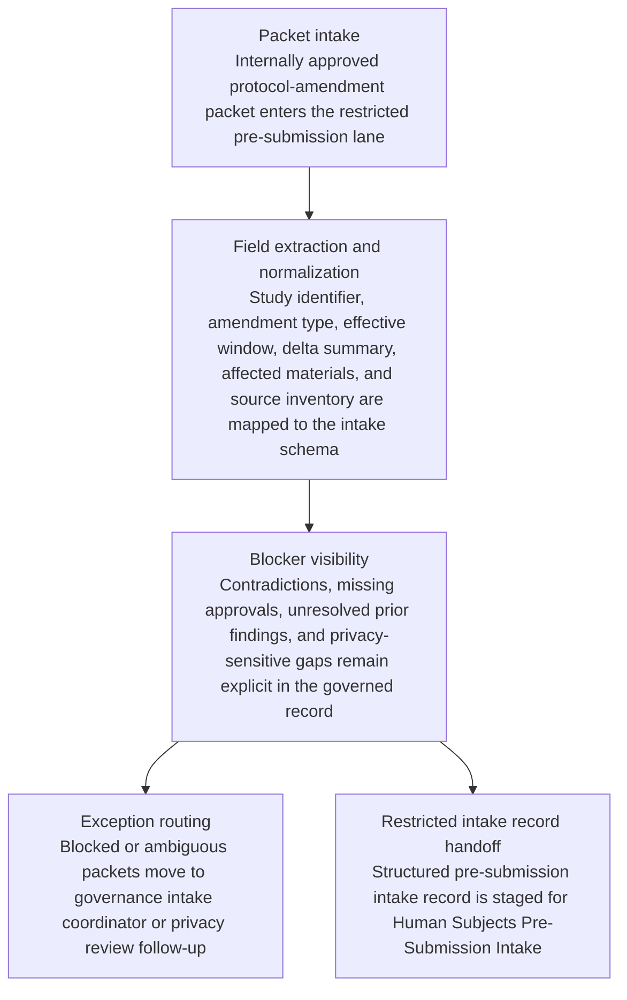

# Internally approved protocol-amendment packet to restricted pre-submission intake record handoff

## Linked pattern(s)

- `document-to-structured-data-handoff`

## Domain

Research.

## Scenario summary

A clinical research governance operations team receives an internally approved protocol-amendment packet for a multisite observational study that needs to enter a restricted pre-submission intake lane before any formal ethics submission or sponsor communication begins. The source packet combines the amendment cover memo signed by the principal investigator, a redlined protocol, revised schedule-of-events pages, updated recruitment-language excerpts, participant-risk impact notes, site-readiness confirmations, adverse-event context, and a carry-forward list of unresolved findings from the prior protocol version. The workflow must transform that heterogeneous packet into one inspectable governed intake record with required fields for study identifier, amendment type, proposed effective window, delta-from-current-protocol summary, affected participant-facing materials, source document inventory, named intake-lane owner, explicit blocker register, provenance links, and restricted-audience tags while preserving contradictions, missing approvals, and version lineage.

## Target systems / source systems

- Restricted research-governance pre-submission staging system that stores one structured intake record for protocol-change review and shows the owning lane as Human Subjects Pre-Submission Intake
- Protocol repository, amendment drafting workspace, study operations tracker, and controlled document store holding the signed amendment memo, redlines, schedule changes, and prior approved protocol baseline
- Site readiness logs, participant-material libraries, adverse-event review notes, and sponsor-condition trackers used only to normalize identifiers, amendment categories, and carry-forward issue references
- Parsing and extraction services for redlined protocol sections, tabular schedule updates, approval signature pages, and attachment manifests within the packet
- Exception queue for governance intake coordinators, privacy review, or protocol-operations follow-up when blockers prevent safe staging into the restricted pre-submission lane

## Why this instance matters

This grounds the transform pattern in research governance work where the valuable output is a trustworthy staged intake record rather than an amendment recommendation, ethics determination, or submission action. Protocol-change packets often arrive as mixed narrative, tracked-change, and approval artifacts that reviewers cannot safely triage without a normalized record showing exactly what changed, who owns the intake lane, which blockers remain visible, and how each field traces back to the source packet. The instance shows why approval-bound research handoffs need schema-aligned transformation with explicit provenance, blocker visibility, and delta lineage before any downstream pre-submission review can start.

## Likely architecture choices

- A tool-using single agent can assemble the amendment packet, extract structured intake fields, compare the redlined protocol against the current approved baseline, and emit one restricted pre-submission intake record plus a transformation trace.
- The target handoff should remain a single governed artifact in staging that includes lane ownership, blocker state, source inventory, and delta lineage rather than a draft submission package or reviewer-facing narrative.
- Approved reference data may normalize study ids, site codes, amendment classes, document types, and intake-lane labels, but unsupported inference about ethics risk level, sponsor acceptance, site implementation readiness, or whether a missing signoff is waivable should force exception routing.
- Human review remains necessary when the redline conflicts with the amendment memo, participant-facing changes appear without an approved baseline link, blocker status is ambiguous, or prior unresolved findings are carried forward without clear disposition lineage.

## Governance notes

- Every consequential field should retain provenance to the exact signed memo section, protocol redline span, schedule-of-events table row, site-readiness entry, prior-version finding, or controlled-library record that supports it, especially for amendment scope, proposed effective window, affected materials, blocker status, and lane ownership.
- The staged record should expose blockers as first-class fields rather than burying them in free text, including missing site signoffs, unresolved participant-safety wording questions, absent privacy review references, and incomplete sponsor-condition carry-forwards.
- Delta lineage should show which current-protocol sections are superseded, which prior intake findings remain open, and which amendment facts were newly introduced so restricted reviewers can inspect change scope without reopening the full packet.
- Audience controls should keep the handoff bounded to the named restricted pre-submission intake lane; reuse of the record for reviewer outreach, ethics submission, sponsor notification, or site activation should require separate downstream approval and workflow steps.
- Human research-governance owners must decide whether the staged record is sufficient for formal pre-submission review, whether blockers can be cleared, and whether the amendment proceeds any further; the transformation workflow stops at structured intake.

## Evaluation considerations

- Percentage of staged protocol-amendment intake records accepted by the restricted pre-submission lane without manual re-entry of amendment scope, blocker state, or protocol-delta details
- Rate of contradictory, incomplete, or approval-missing amendment packets correctly diverted to exception review before any ethics pre-submission handling or sponsor-facing action begins
- Completeness of field-level provenance, blocker visibility, delta lineage, and lane-ownership capture during governance audit or protocol-history reconstruction
- Reliability of the handoff when redlined sections are reformatted, prior findings are reopened, signature pages arrive late, or the restricted intake schema adds a new required governance field
