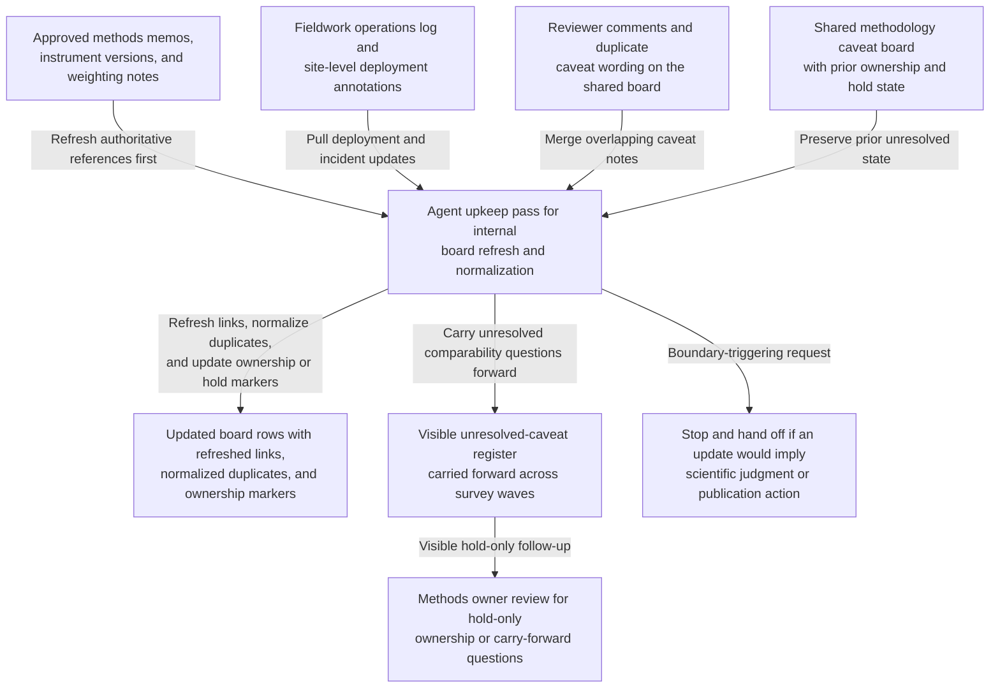
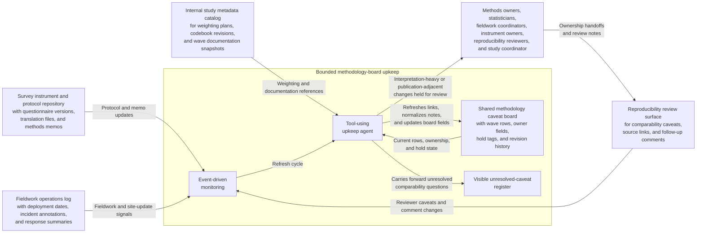

# Longitudinal survey methodology caveat board shared workbench upkeep

## Linked pattern(s)

- `shared-workbench-orchestration`

## Domain

Research for internal longitudinal study methods governance.

## Scenario summary

An internal research methods group maintains a shared methodology caveat board for a multi-wave longitudinal survey while statisticians, fieldwork coordinators, instrument owners, and reproducibility reviewers continuously log small comparability concerns that could affect later internal analysis. Updates arrive throughout the week: one analyst links a revised weighting note for a low-response subgroup, a fieldwork lead flags that one site used an older instrument wording for two days, a methods reviewer adds a caveat about translation drift in one wave, and a study coordinator reassigns ownership of an unresolved skip-logic question. The agent keeps that bounded internal board usable by refreshing source links, normalizing duplicate caveat wording, updating wave-level ownership and hold markers, and carrying unresolved comparability questions forward in a visible register without turning the board into a publication recommendation, protocol decision, or execution queue. Humans remain responsible for deciding whether a caveat is scientifically material, whether a wave should be excluded from analysis, whether weighting or documentation changes are warranted, and when any board content is mature enough to feed a separate review or publication workflow.

## Target systems / source systems

- Shared methodology caveat board with wave-level rows, owner fields, hold tags, and revision history
- Survey instrument and protocol repository containing questionnaire versions, amendment notes, translation files, and approved methods memos
- Fieldwork operations log with site-level deployment dates, interviewer notes, response-rate summaries, and incident annotations
- Reproducibility review surface where statisticians and methods reviewers add comparability caveats, source links, and follow-up comments
- Internal study metadata catalog referenced by caveat-board rows for weighting plans, codebook revisions, and wave documentation snapshots

## Why this instance matters

This grounds the pattern in a research-methods setting that is materially different from benchmark evidence upkeep or data-use restriction tracking because the maintained artifact is an internal methodology caveat board for survey comparability and reproducibility. The useful work is keeping one bounded board current and resumable as small method, fieldwork, and documentation updates arrive from several collaborators. That keeps the workflow anchored on internal workbench upkeep, provenance, ownership visibility, and explicit holds rather than recommendation, adjudication, publication drafting, or downstream study execution.

## Likely architecture choices

- Event-driven monitoring fits because upkeep should react when protocol notes, fieldwork logs, reviewer comments, or board fields change.
- A tool-using single agent can refresh source references, normalize overlapping caveat wording, and keep ownership plus hold markers synchronized inside one bounded board.
- Human-in-the-loop review remains necessary when a note would reinterpret methodology, collapse a contested caveat, or make the board sound like an analysis or publication decision.
- Bounded delegation works because methods owners can predefine allowable field updates, source boundaries, and hold conditions without delegating scientific judgment, protocol approval, or study operations.

## Governance notes

- The board should clearly separate approved source facts, reviewer proposals, unresolved comparability questions, and held caveats so upkeep never implies that a methodological judgment has already been made.
- Questionnaire-version links, translation references, weighting-plan identifiers, and owner assignments should be revalidated before a row is marked current or a hold is cleared.
- The agent may normalize structure and merge overlapping caveat notes, but it should not decide whether one wave is analytically valid, approve exclusion criteria, or remove a caveat that a human reviewer accepted.
- If a requested update would set publication language, authorize protocol changes, approve an analysis path, or trigger fieldwork action, the workflow should stop and hand off to the appropriate adjacent pattern.

## Evaluation considerations

- Percentage of board refreshes that preserve correct wave references, protocol links, ownership fields, and unresolved-question state across repeated upkeep cycles
- Reviewer correction rate for merged caveat notes, refreshed methods references, or automatically updated hold markers
- Rate at which interpretation-heavy or publication-adjacent edits are held for human review instead of being silently folded into the internal board
- Usefulness of the maintained workbench for helping methods, fieldwork, and reproducibility reviewers resume survey-governance work without reconstructing stale context by hand
