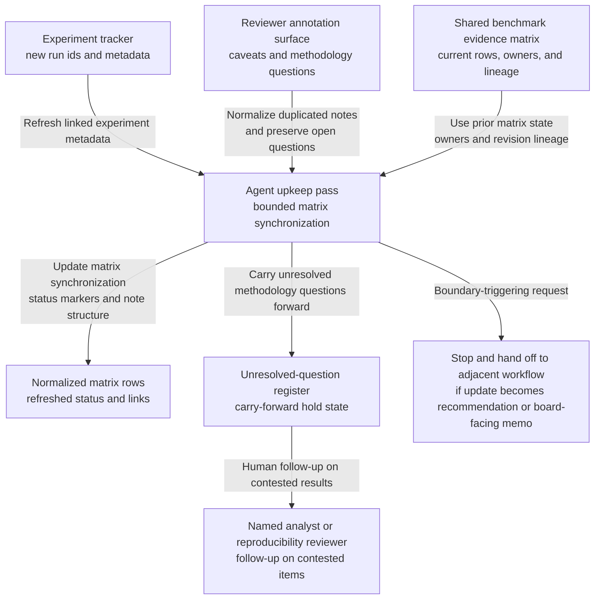
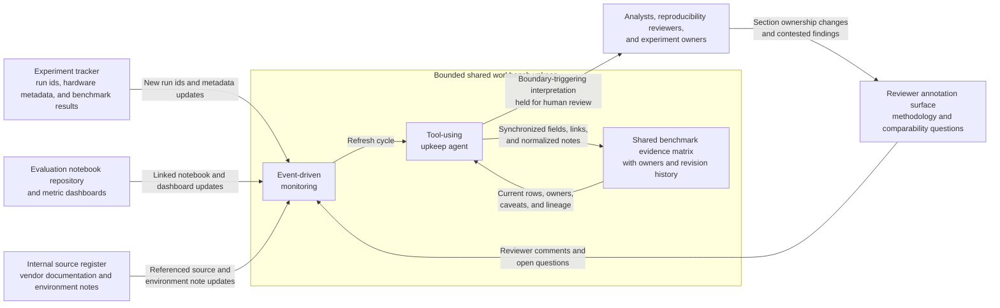

# Model-serving benchmark evidence matrix shared workbench upkeep

## Linked pattern(s)

- `shared-workbench-orchestration`

## Domain

Research for internal AI platform evaluation.

## Scenario summary

A small applied-research team keeps an internal benchmark evidence matrix in a shared workbench while comparing model-serving platforms for future infrastructure planning. Analysts, reproducibility reviewers, and experiment owners continuously add run ids, caveat notes, hardware annotations, reviewer comments, and section ownership changes as new benchmark reruns land. The agent's role is to keep that bounded internal matrix synchronized: refresh linked experiment metadata, normalize duplicated reviewer notes, update section status markers, and carry unresolved methodology questions forward without collapsing them into a final recommendation memo. Humans remain responsible for interpreting contested results, deciding which evidence is persuasive, and choosing when any part of the matrix is mature enough to feed a separate board-facing briefing workflow.

## Target systems / source systems

- Shared research workbench containing the benchmark evidence matrix, section ownership, caveat flags, and revision history
- Experiment tracker with run ids, prompt suites, hardware metadata, throughput and latency results, and reproducibility status
- Evaluation notebook repository and metric dashboards linked from matrix rows and reviewer comments
- Reviewer annotation surface where research leads and infrastructure partners mark open methodology or comparability questions
- Internal source register for vendor documentation and benchmark environment notes referenced by matrix entries

## Why this instance matters

This grounds the pattern in a low-risk research setting where the agent is not drafting the final architecture recommendation or even the benchmark memo. The useful work is keeping one internal evidence matrix coherent as many small edits arrive from people and linked systems. That makes the collaboration about shared workbench upkeep, provenance, and hold-state management rather than open-ended synthesis or judgment packaging.

## Likely architecture choices

- Event-driven monitoring fits because the upkeep loop should react when new benchmark runs, reviewer comments, or matrix field changes appear.
- A tool-using single agent can refresh run metadata, normalize duplicated notes, and update open-question markers in one bounded workbench.
- Human-in-the-loop review remains necessary when a change would reinterpret a disputed result, collapse a caveat, or promote matrix content into a board-facing deliverable.
- Bounded delegation is appropriate because the workbench rules can pre-authorize structural refreshes while keeping substantive interpretation with the research team.

## Governance notes

- The matrix should distinguish measured internal results, linked vendor claims, and unresolved reviewer interpretation so the upkeep loop never makes them look equally validated.
- Accepted human wording for disputed caveats or methodology limits should be preserved separately from agent-proposed normalization edits.
- Each maintained matrix row should keep inspectable links to run ids, notebook revisions, or dashboard snapshots rather than copying broad chunks of source material into the workspace.
- If a requested update starts sounding like a final recommendation, platform ranking, or publication-ready statement, the workflow should hold that section for human review instead of treating it as routine upkeep.

## Evaluation considerations

- Percentage of benchmark matrix updates that retain correct run links, reviewer ownership, and unresolved-question state after automatic upkeep
- Reviewer correction rate for normalized caveat notes, merged comments, or refreshed run metadata in sampled revisions
- Rate at which interpretation-heavy edits are held for human review instead of being silently folded into the matrix
- Usefulness of the maintained workbench for helping analysts resume benchmark preparation without reconstructing prior context by hand
