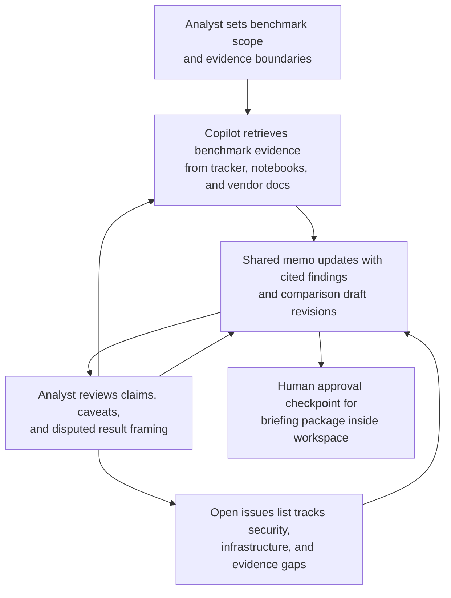

# Model-serving platform benchmark briefing copilot loop

## Linked pattern(s)

- `analyst-copilot-loop`
- `research-synthesis-with-citation-verification`

## Domain

Research for internal AI platform strategy.

## Scenario summary

An applied-research analyst is preparing a recommendation-ready benchmark briefing for an architecture review board that must choose between three model-serving platforms for internal generative-AI workloads. The analyst uses a copilot inside a shared research workspace to iteratively tighten benchmark scope, pull source-grounded latency and cost results from the experiment tracker, compare vendor claims against internal test runs, rewrite the board memo for different stakeholder questions, and maintain an open-issues list for security and infrastructure follow-up, while the human analyst remains responsible for deciding which evidence is in scope, interpreting tradeoffs in disputed results, and approving the final briefing before it reaches engineering leadership.

## Target systems / source systems

- Shared research workspace with the draft benchmark memo, reviewer comments, and section-level ownership
- Internal experiment tracker storing benchmark runs, prompt sets, hardware configuration notes, and reproducibility metadata
- Evaluation notebook repository and benchmark dashboards for throughput, latency, error-rate, and cost-per-request comparisons
- Vendor documentation portal with published deployment guidance, pricing assumptions, and feature claims
- Security review queue and architecture decision record archive for non-performance constraints such as tenancy, audit logging, and rollback options

## Why this instance matters

This grounds the collaboration pattern in benchmark preparation rather than case escalation. The difficult work is not just generating a comparison table; it is sustaining a disciplined human-agent loop while the analyst re-frames questions, checks whether apparent performance gaps come from configuration differences or real product limits, and decides how much uncertainty the architecture review board should see. A polished draft that collapses internal measurements, vendor claims, and unresolved caveats into one narrative would make the benchmark look more objective than it is, so the collaboration design has to keep evidence lineage and accountability visible across every iteration.

## Likely architecture choices

- Human-in-the-loop collaboration should remain primary because benchmark inclusion criteria, interpretation of conflicting runs, and the final recommendation framing all require accountable human judgment.
- A tool-using single agent can retrieve experiment metadata, refresh comparison tables, draft section rewrites, and track unresolved evidence gaps inside one shared workbench.
- The copilot may update the research memo and evidence matrix, but publication to the architecture review board, benchmark score normalization changes, and any downstream procurement or rollout action should remain explicitly human-approved.

## Governance notes

- The shared artifact should distinguish internal benchmark results, vendor self-reported claims, and analyst interpretation so the copilot does not blur measured evidence with marketing language.
- Each material conclusion should link back to inspectable run ids, notebook commits, or vendor documents, and missing provenance should block that claim from the final briefing.
- The analyst should own decisions about benchmark weighting, exclusion of failed runs, and treatment of anomalous hardware conditions; the agent may propose but should not silently apply those methodological choices.
- Security, privacy, and tenancy concerns that fall outside benchmark performance should stay visible as separate review items so a strong latency result does not hide governance blockers.

## Evaluation considerations

- Time to produce a board-ready benchmark memo that preserves citation and run-level traceability after multiple review turns
- Reviewer correction rate for claims where the copilot misstated benchmark methodology, merged incomparable runs, or overstated confidence in a platform advantage
- Percentage of final comparison statements backed by linked experiment artifacts or primary vendor documentation
- Usefulness of the open-issues and caveats sections for helping reviewers distinguish ready-to-decide findings from questions that still require human follow-up
