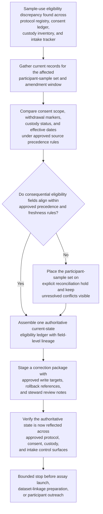
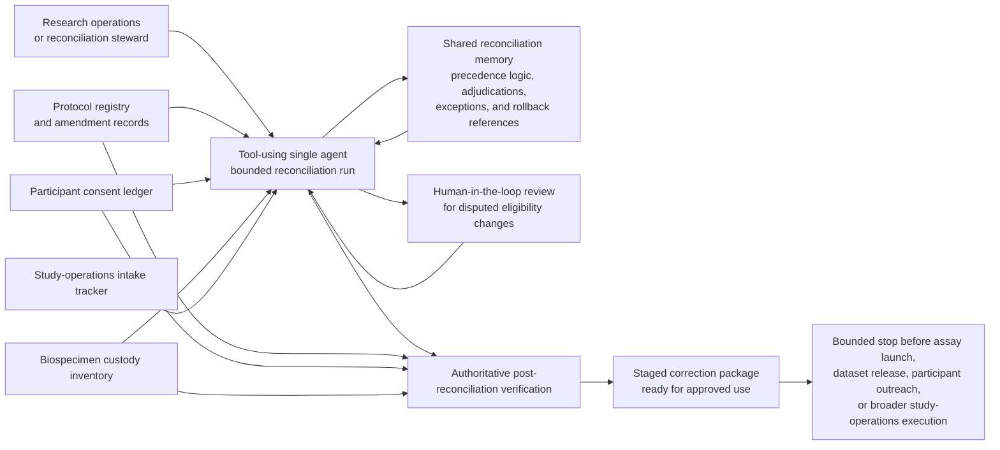

# Protocol, consent, and sample-custody use-eligibility authoritative record reconciliation

## Linked pattern(s)

- `authoritative-record-reconciliation`

## Domain

Research.

## Scenario summary

After a protocol amendment narrows permitted secondary analyses for one longitudinal biospecimen cohort and a delayed site sync leaves several records out of step, research operations discovers that current sample-use eligibility no longer agrees across the protocol registry, the participant consent ledger, the biospecimen custody inventory, and the study-operations intake tracker used to queue governed assay work. One source shows a participant's samples as eligible for genomic re-analysis under the newly approved amendment window, another still carries the pre-amendment consent scope as active, and the custody inventory matches the specimen identifiers and storage status but not the withdrawal marker and effective date now reflected in the consent ledger. Before any sample is queued for a governed assay, any dataset linkage packet is prepared, or any team decides whether the drift came from amendment timing, site processing error, or stale synchronization, the workflow must restore one trusted current use-eligibility state for each affected participant-sample record set, keep unresolved conflicts visible, stage a correction-ready package, and verify that the authoritative state is the one reflected across approved research control surfaces.

## Target systems / source systems

- Protocol registry entries, approved amendment records, allowed analysis-scope fields, cohort inclusion criteria, and protocol effective-date history
- Participant consent ledger records holding consent version, withdrawal or restriction markers, approved secondary-use permissions, and steward-reviewed effective dates
- Biospecimen custody inventory, specimen-chain-of-custody records, freezer-location state, aliquot identifiers, and sample-status timestamps tied to governed use restrictions
- Study-operations intake tracker, assay-queue staging records, and approved participant-sample cross-reference mappings used to prepare controlled downstream research work
- Reconciliation workspace tooling used to preserve field-level discrepancy ledgers, unresolved review items, staged correction packages, and post-reconciliation verification evidence

## Why this instance matters

This grounds the pattern in a research-governance workflow where the pressing problem is not recommending whether a study should proceed, explaining why the records drifted, or deciding how to communicate with participants, but restoring one defensible authoritative record before governed research systems rely on contradictory sample-use state. Human-subjects and biospecimen workflows often split authority across protocol approval, consent governance, physical custody, and study-operations intake systems, so an apparently current eligibility flag can still be unsafe when consent scope, withdrawal status, specimen linkage, or amendment effective-date lineage does not align. The instance stays inside this family because it centers on source-of-truth restoration, field-level discrepancy resolution, staged correction packaging, and authoritative verification rather than publication choice, study execution, release approval, or root-cause investigation.

## Likely architecture choices

- A tool-using single agent can gather protocol-registry extracts, consent-ledger records, custody-inventory snapshots, and intake-tracker entries into one bounded reconciliation run for each affected participant-sample set.
- Human-in-the-loop review should remain standard for disputed withdrawal timing, participant-identity or specimen-linkage ambiguity, conflicting amendment applicability, or any case where a proposed correction would change governed secondary-use eligibility.
- The workflow should perform authoritative post-reconciliation verification against the approved registry, consent, and custody surfaces before marking the staged correction package ready, then stop before assay launch, dataset release, participant outreach, or broader study-operations execution.
- Shared reconciliation memory should preserve superseded eligibility values, applied source-precedence logic, prior steward adjudications, exception routing, and rollback references so later reviewers can inspect exactly why one use-eligibility state became authoritative.

## Governance notes

- Every protocol identifier, consent-version field, withdrawal marker, specimen identifier, custody status, use-restriction flag, and effective date should retain lineage to the exact source record and extraction time that supports the reconciled state.
- The workflow should place a participant-sample record set on explicit reconciliation hold whenever protocol scope, consent permission, custody status, and intake-tracker readiness cannot be aligned inside approved precedence and freshness rules.
- Human research-governance, biobank, or human-subjects oversight owners must approve publication of ambiguous, bulk, or participant-rights-sensitive corrections into authoritative systems even when routine in-policy field repairs are otherwise reversible.
- Working ledgers and handoff packets should minimize exposed participant detail, using stable internal participant and specimen references wherever full identifying information is not necessary for steward review.

## Evaluation considerations

- Time to produce a human-reviewable authoritative sample-use eligibility ledger with complete field-level lineage, visible unresolved exceptions, and explicit post-reconciliation verification status
- Agreement between the workflow's reconciled participant-sample use state and the final steward-accepted current-state view before any governed assay queueing or dataset-linkage preparation proceeds
- Percentage of eligibility conflicts routed into explicit hold or review queues rather than silently overwritten during reconciliation
- Reliability of correction-package generation and post-reconciliation verification when protocol amendments, consent updates, or custody timestamps refresh during repeated reconciliation runs
