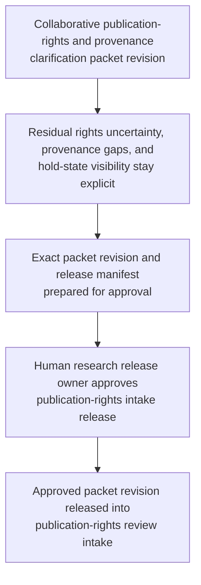
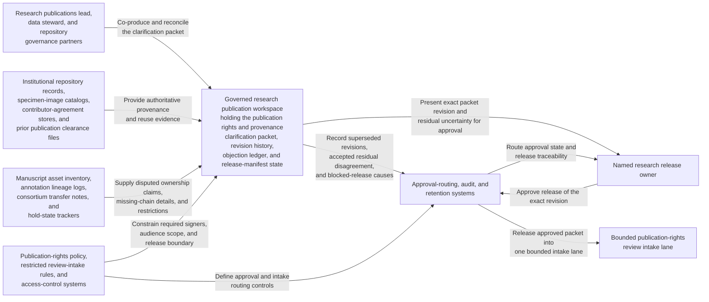

# Publication rights and provenance clarification packet approved for publication rights review intake

## Linked pattern(s)

- `approval-gated-collaborative-artifact-release`

## Domain

Research.

## Scenario summary

A research publications lead, a data steward, and repository governance partners are co-producing one governed publication rights and provenance clarification packet because a manuscript-ready supplement now relies on legacy specimen images, derived annotations, and consortium-provided reference tables whose reuse lineage is incomplete and partially contested. Agents help reconcile deposit records, contributor agreements, repository restrictions, hold-state notes, and approved provenance wording into the shared packet while preserving which rights questions remain unresolved and which residual uncertainties the human artifact owner accepted explicitly. The workflow ends only when the named research release owner approves that exact packet revision for one bounded publication rights review intake lane, where downstream reviewers may decide whether the asset set is ready for formal rights assessment or needs narrower provenance handling. It does not adjudicate publication rights, contact outside contributors, or authorize manuscript release.

## Target systems / source systems

- Governed research publication workspace holding the publication rights and provenance clarification packet, revision history, objection ledger, and release-manifest state
- Institutional repository records, specimen-image catalogs, contributor-agreement stores, and prior publication clearance files providing authoritative provenance and reuse evidence
- Manuscript asset inventory, annotation lineage logs, consortium transfer notes, and hold-state trackers supplying disputed ownership claims, missing-chain details, and unresolved restrictions
- Publication-rights policy, restricted review-intake rules, and access-control systems defining required signers, approved packet audience, and the one bounded intake lane
- Approval-routing, audit, and retention systems preserving superseded packet revisions, accepted residual disagreement, blocked-release causes, and downstream handoff traceability

## Why this instance matters

This grounds the pattern in research governance work focused on publication-rights and provenance control rather than claim support or human-subjects language review. The reusable challenge is collaborative ownership of one sensitive clarification artifact whose exact revision must be approved before it can cross into a bounded rights-review intake lane, while contested lineage gaps and hold states remain inspectable instead of being polished away. The example stays inside the pattern boundary because rights adjudication, contributor outreach, and publication release remain separate workflows.

## Likely architecture choices

- Approval-gated execution fits because the clarification packet can be collaboration-ready while still blocked from publication-rights intake until the human release owner approves the exact revision.
- Human-in-the-loop control is required because only accountable research leaders may accept residual provenance uncertainty, confirm audience scope, and authorize the packet's release boundary.
- Agents may crosswalk lineage records, refresh evidence links, and maintain the release trace, but they must not decide reuse eligibility, negotiate contributor rights, or release manuscript materials.

## Governance notes

- The release manifest should bind one exact packet revision, the named publication-rights review lane, signer identities, the included asset inventory, and any residual objections the human release owner accepted explicitly.
- Missing contributor agreements, disputed repository lineage, asset-level hold states, and consortium transfer caveats should remain visible in the packet or boundary ledger rather than being normalized away before release.
- Audience scope should stay limited to the approved publication-rights intake lane; reuse of the packet for author outreach, manuscript approval, or external disclosure should require separate downstream approval.
- If provenance evidence, rights restrictions, or the approved reviewer set changes materially during approval review, the workflow should hold release and supersede the prior packet revision rather than letting stale approval carry forward.

## Evaluation considerations

- Rate at which publication-rights intake accepts the released packet without discovering hidden lineage gaps, stale restriction evidence, or audience-boundary mistakes
- Time required to keep one collaborative clarification packet synchronized as asset inventories, repository notes, and signer state evolve
- Reliability of binding between the released artifact revision, accepted residual disagreement, asset-level hold visibility, and the bounded publication-rights review lane
- Frequency with which humans reject agent-assisted edits because they drifted into rights adjudication, contributor outreach, or manuscript-release execution
