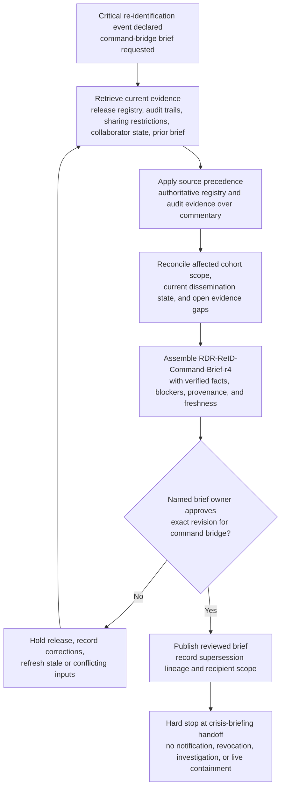

# Rare-disease registry re-identification command-bridge crisis briefing evidence synthesis

## Linked pattern(s)

- `crisis-briefing-evidence-synthesis`

## Domain

Research.

## Scenario summary

Research privacy leadership has already declared a critical registry re-identification event after disclosure-risk monitoring, access-audit review, and collaborator-handling checks show that one rare-disease cohort may now be linkable across restricted dataset exports, query activity, and draft external research materials. Before anyone recommends dataset suspension, collaborator contact, participant notification, IRB escalation, regulator outreach, root-cause investigation, or live containment action, the workflow must assemble one exact governed artifact: `RDR-ReID-Command-Brief-r4`. The brief has explicit prerequisites before synthesis begins: a declared critical-case scope, the current restricted command-bridge audience, the frozen affected cohort export manifest, the active consent-and-data-use restriction snapshot, the latest access-review roster, and prior brief lineage from `r3`. Source precedence must stay visible inside the brief: the authoritative restricted-release registry, query and download audit logs, approved disclosure-control configuration baselines, collaborator transfer manifests, and IRB-approved sharing restrictions outrank analyst notebooks, bridge chat, email summaries, or speculative study-team commentary. Visible blockers must remain open rather than being flattened into a confident narrative, including a stale collaborator receipt acknowledgment from the Zurich genomics partner, an unresolved mismatch between the query audit trail and export manifest for cohort shard `RD-17`, missing confirmation of whether a suppressed geography field appeared in a preprint supplement draft, and an incomplete consent-withdrawal roster refresh from one enrolling site. The workflow stops hard at reviewed crisis-brief handoff and supersession recording rather than notification, access revocation, publication intervention, causal investigation, or downstream execution.

## Target systems / source systems

- Restricted research command-bridge workspace where `RDR-ReID-Command-Brief-r4`, prior revisions, unresolved-question registers, approval acknowledgements, and supersession history are stored.
- Authoritative restricted-release registry, dataset export manifests, and transfer-approval records defining which cohort extracts, derived tables, and collaborator deliveries are in scope for the declared event.
- Query, download, workspace-access, and data-egress audit systems capturing the freshest inspectable evidence about who accessed the cohort, what filters or joins were run, and whether any governed export boundaries were crossed.
- IRB protocol repository, consent-version archive, data-use agreement ledger, and withdrawal registry showing active sharing restrictions, participant-level exclusion or revocation state, and audience constraints for the crisis brief.
- Disclosure-control baseline repository, publication-support workspace, and collaborator submission trackers recording suppression rules, approved cell-size controls, preprint annex state, and current external-material lineage.
- Prior command briefs, correction logs, and restricted annex references used to preserve continuity while the event picture changes quickly.

## Why this instance matters

This grounds the pattern in a research crisis where leadership needs one provenance-preserving privacy brief, not another disclosure-risk alert, approval packet, or publication recommendation. Rare-disease and other highly linkable cohorts can create severe ambiguity because release registries, query audits, collaborator manifests, consent restrictions, and publication materials often move on different clocks and carry different authority. The instance shows why crisis-briefing evidence synthesis matters after declaration: leaders need one inspectable, source-ranked situation picture with visible blockers before they decide how to handle participant protection, collaborator contact, or downstream governance escalation elsewhere.

## Likely architecture choices

- An orchestrated multi-agent workflow can separate release-registry retrieval, audit-log verification, consent-and-sharing-restriction assembly, collaborator-material status collection, and final command-brief composition while maintaining one shared crisis-state ledger.
- Human-in-the-loop review should remain mandatory for each command-bridge revision because affected-cohort scope, dissemination wording, and collaborator-status claims can materially influence downstream privacy, ethics, and publication decisions.
- The workflow should preserve claim-level provenance and freshness markers that distinguish authoritative release and audit evidence, approved governance constraints, and lower-authority bridge observations awaiting confirmation.
- Retrieval should stay inside approved registry, audit, IRB, disclosure-control, and collaborator-tracking systems, and the synthesis should stop at reviewer-approved brief handoff rather than recommending notification, access suspension, publication withdrawal, root-cause explanation, or operational containment steps.

## Governance notes

- The brief should keep source precedence explicit: restricted-release registry and immutable audit records outrank collaborator email summaries, local analysis notebooks, and bridge chat whenever the event picture conflicts.
- Dr. Leila Haddad, Director of Research Data Privacy Response, is the accountable human brief owner who must approve each command-bridge revision, reviewer scope, and supersession step before the artifact becomes the current crisis brief.
- Participant identifiers, rare-disease site names, collaborator-specific credential details, and quasi-identifier combinations should be minimized in the shared brief, with tightly controlled annex references used only for narrowly scoped privacy and ethics reviewers.
- Open blockers such as the stale Zurich acknowledgment, the `RD-17` audit-versus-manifest mismatch, uncertain preprint supplement field exposure, and incomplete withdrawal refresh must remain visible instead of being compressed into confident exposure or containment claims.
- The workflow must end at reviewed crisis-briefing handoff and evidence-gap visibility; participant outreach, collaborator suspension, IRB or regulator notification, publication action, causal investigation, and live access-control execution remain outside scope.

## Evaluation considerations

- Median time from declared re-identification event to reviewer-approved `RDR-ReID-Command-Brief-r4` with complete provenance, freshness, and supersession trace.
- Percentage of material cohort-scope, dissemination-state, collaborator-exposure, and governance-constraint statements backed by inspectable authoritative sources.
- Reviewer correction rate for source-precedence handling, stale evidence reuse, or blocker visibility across successive command-bridge brief revisions.
- Rate at which unresolved dissemination, withdrawal-state, or publication-material ambiguity is surfaced explicitly before downstream privacy, ethics, notification, or containment decisions are made.
