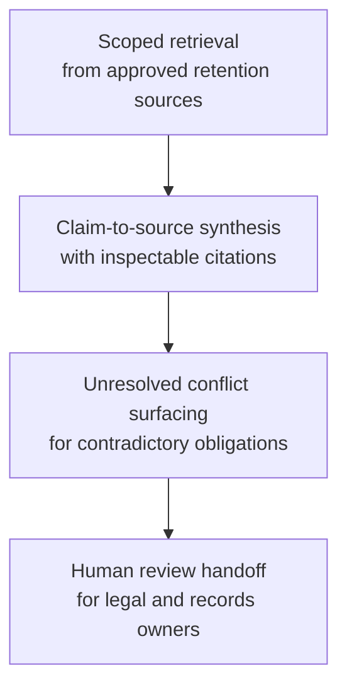

# Regulatory obligation synthesis for data retention review

## Linked pattern(s)

- `research-synthesis-with-citation-verification`

## Domain

Research with compliance-adjacent policy review.

## Scenario summary

A privacy and records-governance team is preparing an annual review of customer-data retention obligations across support transcripts, billing records, fraud-monitoring evidence, and security logs. The workflow needs a grounded synthesis of which retention periods are mandatory, which are policy choices, and where the source material is contradictory across jurisdictions or internal standards.

## Target systems / source systems

- Internal records-retention policy library
- Data inventory and system-of-record catalog
- Jurisdiction-specific regulatory text and regulator guidance
- Prior audit findings and control-testing evidence
- Legal interpretation memos and policy exception register

## Why this instance matters

This is a representative case where fluent summarization is not enough. The value comes from preserving claim-to-source traceability so legal, privacy, and records owners can inspect every material statement before changing retention schedules or approving disposal actions.

## Likely architecture choices

- A tool-using single agent handles scoped retrieval, note consolidation, and draft synthesis across approved corpora.
- Human-in-the-loop review stays mandatory for source-boundary decisions, interpretation of conflicting obligations, and sign-off on the final brief.
- The workflow maintains an evidence trace that maps each retention claim to the cited regulation, policy clause, or audit artifact.

## Governance notes

- Retrieval should stay inside an approved trust boundary that favors primary-source regulations, controlled internal policies, and durable audit artifacts.
- The synthesis should separate verified obligations, local policy choices, and unresolved interpretation questions instead of flattening them together.
- Citation gaps, stale guidance, and conflicting effective dates should block downstream use until a reviewer resolves them.
- Sensitive excerpts should be minimized so the review artifact does not copy more regulated or personal data than needed.

## Evaluation considerations

- Percentage of material retention claims backed by inspectable citations
- Reviewer correction rate for legal or policy interpretation
- Rate at which conflicting obligations are surfaced explicitly rather than omitted
- Usefulness of the open-questions section for closing policy gaps before schedule changes
