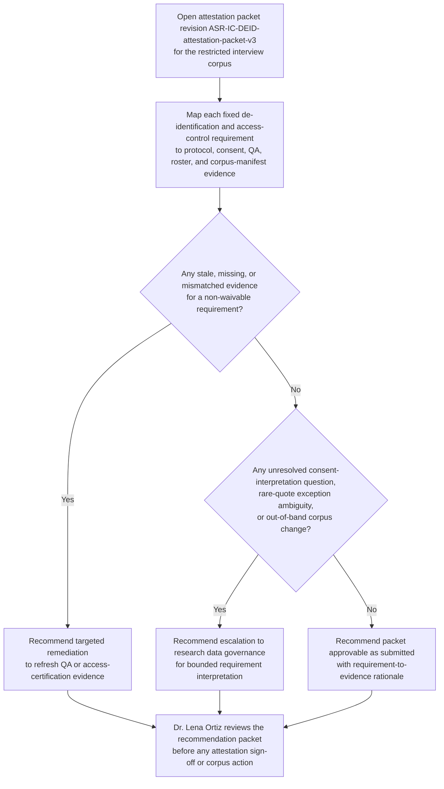
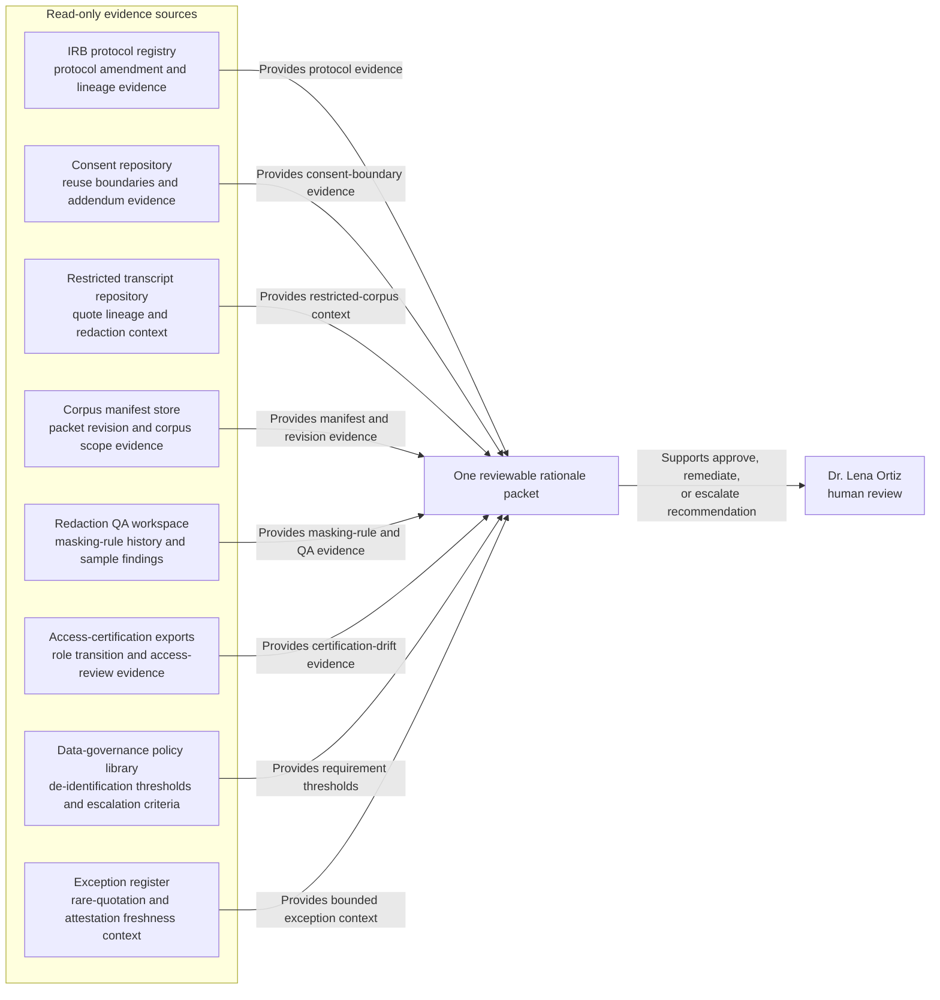

# Restricted interview-corpus de-identification control attestation recommendation

## Linked pattern(s)

- `control-requirement-attestation-recommendation`

## Domain

Research.

## Scenario summary

Dr. Lena Ortiz, the named Research Data Governance Lead for the Adolescent Sleep Resilience longitudinal study, is preparing the semiannual internal attestation for one inspectable governed artifact: `ASR-IC-DEID-attestation-packet-v3`, covering the restricted qualitative interview corpus used for approved secondary analysis. The prerequisite state is already fixed before review begins: IRB amendment `IRB-2025-041A` is active, consent addendum `C-17` governs reuse boundaries for newly transcribed family-history passages, and de-identification SOP `RDG-SOP-2025-06` plus transcript-redaction workspace release `2.4` are the current policy and product baselines. Source precedence is explicit inside the packet and must remain so in the recommendation: approved protocol and consent artifacts override research data-governance policy interpretations, those policy records override the curated transcript manifest and access-certification exports, and reviewer notes are advisory only when they conflict with the higher-order sources. Packet v3 supersedes v2 after a refreshed transcript manifest was attached, but visible unresolved items remain: one quote-level QA sample still uses pre-2.4 masking rules, one access-certification export predates a coordinator role transition, and it is still unclear whether the amended consent language permits retention of a small set of rare family-history quotations inside the restricted corpus. The workflow must recommend whether the attestation packet is supportable as submitted, needs targeted remediation, or should escalate for bounded interpretation before Dr. Ortiz signs the attestation or anyone alters corpus contents, access rights, or study registry records.

## Target systems / source systems

- IRB protocol registry and consent-document repository containing amendment `IRB-2025-041A`, consent addendum `C-17`, approval timestamps, and protocol-version lineage
- Restricted transcript repository and corpus manifest store holding the controlled interview set, redaction status, quote lineage, and packet revision `ASR-IC-DEID-attestation-packet-v3`
- Redaction QA workspace with sample-review logs, masking-rule version history, exception annotations, and the unresolved quote-level validation sample tied to workspace release `2.4`
- Research identity-governance and access-certification exports showing approved analyst roles, coordinator transitions, secondary-use permissions, and prior attestation outcomes
- Research data governance policy library and exception register defining de-identification thresholds, rare-quote handling limits, attestation freshness rules, and escalation criteria

## Why this instance matters

This grounds the pattern in research with a materially different attestation problem from engineering access controls or finance journal evidence. The core work is deciding whether a specific research-governance packet for a restricted human-subjects corpus actually satisfies fixed de-identification and reuse requirements, with explicit source precedence, revision lineage, and visible blockers that a human owner can inspect quickly. It stays inside the recommendation family boundary because the workflow does not rewrite consent language, approve secondary use, release excerpts, re-redact transcripts, or alter access permissions.

## Likely architecture choices

- A tool-using single agent can retrieve the exact packet revision, align requirement identifiers to protocol and consent sources, compare redaction QA evidence with the active `2.4` masking rules, and assemble one reviewable rationale packet for Dr. Ortiz.
- Human-in-the-loop review is required because the named owner must decide whether partial evidence is acceptable, whether the consent-language ambiguity stays within delegated interpretation bounds, or whether escalation is necessary.
- Read-only integration with protocol, transcript, QA, and access-governance systems is preferable so the workflow cannot mutate corpus contents, update approvals, certify access, or record the attestation automatically.

## Governance notes

- The recommendation should stay attached to one exact governed artifact revision, `ASR-IC-DEID-attestation-packet-v3`, while preserving lineage to v2 so reviewers can see what changed and which unresolved items remained open across revisions.
- Source precedence must remain explicit in the packet and any recommendation: approved protocol and consent records outrank internal policy interpretation, policy records outrank operational manifests and access exports, and analyst or reviewer notes cannot silently override the higher-precedence sources.
- Visible blockers should not be summarized away: the stale pre-2.4 QA sample, the coordinator-transition certification gap, and the unresolved rare-quotation consent question must each remain inspectable with direct evidence links.
- Interview excerpts, consent artifacts, analyst identities, and access records should remain visible only to authorized research governance, privacy, and study-operations reviewers under normal need-to-know and retention controls.
- The boundary between recommendation and action must stay explicit: signing the attestation, approving quote retention, changing redaction rules, updating corpus membership, or altering analyst access remains outside this workflow.

## Evaluation considerations

- Reviewer agreement with the recommended approve, remediate, or escalate posture without major corrections to source-precedence handling or requirement mapping
- Rate at which stale redaction QA, access-certification drift, or consent-scope ambiguity is surfaced before semiannual attestation sign-off
- Quality of traceability from each de-identification and restricted-reuse requirement to the exact protocol, consent, corpus-manifest, QA, and access-governance evidence used
- Stability of recommendations when protocol amendments, masking-rule versions, or roster state change during the review window
