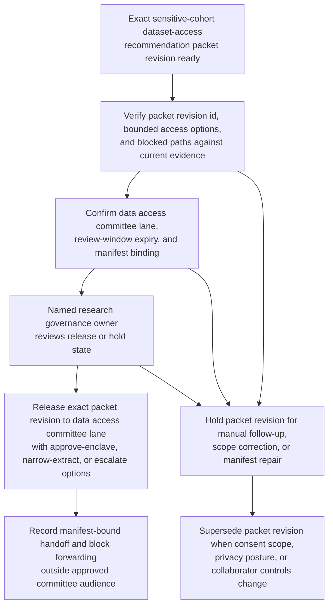

# Sensitive cohort dataset access recommendation packet revision approved for data access committee decision lane

## Linked pattern(s)

- `approval-gated-recommendation-release`

## Domain

Research.

## Scenario summary

A research data-governance workflow has already prepared one exact recommendation packet revision for an external collaborator's request to access a sensitive longitudinal cohort dataset. The packet narrows the bounded options to approve enclave-only access to the approved variable subset, narrow the request to synthetic or aggregate extracts pending stronger controls, or escalate to IRB and privacy review, and it keeps blocked paths such as direct row-level export or reuse outside the stated protocol explicit. Before that exact packet revision can enter the restricted data access committee decision lane, a named research governance owner must approve the committee scope, review-window expiry, and manifest binding so committee members receive the governed recommendation artifact rather than a stale or broadened copy. The workflow stops at governed release of that packet revision; it does not adjudicate the access request, provision the enclave, amend the protocol, or release any dataset.

## Target systems / source systems

- Data access recommendation workspace holding the current packet revision, bounded access options, blocked-path notes, and superseded drafts
- Protocol registry, consent constraint records, privacy-risk assessments, and collaborator security questionnaires already cited by the recommendation packet
- Research governance repository defining the named data access committee lane, approved recipients, review-window timing, and the human owner who may approve packet release
- Approval manifest and restricted-routing tooling that records the exact packet hash, committee audience, and any blocked forwarding attempts outside the approved lane
- Audit and supersession ledger used to hold older packet revisions when consent scope, de-identification posture, or collaborator controls change before committee review

## Why this instance matters

This grounds the pattern in research where the reusable governance problem is not generating a new access recommendation, but controlling release of one bounded recommendation artifact into one human decision lane. Sensitive dataset-access packets often change late as consent interpretations are clarified, privacy-risk reviewers tighten variable restrictions, or collaborator safeguards are updated, so approval must stay tied to one reviewed revision rather than to a vague permission to keep circulating access advice. The example keeps the family boundary clean by ending at data-access-committee handoff rather than access adjudication, enclave provisioning, protocol amendment, or downstream data sharing.

## Likely architecture choices

- Approval-gated execution fits because the recommendation packet remains held until a named research governance owner authorizes release into the data access committee decision lane.
- Human-in-the-loop review remains necessary because only accountable data-governance owners should confirm recipient scope, expiry timing, and blocked-access visibility without collapsing the workflow into access approval itself.
- A governed agent can verify packet hashes, assemble the release manifest, and block broadened distribution, but it should not approve dataset access, provision research infrastructure, or rewrite the recommendation.

## Governance notes

- Approval should bind to one immutable packet revision, one named data access committee lane, one bounded review window, and one exact access-option set so later edits cannot inherit release authority silently.
- Consent limitations, privacy caveats, collaborator-control gaps, and blocked row-level export paths should remain visible in the released packet rather than being flattened into a simple access-ready answer.
- If protocol scope, de-identification posture, collaborator security evidence, or committee audience changes during approval review, the pending packet should be held and superseded rather than routed under stale approval.
- Audit records should preserve the released packet id, option-set hash, approver identity, committee-recipient scope, expiry timing, and any blocked redistribution attempts.

## Evaluation considerations

- Percentage of data access committee releases where the packet revision id, bounded access-option set, and manifest metadata align exactly without later correction
- Rate at which superseded or stale dataset-access recommendation packets are blocked before committee review
- Time required to move from packet-ready status to approved bounded committee release when protocol, consent, and privacy evidence are complete
- Reviewer correction rate for missing blocked paths, wrong audience scope, or stale-state handling after the committee receives the released recommendation packet
