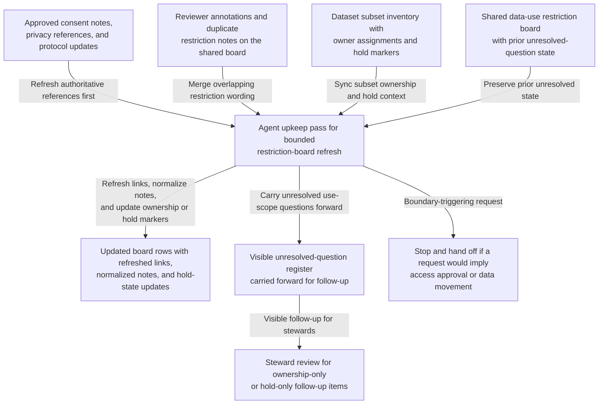

# Study-dataset data-use restriction board shared workbench upkeep

## Linked pattern(s)

- `shared-workbench-orchestration`

## Domain

Research for internal human-subjects data stewardship.

## Scenario summary

An internal research operations team maintains a shared data-use restriction board for a de-identified study dataset while principal investigators, privacy stewards, repository curators, and methods reviewers continuously refine what material may be reused in secondary internal analysis. Small updates arrive throughout the week: one steward links a revised consent-scope note, a curator flags a stale transcript-tag example, a reviewer adds a caveat that one coded excerpt set must stay inside a secure enclave, and a study lead reassigns ownership of an unresolved linkage-risk question. The agent keeps that bounded internal board usable by refreshing linked source references, normalizing duplicate restriction notes, updating subset ownership and hold markers, and carrying unresolved use-scope questions forward in a visible register. Humans remain responsible for deciding what the consent language actually permits, whether a restriction interpretation is correct, whether a dataset segment is safe for reuse, and when any material should move into separate approval, release, or execution workflows.

## Target systems / source systems

- Shared data-use restriction board with dataset-segment rows, owner fields, hold tags, and revision history
- Internal consent and study-governance repository containing approved protocol notes, participant-consent language, and privacy review references
- Dataset inventory or enclave-access register with subset identifiers, storage boundaries, steward assignments, and retention metadata
- Reviewer annotation surface where privacy stewards, methods leads, and repository curators add small caveats, source links, and handoff notes
- Secure research artifact catalog referenced by restriction-board rows for transcript subsets, codebooks, and approved derived extracts

## Why this instance matters

This grounds the pattern in a research-governance setting that is materially different from benchmark evidence upkeep because the maintained artifact is an internal restriction board rather than a performance matrix or comparative results workspace. The useful work is keeping one bounded governance workbench current and resumable as small consent, privacy, and stewardship updates arrive from several collaborators. That makes the workflow about internal artifact upkeep, provenance, and hold-state visibility rather than recommendation, release approval, or downstream dataset handling.

## Likely architecture choices

- Event-driven monitoring fits because upkeep should react when consent references, enclave metadata, reviewer notes, or board fields change.
- A tool-using single agent can refresh source links, normalize duplicate restriction wording, and keep ownership plus hold markers synchronized inside one bounded board.
- Human-in-the-loop review remains necessary when a note would reinterpret consent scope, clear a restriction that is still contested, or make the board sound like an approved reuse decision.
- Bounded delegation works because research governance owners can predefine allowable field updates, source boundaries, and hold conditions without delegating permissioning, release approval, or study execution.

## Governance notes

- The board should clearly separate approved source references, reviewer proposals, unresolved use-scope questions, and held restrictions so upkeep never implies that a reuse decision has already been made.
- Consent references, protocol identifiers, enclave-boundary metadata, and owner assignments should be revalidated before a row is marked current or a hold is cleared.
- The agent may normalize structure and merge overlapping notes, but it should not decide what consent language means, approve secondary use, or remove a restriction that a human steward accepted.
- If a requested update would authorize access, release dataset material, approve a publication use case, or trigger operational data movement, the workflow should stop and hand off to the appropriate adjacent pattern.

## Evaluation considerations

- Percentage of board refreshes that preserve correct consent links, subset identifiers, ownership fields, and unresolved-question state across repeated update cycles
- Reviewer correction rate for merged restriction notes, refreshed governance references, or automatically updated hold markers
- Rate at which interpretation-heavy or approval-adjacent edits are held for human review instead of being silently folded into the internal board
- Usefulness of the maintained workbench for helping privacy, stewardship, and methods reviewers resume dataset-governance work without reconstructing stale context by hand
