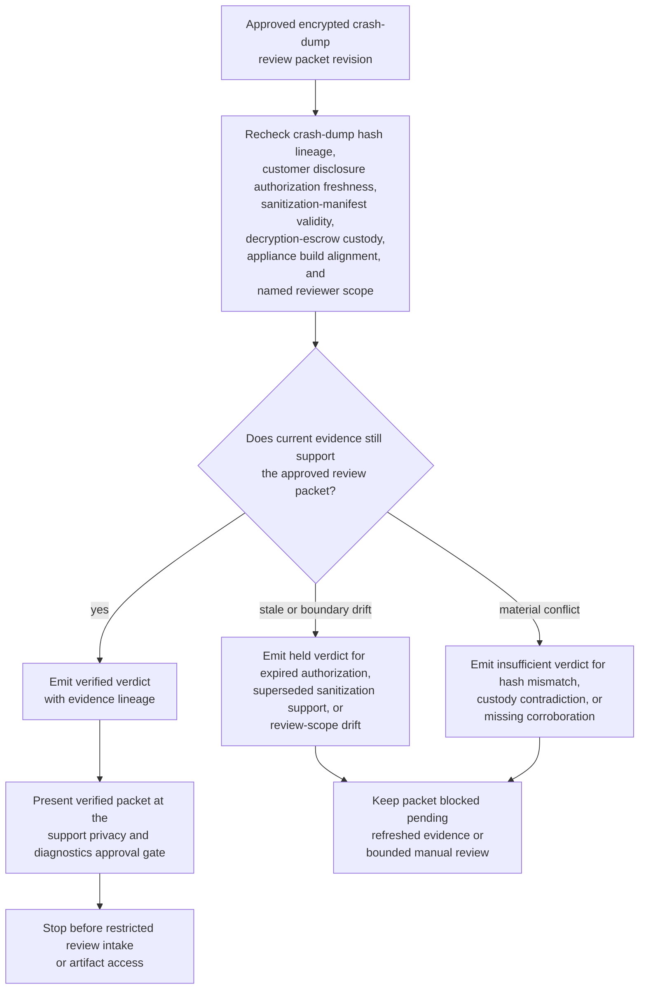
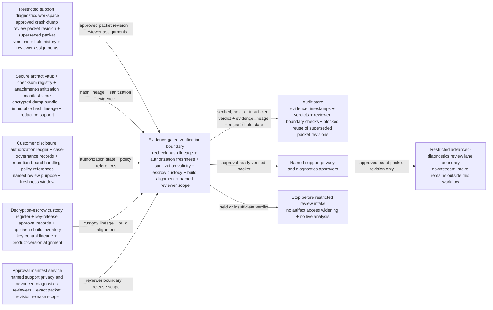

# Approved encrypted crash-dump review packet evidence gate verification

## Linked pattern(s)

- `evidence-gated-verification-for-release`

## Domain

Support.

## Scenario summary

A premium support diagnostics team already has one approved encrypted crash-dump review packet revision for a severe appliance kernel-panic case, but that exact packet cannot be released into the restricted advanced-diagnostics review lane until current evidence still supports human reliance on it. The workflow rechecks crash-dump hash lineage, customer disclosure authorization freshness, sanitization-manifest validity, decryption-escrow custody, appliance build alignment, and named reviewer scope against the approved packet revision, then emits a verified, held, or insufficient verdict with explicit evidence lineage and release-hold state for named support privacy and diagnostics approvers. It must not request new customer artifacts, widen artifact access, open the dump for live analysis, communicate with the customer, change entitlements, or execute remediation.

## Target systems / source systems

- Restricted support diagnostics workspace holding the approved crash-dump review packet revision, superseded packet versions, hold history, and reviewer assignments
- Secure artifact vault, checksum registry, and attachment-sanitization manifest store used to confirm the exact encrypted dump bundle, redaction support, and immutable hash lineage
- Customer disclosure authorization ledger, case-governance records, and retention-bound handling policy references defining whether the approved packet may still be used for the named review purpose
- Decryption-escrow custody register, key-release approval records, and appliance build inventory used to confirm key-control lineage and product-version alignment without opening the dump
- Approval manifest service recording which support privacy and advanced-diagnostics reviewers may release one exact packet revision into the restricted review lane
- Audit store preserving evidence timestamps, verified or held verdicts, reviewer-boundary checks, and blocked reuse of superseded packet revisions

## Why this instance matters

This grounds the pattern in support where the hard problem is not assembling a new escalation packet, deciding whether the kernel panic merits deeper investigation, or performing the restricted review itself. The hard problem is proving that one already approved crash-dump packet revision is still trustworthy for downstream human reliance when disclosure authorization windows, sanitization evidence, escrow custody, and build context can all drift after approval. The value is a bounded evidence gate that shows whether one exact packet revision remains sufficient for restricted advanced-diagnostics intake without drifting into packet repair, vendor escalation, customer communication, or live technical analysis.

## Likely architecture choices

- Approval-gated execution fits because the verification packet can be assembled automatically while restricted advanced-diagnostics intake remains concretely blocked until named support privacy and diagnostics approvers release that exact packet revision.
- Human-in-the-loop review should remain mandatory because privacy, support, and advanced-diagnostics owners must interpret held conditions before anyone relies on the packet for a consequential review handoff.
- Durable verification state should preserve superseded verdicts, repeated release holds, packet-version lineage, and escrow-custody changes so later reviewers can distinguish genuine evidence refresh from duplicate checks on a previously blocked revision.

## Governance notes

- The verification result should show packet revision lineage, crash-dump hashes, sanitization-manifest identifiers and timestamps, customer disclosure authorization state, decryption-escrow custody lineage, appliance build alignment, and the approved restricted reviewer boundary directly in the approval-ready packet.
- A packet should remain held whenever disclosure authorization falls outside the approved freshness window, the sanitization manifest cited by the packet is superseded, the requested downstream lane exceeds the named reviewer boundary, or appliance build identifiers no longer align with the approved packet context.
- A packet should be marked insufficient whenever one dump hash no longer matches the approved bundle, decryption-escrow custody records conflict materially, or one required corroborating source is missing for a restricted artifact class.
- Human approval is required before the verified packet is handed into restricted advanced-diagnostics review or used to justify downstream reliance by support privacy, escalation, or diagnostics teams.
- Any recommendation about likely root cause, any packet repair, any customer outreach, any vendor escalation, and any decryption or remediation action belongs in adjacent recommendation, reconciliation, collaboration, or execution workflows rather than this verification gate.

## Evaluation considerations

- Percentage of approved crash-dump review packets that receive a verdict with complete hash, sanitization, authorization, custody, and reviewer-boundary lineage
- Rate at which expired disclosure authorization, superseded sanitization evidence, reviewer-scope drift, or hash mismatch are caught before restricted reviewers rely on the packet
- Reviewer agreement that verified, held, and insufficient outcomes reflect the intended sufficiency rules for restricted-artifact freshness, custody integrity, and named review scope
- Reliability of repeated verification when replacement dump bundles, updated sanitization attestations, or reviewer-boundary changes arrive near the restricted intake window
