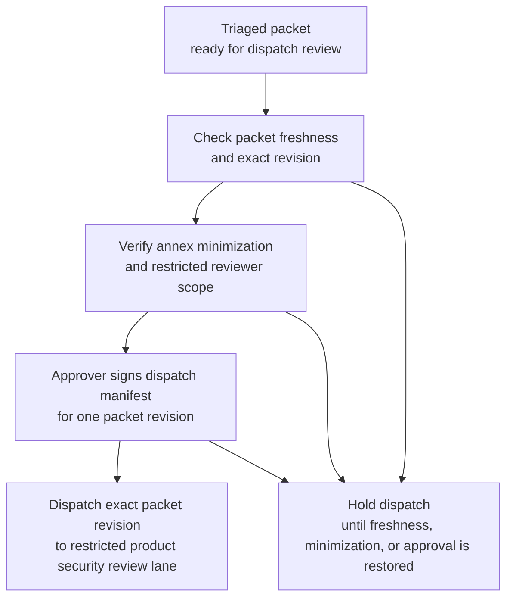

# Break-glass support session token replay triage packet approved for restricted product security review dispatch

## Linked pattern(s)

- `approval-gated-triage-dispatch`

## Domain

Support.

## Scenario summary

A support trust team already has one evidence-backed triage packet assembled for a suspected replay of a short-lived break-glass support session token used during a severe enterprise troubleshooting escalation. Earlier monitoring already correlated privileged-session broker logs, remote-support console events, tenant-boundary alerts, case chronology, identity-provider sign-in records, and one duplicate escalation from a regional duty manager into a single bounded packet with explicit unresolved uncertainty. The next step is not to decide whether the activity was malicious, notify the customer, recommend compensating controls, choose incident authority, open a collaborative investigation room, or trigger remediation; it is to decide whether that exact triaged packet revision may cross into the restricted product security review lane that handles privileged-support misuse. The workflow watches packet freshness, annex minimization, named reviewer scope, and human approval state, then releases the packet only when the dispatch manifest authorizes that one protected downstream queue for that one packet revision.

## Target systems / source systems

- Severe-support incident intake and triage systems holding the already-triaged packet, duplicate-lineage record, affected-case identifiers, unresolved caveat markers, and the predeclared restricted product security review destination
- Privileged support session broker, break-glass access ledger, remote-support console telemetry, and identity-provider audit systems supplying the authoritative token-issuance, session-use, operator, and sign-in references already cited in the packet for freshness and scope checks
- Tenant registry, entitlement, and support-account governance systems recording the bounded tenant-impact references, environment classification, and named-customer handling constraints used to confirm audience minimization before dispatch
- Restricted product security review queue and dispatch-manifest service used to release the exact packet revision into the protected downstream review lane without broadening access
- Approval-routing, audit, and hold-tracking systems preserving signer identity, blocked dispatch attempts, superseded packet revisions, reviewer-roster drift, manual overrides, and append-only release lineage

## Why this instance matters

This grounds `approval-gated-triage-dispatch` in a support-owned severe-case setting where the packet is already triaged and the remaining challenge is governed release into a restricted product security lane, not collaborative packet drafting or downstream security judgment. It is materially distinct from support collaboration-room examples because the workflow does not co-author the packet, reconcile objections live, or manage a shared investigation artifact; it only decides whether one already-bounded packet revision may cross a protected dispatch boundary. The instance keeps the family boundary clean because it owns freshness checks, audience minimization, visible hold state, dispatch manifests, and release lineage only, not renewed triage, customer communication, remedy recommendation, concession choice, authority selection, investigator collaboration, or downstream execution.

## Likely architecture choices

- Event-driven monitoring fits because privileged-session evidence freshness, duplicate merges, tenant-impact references, and reviewer-roster state can change while the already-triaged packet waits at the dispatch gate.
- Approval-gated execution fits because the packet is prepared for one restricted product security review lane but remains concretely blocked until the required support trust approver signs the manifest for that exact revision and lane boundary.
- Human-in-the-loop review should remain on the normal path because releasing a severe support packet into a restricted security lane changes who may inspect tenant and privileged-access context even though this workflow still stops short of deciding incident posture or response.
- The workflow should emit only the released queue entry, dispatch manifest, hold register, and audit trail rather than an incident classification, customer update plan, compensating-control recommendation, investigator workspace, or remediation handoff.

## Governance notes

- The manifest should bind approval to one exact triage packet revision, one restricted product security review queue identifier, one approved reviewer audience, and the tenant-scope boundary authorized for dispatch.
- Dispatch should remain held when privileged-session or identity references become stale, the packet is superseded by a newer duplicate-merge result, reviewer access would exceed the approved restricted audience, or tenant-identifying and privileged-path details have not been minimized to the lane's minimum necessary view.
- Broad queue views should minimize tenant names, operator identities, support case narrative detail, replayable token metadata, and privileged-path specifics while preserving traceable references in governed support and security systems.
- Support trust and product-security governance owners must approve changes to signer roles, reviewer-roster boundaries, minimization policy, freshness windows, and hold-release logic; this workflow ends before fresh triage, customer outreach, security investigation collaboration, compensating-control choice, authority assignment, or downstream remediation begins.

## Evaluation considerations

- Median time from packet readiness to approved restricted-lane dispatch or explicit placement into freshness, minimization, or audience-scope hold state
- Rate of wrong-version, wrong-audience, or over-broad tenant-scope corrections detected after dispatch approval
- Completeness of audit lineage connecting the released packet revision, cited privileged-session sources, signer approval, and the single downstream queue boundary
- Reliability of hold behavior when duplicate merges, reviewer-roster changes, or token and identity evidence freshness shifts during the approval window
