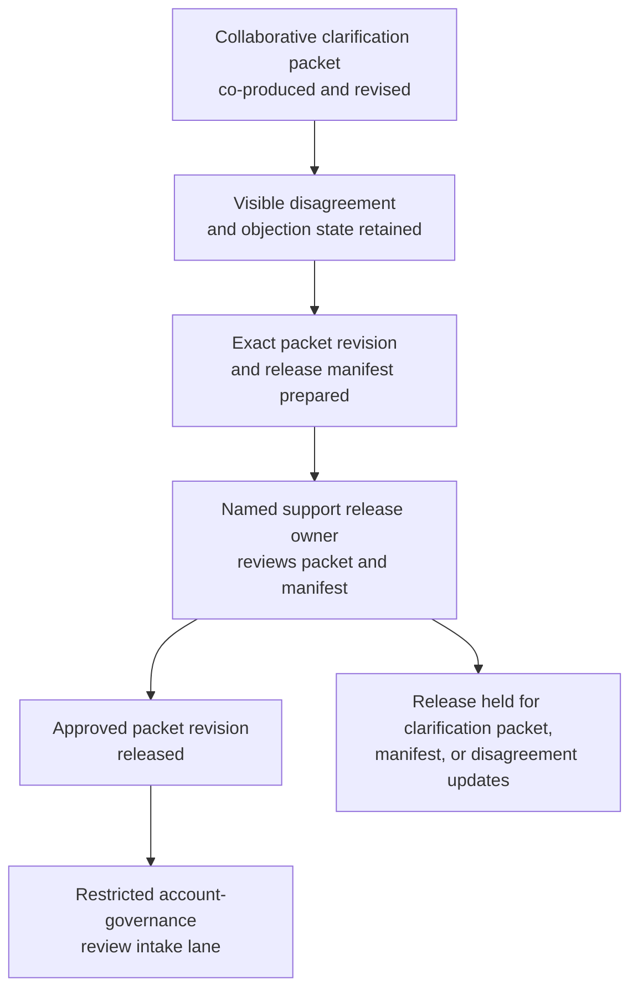

# Contractual service-credit calculation clarification packet approved for restricted account-governance review intake

## Linked pattern(s)

- `approval-gated-collaborative-artifact-release`

## Domain

Support.

## Scenario summary

A strategic support renewal manager, a billing-operations analyst, and an account-governance partner are co-producing one governed contractual service-credit calculation clarification packet because a customer has disputed how outage-duration windows, excluded maintenance intervals, entitlement caps, and overlapping ticket chronology should be interpreted before any internal account-governance reviewers look at the case. Agents help reconcile case timeline extracts, service-level obligation clauses, maintenance-window annotations, metering evidence, calculation worksheets, and unresolved reviewer objections into the shared packet while preserving which disagreements remain open, which evidence lineage is still contested, and which residual caveats the human artifact owner accepted explicitly. The workflow ends only when the named support release owner approves that exact packet revision for one bounded restricted account-governance review intake lane, where downstream reviewers may decide whether the clarification packet is sufficient for formal governance review or needs narrower scope and fresher support. It does not approve a credit, recommend a concession, contact the customer, change billing records, or execute remediation steps.

## Target systems / source systems

- Governed support collaboration workspace holding the contractual service-credit calculation clarification packet, revision history, objection ledger, and release-manifest state
- Case-management, uptime telemetry, maintenance-calendar, and entitlement systems providing incident chronology, excluded-window evidence, service-tier commitments, and prior exception history
- Contract clause library, service-credit policy references, and billing worksheet repositories supplying calculation logic, cap definitions, disputed clause interpretations, and spreadsheet lineage
- Restricted account-governance intake-routing and approval systems used to release one approved packet revision into the bounded internal review lane
- Audit, retention, and access-governance systems preserving superseded packet revisions, accepted residual objections, blocked-release reasons, and downstream handoff traceability

## Why this instance matters

This grounds the pattern in support through a governed calculation-clarification artifact rather than an outage disclosure packet or a forensic evidence packet. The reusable challenge is collaborative stewardship of one exact support artifact whose revision must be approved before it can cross into one restricted account-governance review lane, while visible disagreement about maintenance exclusions, outage-window boundaries, clause interpretation, worksheet freshness, and entitlement-cap treatment remains inspectable instead of being polished away. The example stays inside the pattern boundary because credit approval, concession strategy, customer communication, and billing action remain separate downstream workflows.

## Likely architecture choices

- Approval-gated execution fits because the clarification packet can be collaboration-ready while still blocked from restricted account-governance intake until the human release owner approves the exact revision with its accepted residual caveats.
- Human-in-the-loop control is required because only accountable support and account-governance owners may accept residual contractual ambiguity, confirm reviewer scope, and authorize the packet's release boundary without that approval being treated as a credit decision.
- Agents may reconcile ticket chronology, compare worksheet versions, refresh clause references, and maintain the release trace, but they must not decide whether a credit is owed, recommend concessions, or trigger billing changes.

## Governance notes

- The release manifest should bind one exact packet revision, the named restricted account-governance review-intake lane, signer identities, the covered service-period scope, and any residual objections the human release owner accepted explicitly.
- Conflicting views about excluded maintenance intervals, overlapping outage windows, entitlement-cap application, stale worksheet inputs, and unresolved clause-interpretation objections should remain visible in the packet or boundary ledger rather than being normalized into a single preferred calculation story before release.
- Audience scope should stay limited to the approved restricted review lane; reuse of the packet for customer communications, billing operations, concession approval forums, or executive account briefings should require separate downstream approval.
- If telemetry corrections, contract amendments, entitlement changes, or reviewer-scope shifts alter the calculation picture materially during approval review, the workflow should hold release and supersede the prior packet revision rather than carrying stale approval forward.

## Evaluation considerations

- Rate at which restricted account-governance intake accepts the released packet without discovering hidden calculation-scope drift, stale worksheet lineage, or audience-boundary mistakes
- Time required to keep one collaborative clarification packet synchronized as outage chronology, clause references, worksheet versions, and signer state evolve across support and billing-adjacent teams
- Reliability of binding between the released artifact revision, accepted residual disagreement, covered service-period scope, and the bounded restricted account-governance review intake lane
- Frequency with which humans reject agent-assisted edits because they drifted into concession recommendation, customer communication, billing execution, or downstream governance decisions
