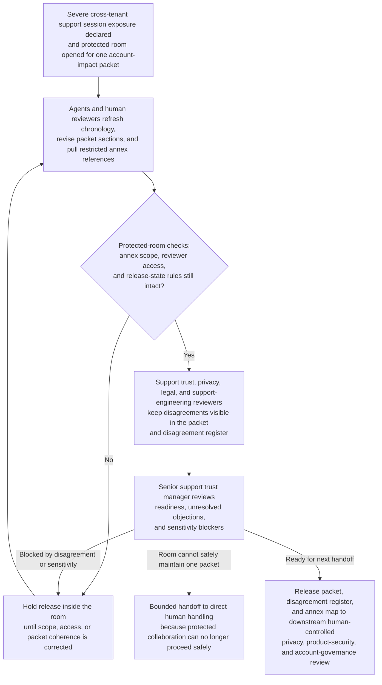

# Cross-tenant support session exposure protected account-impact packet collaboration room

## Linked pattern(s)

- `critical-protected-artifact-collaboration`

## Domain

Support.

## Scenario summary

After a severe cross-tenant support session exposure is declared, support trust opens a protected collaboration room around one account-impact packet that will later support bounded privacy, product-security, and account-governance review. A senior support trust manager owns the artifact while agents help reconcile remote-session chronology updates, privacy objections, legal wording disputes, support-engineering annotations, and restricted annex material about affected tenant identities, session replay references, and privileged-support access paths. The room remains centered on that one shared artifact: humans and agents jointly revise the packet, keep disagreement visible about exposure scope and evidence sufficiency, and preserve strict boundaries between the main packet and need-to-know annexes. The human artifact owner remains responsible for deciding whether the packet is ready for the next bounded handoff and whether unresolved disagreement or sensitivity still blocks release, while disclosure authority choice, customer communication, compensatory-offer planning, privileged-access changes, and downstream response execution stay outside the workflow.

## Target systems / source systems

- Restricted support-trust collaboration room with the main account-impact packet, disagreement register, annex map, and release-state controls
- Support case-management timelines, privileged-session tooling, remote-screen-share logs, and escalation notes containing chronology, operator actions, and current containment status
- Tenant registry, entitlement records, and account-governance repositories containing affected-account mappings, contractual handling constraints, and named-reviewer boundaries
- Restricted annex store holding tenant-identifying detail, session replay references, privileged-access-path notes, and draft sensitivity tables that cannot remain in the main packet
- Audit and access-control systems logging packet revisions, annex retrievals, release approvals, reviewer-scope changes, and manual overrides

## Why this instance matters

This grounds the pattern in a support severe-case setting where the reusable shape is protected co-authoring of one sensitive account-impact artifact, not deciding disclosure posture or executing customer handling. The packet must stay honest about conflicting interpretations of what was exposed, which tenants were affected, and whether available session evidence is sufficient, while tightly controlling tenant-identifying and access-sensitive annex material. It shows why the family boundary matters: the workflow ends with a human-owned packet handoff, not with customer notification, compensatory offers, privileged-access revocation, or operational remediation.

## Likely architecture choices

- Human-in-the-loop collaboration should remain primary because only accountable support-trust, privacy, and legal owners can accept disputed exposure language, narrow annex exposure, and release the packet into the next critical review lane.
- An orchestrated multi-agent setup fits when separate agent roles refresh chronology evidence, normalize reviewer objections, maintain annex boundaries, and preserve the protected trace across successive revisions.
- Agents may draft revisions, reconcile evidence references, and maintain readiness state, but selecting disclosure authorities, contacting affected customers, changing support-access privileges, or initiating remediation work should remain outside the room and explicitly human-controlled.

## Governance notes

- The packet should distinguish verified chronology, disputed exposure interpretation, restricted tenant-identifying or access-sensitive detail, and accepted residual disagreement so downstream reviewers can see exactly what remains unsettled.
- Every material statement about affected-tenant scope, session visibility, privileged-path use, contractual exposure, or review readiness should link to inspectable evidence or remain labeled as contested.
- Full tenant identifiers, session replay clips, privileged tooling references, draft customer-impact tallies, and any access-path detail that exceeds the main audience need should stay in annexes with tightly logged access and explicit promotion controls.
- The readiness record should name the human artifact owner, unresolved blockers, accepted residual disagreement, and the downstream boundary between the room and formal privacy, product-security, or account-governance review workflows.
- If the room can no longer maintain one coherent packet because scope evidence changes too quickly or reviewer-scope controls become unsafe, the workflow should hold release and escalate for direct human handling rather than smoothing over conflict or broadening access.

## Evaluation considerations

- Time to maintain a protected account-impact packet that keeps disagreement visibility, annex discipline, and human release ownership intact as session evidence changes
- Rate at which downstream privacy, product-security, or account-governance reviewers find hidden objections, stale chronology, or over-broad annex exposure after the room signals handoff readiness
- Reliability of the disagreement register and annex map as scope estimates, reviewer positions, and restricted evidence references continue to shift
- Frequency with which humans reject agent-assisted revisions because they drifted into disclosure recommendation, customer communication planning, privilege-change direction, or downstream response execution
