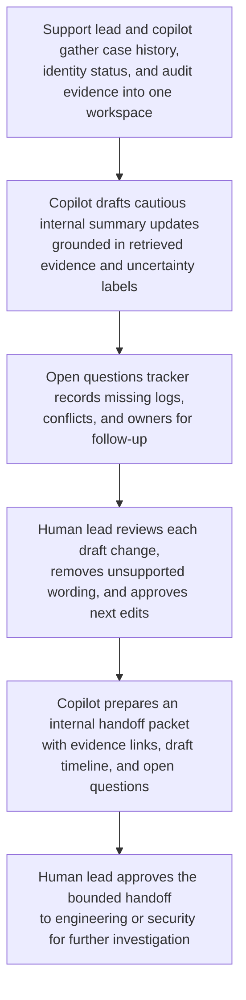

# Deprovisioned contractor access escalation copilot loop

## Linked pattern(s)

- `analyst-copilot-loop`

## Domain

Support.

## Scenario summary

A support lead is handling a sensitive enterprise escalation after a customer reports that a recently deprovisioned contractor may still have been able to view historical support attachments containing invoice backups and configuration exports. The lead uses a copilot inside the case workspace to iteratively summarize ticket history, compare account-state evidence from identity and audit systems, rewrite customer-facing updates in a careful tone, and prepare an engineering-and-security handoff, while the human lead remains responsible for interpreting the evidence, deciding what can be said externally, and approving the final next-step message.

## Target systems / source systems

- Support case workspace with prior ticket history, severity notes, and executive-escalation timeline
- Identity provider and product access logs showing contractor deactivation status and session history
- Attachment storage audit trail for download, preview, and retention events
- Internal knowledge base articles for account deprovisioning behavior and known edge cases
- Engineering incident channel or escalation queue for product investigation and remediation ownership

## Why this instance matters

This grounds the collaboration pattern in support work where the hard part is not only diagnosis, but maintaining a disciplined shared loop between evidence gathering, cautious customer communication, and explicit handoff ownership. A polished but weakly governed draft could overstate root cause, understate exposure, or leave engineering and security without a usable escalation packet, so the instance highlights why visible turns and human responsibility matter.

## Likely architecture choices

- Human-in-the-loop collaboration should remain the default because customer-facing language, exposure interpretation, and escalation scope all require an accountable support lead.
- A tool-using single agent can retrieve ticket history, pull relevant log excerpts, maintain an open-questions list, and propose revised message drafts inside one shared workbench.
- Write access to outbound email, status-page tooling, or customer account settings should stay human-gated so the copilot cannot independently send updates or make containment claims.

## Governance notes

- Customer updates should clearly distinguish confirmed facts, still-unverified hypotheses, and the owner of each next investigation step.
- The shared artifact should preserve which statements were agent-drafted versus human-approved so later review can reconstruct how the escalation narrative evolved.
- Sensitive attachment names, invoice details, and identity records should be minimized in the copilot context unless they are necessary for diagnosis or the downstream handoff.
- If the evidence suggests possible unauthorized data access, the workflow should force escalation into the formal security process rather than letting the support loop continue as routine case handling.

## Evaluation considerations

- Time from escalation intake to a human-approved customer update that is evidence-grounded and non-speculative
- Quality of the engineering or security handoff, including whether open questions, reproduced facts, and requested next actions are explicit
- Frequency of customer-facing drafts that require major human correction because the copilot overstated certainty or missed responsibility boundaries
- Reviewer ability to reconstruct the collaboration trace and confirm that sensitive claims were human-approved before external communication
