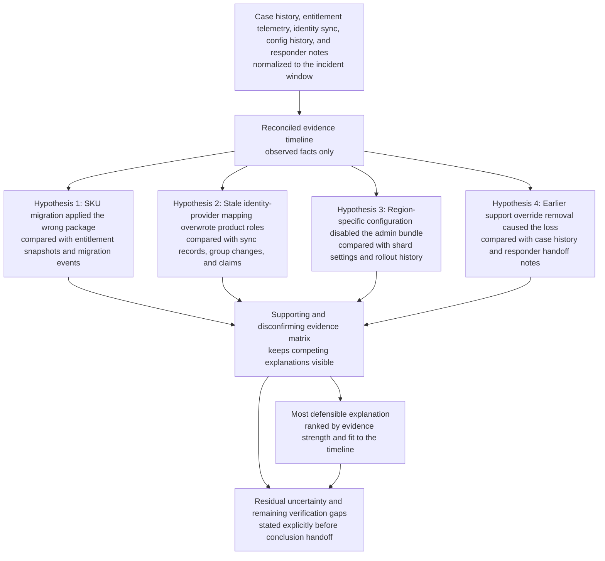

# Enterprise admin entitlement drift root-cause investigation

## Linked pattern(s)

- `incident-root-cause-analysis`

## Domain

Support.

## Scenario summary

After initial triage has already confirmed a customer-impacting access issue, an enterprise support investigation team must determine why several tenant administrators suddenly lost access to audit exports, billing controls, and user-management actions during a contract-renewal week. The plausible causes conflict: an entitlement sync may have applied the wrong package after a SKU migration, a stale identity-provider group mapping may have overwritten product roles, a region-specific configuration flag may have disabled the admin bundle for one shard, or a responder may have removed a temporary override during an earlier support case without recognizing its downstream impact. The workflow reconciles case history, product telemetry, entitlement snapshots, audit evidence, and responder notes into a defensible explanation of what failed, what remains uncertain, and which checks still need human follow-through before anyone promises remediation, declares a security incident, or sends a customer-facing root-cause statement.

## Target systems / source systems

- Support case history, escalation notes, prior workaround records, and severity timeline for the affected tenant
- Entitlement service logs, plan-migration events, package snapshots, and role-resolution telemetry for the incident window
- Identity-provider sync records, SCIM or group-mapping changes, session claims, and admin-authentication audit logs
- Product configuration history, feature-flag rollout records, and shard-specific admin-capability settings
- Internal responder bridge notes, shift handoff comments, and engineering investigation updates linked to the escalation

## Why this instance matters

This grounds `incident-root-cause-analysis` in support work where the hard problem starts after triage, when the team must explain a real customer-impacting mismatch rather than merely route it. Enterprise access escalations often blend subscription state, identity synchronization, product configuration, and human case handling, so the first plausible explanation can be wrong in ways that worsen trust or trigger the wrong remediation. The instance keeps the family boundary clear by centering evidence-backed investigation and competing hypotheses, while leaving customer messaging, security declarations, and irreversible entitlement changes under accountable human control.

## Likely architecture choices

- An orchestrated multi-agent flow can separate case-history retrieval, entitlement timeline reconstruction, identity-audit reconciliation, and hypothesis verification while preserving one shared investigation record.
- Shared case memory should retain competing explanations, confirming and disconfirming evidence, timestamp normalization choices, and open questions across support, identity, and product handoffs.
- Human-in-the-loop review remains necessary before declaring the primary cause, treating the issue as unauthorized access or mere configuration drift, or approving any corrective entitlement or role-restoration action.

## Governance notes

- Evidence should remain linked to the original case, audit, entitlement, and configuration records so reviewers can inspect the exact source behind each causal claim.
- The workflow should distinguish observed access loss from inferred compromise; ambiguous admin-session activity or missing role assignments should not automatically become a security declaration.
- Remediation promises, customer-facing root-cause language, permanent role changes, retroactive data-exposure statements, and compensatory actions must remain human-approved.
- Sensitive tenant metadata, user identifiers, and admin audit details should be minimized in broad investigation summaries while remaining available in restricted evidence views.
- If competing hypotheses remain unresolved, the workflow should surface that uncertainty explicitly instead of forcing a single explanation to accelerate closure.

## Evaluation considerations

- Time to first defensible hypothesis set with cited case, entitlement, identity, and configuration evidence
- Completeness of the reconciled timeline across contract migration, identity sync, configuration changes, support interventions, and customer-reported impact
- Agreement between the workflow's ranked explanations and the final support- and engineering-accepted root cause
- Rate at which unresolved ambiguity, possible security implications, or evidence gaps are surfaced before customer communication or corrective access changes are approved
