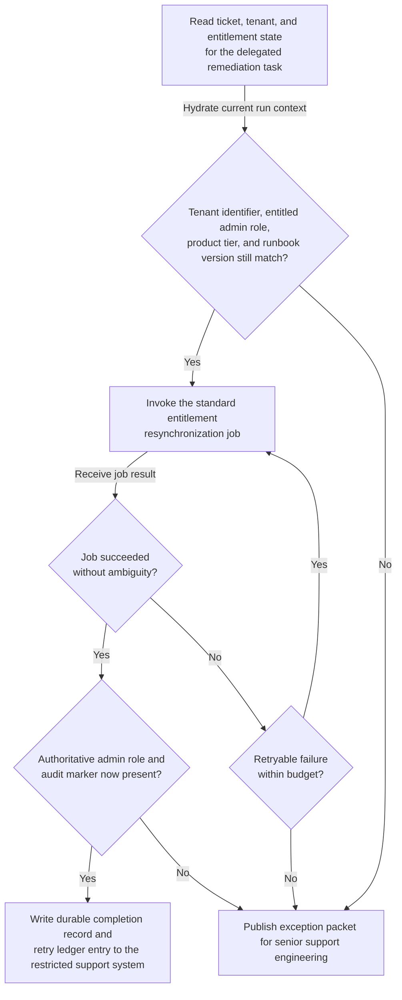

# Enterprise admin entitlement resynchronization runbook execution

## Linked pattern(s)

- `exception-aware-task-execution`

## Domain

Support.

## Scenario summary

A restricted enterprise support operations queue receives a prequalified entitlement-remediation task for a tenant whose designated customer administrators lost the expected admin role after a known identity-sync drift event. The workflow is limited to delegated routine completion under an approved runbook: re-read the ticket, tenant, and entitlement state; confirm the tenant identifier, entitled admin role, approved product tier, and runbook version still match; invoke the standard entitlement resynchronization job; retry bounded transient failures up to the documented limit; verify that the target admin role and audit marker are now present in the authoritative account state; and write one durable completion record plus one retry ledger entry back to the restricted support task system. If the current tenant state conflicts with the runbook prerequisites, the role mapping implies a pricing or contract interpretation question, the sync job returns an ambiguous partial result, or the bounded retries are exhausted, the workflow must stop and publish an exception packet for senior support engineering instead of improvising a broader entitlement change, customer communication, or discretionary access redesign.

## Target systems / source systems

- Restricted enterprise support task queue and case record holding the delegated remediation request, approved runbook identifier, and current retry budget
- Tenant master record, entitlement ledger, and role-assignment service that expose the authoritative current admin-role state
- Provisioning or identity-sync job runner used to execute the standard entitlement resynchronization step and return retryable or terminal status
- Audit store for checkpoint state, verification evidence, retry counts, completion records, and exception packets
- Internal support escalation channel or responder queue that receives out-of-policy or ambiguous remediation cases for human takeover

## Why this instance matters

This grounds the pattern in support work where the valuable automation is not customer messaging, policy interpretation, or one-off entitlement judgment. The recurring need is to carry a known safe remediation runbook through completion across multiple internal systems while preserving checkpoints, retry history, and explicit verification of the final account state. The example shows why execute-family delegated routine completion needs bounded retries and exception-only escalation: support teams want the common resynchronization fix completed quickly, but any contract mismatch, ambiguous identity state, or off-runbook entitlement branch must halt immediately for human review.

## Likely architecture choices

- An orchestrated execution flow can separate task intake, state hydration, remediation execution, verification, and escalation packaging while keeping one authoritative checkpoint ledger for the task.
- Durable workflow state should record the current checkpoint, retry count, last sync-job result, and final verified entitlement state so duplicate events or interrupted runs can resume safely.
- Verification should re-read authoritative role-assignment state after each consequential action rather than trusting the sync job response alone.
- Human takeover should trigger automatically when retries are exhausted, the tenant or role mapping no longer matches the runbook prerequisites, or the next step would require contract interpretation, customer communication, or discretionary privilege redesign.

## Governance notes

- The workflow should copy only the tenant identifiers, role-assignment fields, runbook version, retry state, and evidence needed for execution and escalation, not full customer correspondence or unrelated account metadata.
- Audit traces should record each checkpoint transition, sync-job invocation, retry reason, post-action verification result, and the exact condition that caused any escalation.
- Every automated action should be idempotent or guarded by checkpoint checks so a resumed run does not apply the same entitlement repair twice after a partial success.
- The automation must not alter subscription tier, grant a broader role than the runbook specifies, interpret contract language, contact the customer, redesign entitlement policy, or continue after ambiguous verification.

## Evaluation considerations

- Percentage of in-scope enterprise admin entitlement resynchronization tasks completed without manual intervention beyond documented exception checkpoints
- Rate of contract-tier mismatches, stale tenant mappings, ambiguous sync-job results, or exhausted retries detected before an incorrect entitlement change is recorded as complete
- Completeness of retry ledgers and exception packets handed to senior support engineering when the routine runbook cannot finish safely
- Reliability of replay-safe recovery when a transient provisioning failure occurs after one checkpoint has been written but before final verification succeeds
