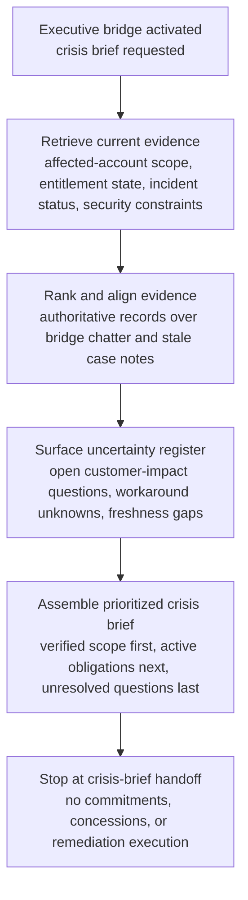
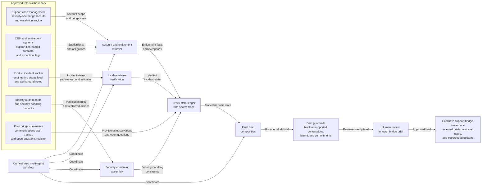

# Enterprise admin lockout executive bridge crisis briefing evidence synthesis

## Linked pattern(s)

- `crisis-briefing-evidence-synthesis`

## Domain

Support.

## Scenario summary

Support leadership has already activated an executive bridge after a widespread enterprise admin lockout leaves multiple premium customers unable to recover tenant access. Before anyone promises workaround timelines, approves customer communications, offers concessions, or coordinates downstream remediation, the workflow needs one grounded crisis brief that merges verified affected-account scope, active entitlement and escalation obligations, product-incident status, security-handling constraints, known workaround availability, and unresolved customer-impact questions. The useful output is a provenance-preserving support crisis brief that distinguishes binding account facts and active incident state from anecdotal bridge chatter or stale case commentary so human leaders can manage a severe customer event from one inspectable narrative.

## Target systems / source systems

- Executive support bridge workspace where reviewed briefs, restricted notes, and superseded updates are stored
- Premium-support case management system, severity-one bridge records, and account-escalation tracker
- CRM and entitlement systems showing active support tier, named contacts, contractual escalation commitments, and prior exception flags
- Product incident tracker, engineering status feed, and workaround validation notes shared for incident coordination
- Identity and access audit records plus approved security-handling runbooks governing customer verification and restricted actions
- Prior executive bridge summaries, communications draft tracker, and open-questions register for continuity across updates

## Why this instance matters

This grounds the pattern in a support crisis where leadership needs a high-confidence shared situation brief before they choose how to communicate or prioritize downstream actions. Severe customer events often blend product incident data, entitlement obligations, account-specific exceptions, and security constraints that sit in different systems and do not update at the same pace. The instance shows why critical-risk gather/synthesize work should stay distinct from recommendation or execution: the immediate need is evidence-backed context compression with clear provenance and uncertainty boundaries.

## Likely architecture choices

- An orchestrated multi-agent workflow can separate account and entitlement retrieval, incident-status verification, security-constraint assembly, and final brief composition while maintaining one crisis-state ledger.
- Human-in-the-loop review should remain mandatory for each executive bridge brief because customer-impact wording, workaround readiness, and contractual obligations can materially influence downstream communication and commercial decisions.
- The workflow should preserve a trace that distinguishes executed entitlement facts, approved account exceptions, verified product-incident status, and provisional bridge observations awaiting confirmation.
- Retrieval should stay inside approved support, product, security, and account-management systems; unsupported concessions, blame assignment, or workaround commitments should be blocked from the brief itself.

## Governance notes

- Executed entitlement records, approved exception registers, and incident-commander or security-owner updates should outrank copied case comments, sales notes, or informal bridge speculation when sources disagree.
- Customer-identifying details, security-sensitive recovery steps, and privileged access information should be minimized in shared summaries, with restricted annexes used only for tightly scoped reviewers.
- Each briefing revision should show which customer-impact or workaround statements changed since the prior brief so executives do not rely on stale assumptions during a fast-moving bridge.
- Open questions such as incomplete tenant verification, uncertain workaround efficacy, or unresolved exception coverage should remain explicit instead of being flattened into confident customer-status claims.

## Evaluation considerations

- Median time from executive bridge activation to reviewer-approved support crisis brief with complete provenance and freshness trace
- Percentage of material account-impact, entitlement, incident-status, and workaround-availability statements backed by inspectable source references and timestamps
- Reviewer correction rate for source-precedence, customer-scope, or stale-case-comment handling across successive executive bridge briefs
- Rate at which unresolved customer-impact or entitlement ambiguities are surfaced explicitly before downstream communication, concession, or remediation decisions
