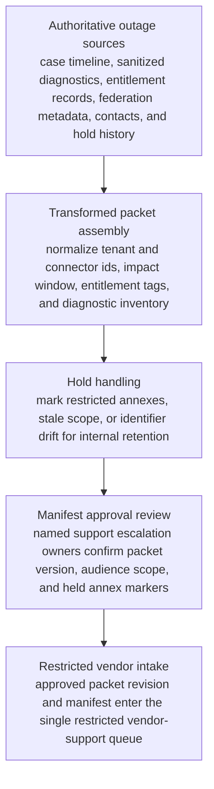
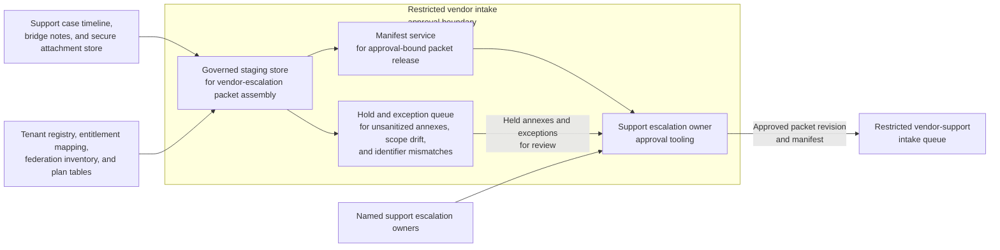

# Enterprise identity outage vendor escalation packet approved for restricted vendor intake

## Linked pattern(s)

- `approval-gated-transformation-release`

## Domain

Support.

## Scenario summary

A premium support escalation team is preparing one exact vendor-escalation intake packet revision for an enterprise identity-federation outage that appears tied to an upstream signing-service fault. The authoritative source state spans the customer case timeline, sanitized HAR and trace summaries, tenant entitlement records, affected federation metadata, approved contact roster, prior vendor-ticket references, and packet hold history for restricted attachments that cannot leave the internal workspace yet. The downstream restricted lane expects one transformed packet with normalized tenant and connector identifiers, impact-window fields, entitlement tags, diagnostic inventory, held-annex markers, and an approval manifest authorizing handoff into that single vendor-support intake queue. The workflow must stop once that exact packet revision is approved for intake, without recommending credits, negotiating vendor priority, communicating externally beyond the bounded intake handoff, or executing any live remediation steps.

## Target systems / source systems

- Enterprise support case-management timeline, bridge notes, and secure attachment store holding the outage chronology and approved diagnostic artifacts
- Tenant registry, entitlement mapping, federation configuration inventory, and vendor-support plan tables used to normalize packet identifiers and scope
- Governed staging store and manifest service that assemble the vendor-escalation intake packet, preserve lineage, and record held annexes that remain internal
- Approval tooling used by named support escalation owners to sign the exact packet version, audience scope, and restricted vendor-intake boundary
- Hold and exception queue for unsanitized attachments, stale entitlement scope, connector-identifier drift, or audience-scope mismatches before any vendor-support workflow receives the packet

## Why this instance matters

This grounds the pattern in support work where the important output is one downstream-ready transformed vendor-intake packet revision rather than an escalation recommendation, a collaborative disclosure draft, or a live incident action. Support teams often need to reshape messy outage evidence into the exact intake structure a restricted vendor lane can accept while keeping blocked attachments and uncertain mappings visible instead of smoothing them into a complete-looking submission. The instance shows how approval-gated transformation release stays in-family when it centers on packet assembly, hold state, lineage, and manifest-bound handoff rather than vendor negotiation, customer communication, or remediation execution.

## Likely architecture choices

- Approval-gated execution fits because the vendor-escalation packet may be technically complete for one restricted intake lane while remaining blocked until a named support escalation owner approves the exact version and audience scope in the manifest.
- Human-in-the-loop governance is required because accountable support reviewers must confirm privacy-safe diagnostics, held annexes, and the single downstream intake boundary before release.
- The workflow should emit only the transformed vendor-escalation packet, transformation trace, hold register, and approval manifest rather than a severity recommendation, commercial concession proposal, vendor-priority request, customer update, or remediation command.
- Approved reference data may normalize tenant ids, connector classes, vendor product codes, and support-plan labels, but unsupported inference about root cause, contract entitlement exceptions, or likely fix timing should force a hold.

## Governance notes

- Every consequential field, especially tenant identity, affected connector scope, outage window, entitlement tier, diagnostic attachment inventory, and vendor-intake lane scope, should retain lineage to authoritative source records and the exact packet version approved for intake.
- The manifest should bind one exact packet revision, one restricted vendor-support intake lane, signer identities, privacy scope, and any held annexes so downstream vendor-handling teams cannot inherit stale or broader approval.
- The workflow should hold release when a diagnostic artifact lacks sanitization lineage, entitlement scope changed after packet assembly began, the packet exposes internal-only notes beyond the approved audience, or connector identifiers no longer match the authoritative federation inventory.
- Support governance owners must approve packet-schema changes, audience-scope rules, and hold-release criteria; the workflow ends before vendor adjudication, customer disclosure, commercial remedy decisions, or live operational action.

## Evaluation considerations

- Percentage of approved vendor-escalation packets accepted by the restricted vendor-intake lane without manual packet rebuilding or reopening internal case systems
- Rate of post-approval corrections caused by packet-version drift, hidden held annexes, or audience-scope mismatches
- Completeness of manifest binding between the approved packet revision, signer set, held diagnostics, and the single restricted intake boundary
- Reliability of supersession behavior when updated traces arrive late, one held sanitization issue is cleared during approval review, or entitlement scope changes before the vendor intake is consumed
