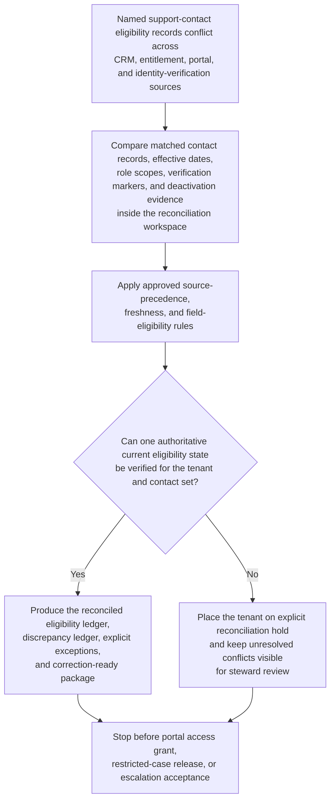
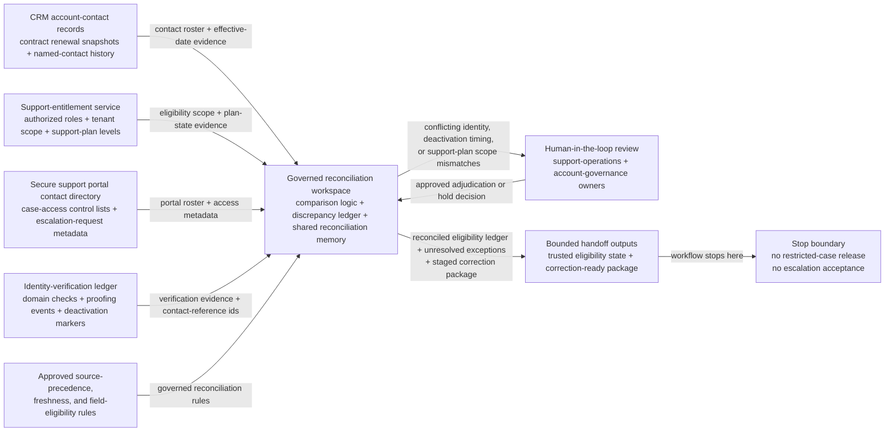

# Enterprise named support-contact eligibility authoritative record reconciliation

## Linked pattern(s)

- `authoritative-record-reconciliation`

## Domain

Support.

## Scenario summary

After a contract renewal, security-admin turnover, and a delayed CRM-to-portal sync, enterprise support operations discovers that the current named support-contact roster for several strategic tenants no longer agrees across the CRM account-contact register, the support-entitlement service, the secure support portal contact directory, and the identity-verification ledger used for restricted case access. One source shows a newly added security lead as an active authorized contact for severity escalations with a recent domain-verification timestamp, another still treats a departed operations manager as the only named contact eligible for restricted attachments, and the portal roster matches the new contact's email but not the support-plan scope or effective date now reflected in the entitlement service. Before any restricted case detail is released, any severity escalation is accepted from the new contact, or any team decides whether the drift came from contract amendment timing, stale synchronization, or admin error, the workflow must restore one trusted current support-contact eligibility state for each affected tenant, keep unresolved conflicts visible, and hand off a correction-ready package for controlled record repair.

## Target systems / source systems

- CRM account-contact records, contract renewal snapshots, support-plan mappings, and named-contact effective-date history
- Support-entitlement service records defining which contact roles, tenant scopes, and support-plan levels are currently authorized for restricted support interactions
- Secure support portal contact directory, case-access control lists, and escalation-request metadata tied to tenant-approved contacts
- Identity-verification ledger holding verified email-domain checks, administrator proofing events, deactivation markers, and immutable contact-reference ids
- Reconciliation workspace tooling used to preserve field-level discrepancy ledgers, unresolved eligibility exceptions, and reversible correction packages

## Why this instance matters

This grounds the pattern in a support workflow where the urgent problem is not deciding whether a contact should receive a concession, whether a severity escalation is justified, or why the records drifted, but restoring one defensible authoritative eligibility record before support teams rely on contradictory contact state. Named-contact eligibility often spans CRM ownership, contract-bound support entitlements, portal-access rosters, and identity-proofing controls, so a superficially updated contact record can still be unsafe when role authority, tenant scope, or effective-date lineage does not align across systems. The instance stays in this family because it centers on authoritative-state restoration, discrepancy visibility, and correction-ready handoff rather than customer communication, contract interpretation, escalation acceptance, or root-cause investigation.

## Likely architecture choices

- A tool-using single agent can gather CRM contact extracts, entitlement-service snapshots, portal roster records, and identity-verification entries into one bounded reconciliation run.
- Human-in-the-loop review should remain standard for conflicting contact identity, disputed deactivation timing, support-plan scope mismatches, or any case where a proposed correction would change who may access restricted case details or open a governed escalation path.
- The workflow should stop at the reconciled support-contact eligibility ledger, unresolved exception queue, and staged correction package rather than granting portal access, accepting a new severity escalation, contacting the customer, or directing contract-policy follow-up.
- Shared reconciliation memory should preserve superseded contact values, applied source-precedence logic, prior steward adjudications, and rollback references so later reviewers can inspect exactly why one eligibility state became authoritative.

## Governance notes

- Every tenant identifier, contact reference, role designation, support-plan scope, deactivation marker, verification status, and effective date should retain lineage to the exact source record and extraction time that supports the reconciled state.
- The workflow should place a tenant on explicit reconciliation hold whenever the CRM roster, entitlement-service authorization, portal directory, and identity-proofing evidence cannot be aligned inside approved precedence and freshness rules.
- Human support-operations and account-governance owners must approve publication of ambiguous, bulk, or restricted-access-sensitive corrections into authoritative systems even when routine in-policy field repairs are otherwise reversible.
- Working ledgers and handoff packets should minimize exposed personal details, using stable internal contact ids and masked email fragments wherever full contact data is not necessary for steward review.

## Evaluation considerations

- Time to produce a human-reviewable authoritative named-contact eligibility ledger with complete field-level lineage and visible unresolved exceptions
- Agreement between the workflow's reconciled contact-eligibility state and the final steward-accepted current-state view before any restricted case access or escalation intake proceeds
- Percentage of contact-eligibility conflicts routed into explicit hold or review queues rather than silently overwritten during reconciliation
- Reliability of correction-package generation when contract snapshots, portal roster entries, or identity-verification markers refresh during repeated reconciliation runs
