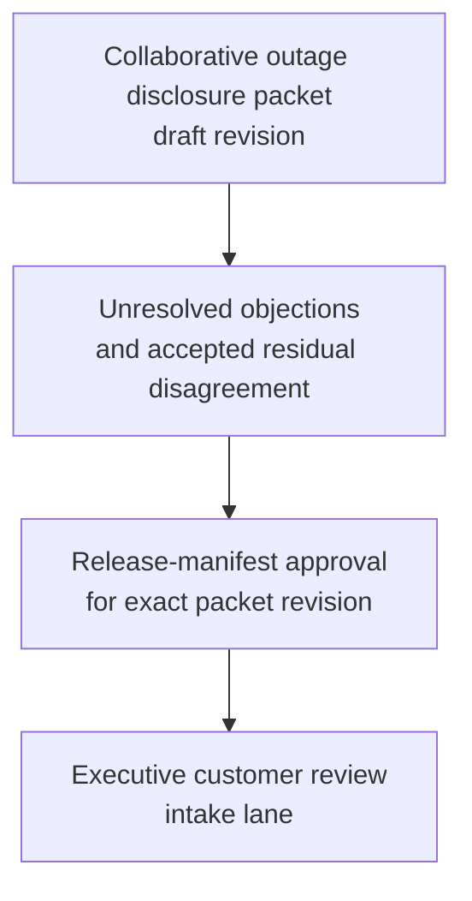
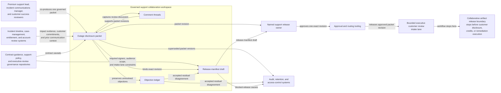

# Enterprise outage disclosure packet approved for executive customer review intake

## Linked pattern(s)

- `approval-gated-collaborative-artifact-release`

## Domain

Support.

## Scenario summary

A premium support lead, an incident communications manager, and customer-success reviewers are co-producing one governed disclosure packet after a prolonged enterprise outage because the timeline, mitigation wording, and residual-issue narrative must be reconciled before executives review any customer-facing draft. Agents help merge incident chronology, support case notes, contract caveats, and disputed wording about service restoration into the shared packet while preserving which objections remain unresolved and which edits the human artifact owner accepted. The workflow ends only when the named support release owner approves that exact packet revision for one bounded executive customer review intake lane, where downstream reviewers may decide what disclosure or follow-up should occur. It does not send the packet to the customer, approve credits, or execute remediation steps.

## Target systems / source systems

- Governed support collaboration workspace storing the outage disclosure packet, comment threads, objection ledger, and release-manifest draft
- Incident timeline, case-management, entitlement, and account-review systems providing authoritative impact evidence, customer commitments, and prior communication context
- Contract-guidance, support-policy, and executive-review governance repositories defining required signers, audience scope, and approved intake-lane constraints
- Approval and routing tooling used to release one approved packet revision into the executive customer review lane
- Audit, retention, and access-control systems preserving superseded packet versions, blocked-release causes, and accepted residual disagreement

## Why this instance matters

This grounds the pattern in support where the reusable challenge is collaborative ownership of one sensitive customer-review artifact and explicit approval to release that artifact itself into one bounded executive lane. The packet is not a remedy recommendation and not an outbound communication event: humans and agents keep one shared disclosure artifact current, preserve disagreement, and then attach release control to the exact revision being handed forward. The example stays family-safe because customer communication, commercial concessions, and remediation execution remain downstream.

## Likely architecture choices

- Approval-gated execution fits because the packet can be collaboration-complete while still blocked from executive customer review until the human release owner approves the exact revision.
- Human-in-the-loop control is necessary because only accountable support and communications leaders may accept residual disagreement, confirm customer-safe audience scope, and authorize the release boundary.
- Agents may refresh chronology evidence, compare wording variants, and maintain the release trace, but they must not approve customer messaging, grant credits, or initiate remediation work.

## Governance notes

- The release manifest should bind one exact packet revision, the named executive customer review lane, signer identities, and any residual objections that the human release owner accepted explicitly.
- Incident-timeline disputes, unresolved service-restoration caveats, contract constraints, and blocked disclosure language should remain visible in the packet or boundary ledger instead of being flattened before release.
- Audience scope should stay limited to the approved executive review lane; reuse of the packet for direct customer messaging, billing action, or wider incident distribution should require separate downstream approval.
- If impact evidence, contractual posture, or executive audience scope changes materially during approval review, the workflow should hold release and supersede the prior packet revision rather than route a stale disclosure draft.

## Evaluation considerations

- Rate at which executive customer review intake accepts the released packet without finding hidden disagreement, stale outage evidence, or wrong audience scope
- Time required to keep one collaborative disclosure packet synchronized as incident facts, reviewer comments, and signer state evolve
- Reliability of binding between the released artifact revision, accepted residual disagreement, and the bounded executive review lane
- Frequency with which humans reject agent-assisted edits because they drifted into customer communication approval, compensation decisions, or remediation execution
