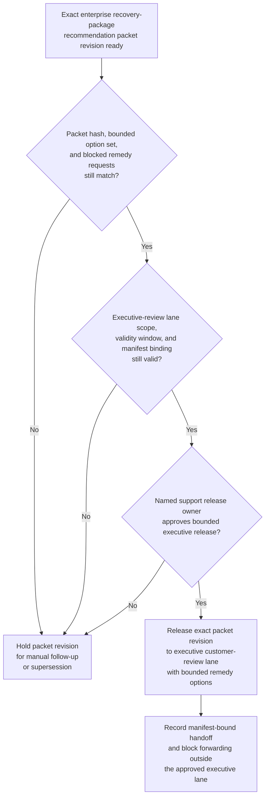

# Enterprise recovery-package recommendation packet revision approved for executive customer-review decision lane

## Linked pattern(s)

- `approval-gated-recommendation-release`

## Domain

Support.

## Scenario summary

An enterprise support recovery workflow has already prepared one exact recommendation packet revision for a strategic-customer outage remedy package after a prolonged identity-service failure. The packet narrows the bounded options to release a capped service-credit and recovery-engineering package, release a narrower credit-only package tied to documented impact, or escalate to chief revenue and legal review, and it keeps blocked requests such as a multi-quarter fee holiday, contract rewrite, or permanent staffing overlay explicit. Before that exact packet revision can enter the restricted executive customer-review decision lane, a named support release owner must approve the audience scope, validity window, and release manifest so reviewers receive the governed recommendation artifact rather than a stale or over-shared copy. The workflow stops at governed release of that packet revision; it does not decide which recovery package is granted, post credits, amend the contract, or communicate the outcome to the customer.

## Target systems / source systems

- Recovery-package recommendation workspace holding the current packet revision, bounded concession options, blocked-term notes, and superseded drafts
- Incident, entitlement, contract, renewal, precedent, and executive account-review records already cited by the recommendation packet
- Governance repository defining the named executive customer-review lane, authorized recipients, release expiry, and the human owner who may approve packet release
- Approval manifest and routing tooling that records the exact packet hash, lane scope, and any blocked forwarding attempts outside the approved executive audience
- Audit and supersession ledger used to hold older packet revisions when impact evidence, commercial context, or requested remedy scope changes before executive review

## Why this instance matters

This grounds the pattern in support where the reusable challenge is release control over a recovery recommendation artifact, not incident triage or customer communication execution. High-stakes recovery packets can change late when outage-impact estimates harden, renewal posture shifts, or contract language narrows what remedies are viable, so approval must bind to one reviewed revision and one executive customer-review lane instead of to a general permission to circulate concession advice. The example keeps the family boundary explicit by ending at packet release for human review rather than executive adjudication, billing action, contract amendment, or customer-facing execution.

## Likely architecture choices

- Approval-gated execution fits because the recommendation packet remains blocked until a named support owner authorizes release into the executive customer-review decision lane.
- Human-in-the-loop review remains necessary because only accountable support and commercial governance owners should confirm audience scope, expiry, and blocked-term visibility without turning the release into approval of the remedy itself.
- A governed agent can verify packet hashes, assemble the manifest, and block broadened distribution, but it should not post credits, approve commercial concessions, or send recovery commitments to the customer.

## Governance notes

- Approval should bind to one immutable packet revision, one named executive review lane, one bounded validity window, and one exact remedy option set so later edits cannot inherit release authority silently.
- Blocked requests such as contract rewrites, open-ended service commitments, or multi-quarter fee holidays should remain visible in the released packet rather than being compressed into a cleaner-looking concession summary.
- If outage-impact evidence, contract posture, or executive audience scope changes during approval review, the pending packet should be held and superseded rather than routed under stale approval.
- Audit records should preserve the released packet id, option-set hash, approver identity, executive-recipient scope, expiry timing, and any blocked redistribution attempts.

## Evaluation considerations

- Percentage of executive-lane releases where the recovery recommendation packet revision, option-set hash, and manifest metadata match exactly without later correction
- Rate at which stale, superseded, or out-of-scope recovery recommendation packets are blocked before executive review
- Time required to move from packet-ready status to approved bounded executive release when impact and contract evidence are complete
- Reviewer correction rate for missing blocked terms, wrong audience scope, or stale-state handling after executives receive the released recommendation packet
