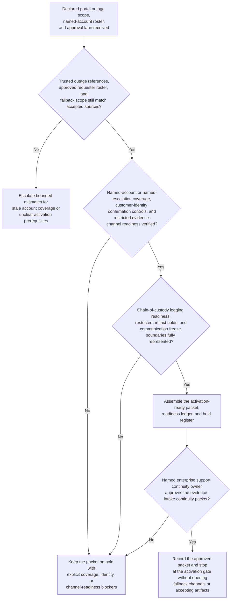

# Enterprise secure support portal restricted evidence intake continuity activation gate

## Linked pattern(s)

- `contingency-plan-activation-gate`

## Domain

Support.

## Scenario summary

After a secure customer support portal outage is declared, enterprise support continuity leadership has already identified the bounded fallback path and the accountable approval owner: a governed restricted evidence-intake continuity path for named enterprise accounts whose active escalations may need security-sensitive screenshots, logs, or packet captures before the primary portal recovers. Upstream outage-truth and authority-routing work has already established the trusted outage scope, affected named-account roster, approved requester roster, restricted evidence classes, and approval lane. The planning workflow now has to prepare one activation-ready continuity packet showing named-account or named-escalation coverage, customer-identity confirmation controls, restricted evidence-channel readiness, chain-of-custody logging readiness, and explicit holds that must remain in force before any fallback intake can begin. It should preserve explicit holds for any uncovered named account, stale requester verification data, unready restricted evidence channel, broken custody-log template, or unresolved legal or privacy hold, and stop at the approval gate rather than opening fallback channels, accepting customer artifacts, sending customer or vendor communications, escalating the vendor, or performing incident remediation.

## Target systems / source systems

- Enterprise support continuity playbooks and outage workspace with the declared portal-outage scope, named-account coverage model, prior packet versions, and restricted evidence-intake boundaries
- Trusted portal outage-state, customer contact-governance, named escalation roster, and restricted evidence classification systems already accepted as authoritative inputs for contingency preparation
- Secure evidence-transfer readiness records for preprovisioned upload vaults, escrowed encrypted mailboxes, checksum tooling, custody-log templates, and access-control bindings that remain disabled until approval
- Approval-routing and audit systems that capture packet versions, open holds, resource commitments, and human sign-off before any restricted evidence-intake continuity mode may start
- Restricted communication-planning tools for customer callback timing, vendor-support notice timing, and downstream case-handling steps that remain outside the planning gate

## Why this instance matters

This grounds the pattern in support where the hard problem is not deciding whether a customer artifact should be accepted, running the fallback intake itself, or escalating the portal vendor. The hard problem is keeping one approval-gated readiness packet current while named-account coverage, identity-confirmation controls, restricted channel readiness, and custody safeguards can all drift during a portal outage. It shows why contingency planning deserves its own slice apart from outage truth restoration, customer communication preparation, restricted artifact release, and downstream support or security handling: leaders need a disciplined activation gate artifact before any governed evidence-intake continuity path can be approved safely.

## Likely architecture choices

- Approval-gated execution fits because the restricted evidence-intake continuity mode may be technically prepared while still blocked until enterprise support continuity leadership approves the packet.
- The readiness ledger should tie named-account coverage, approved requester verification controls, channel-readiness checks, custody-log readiness, and explicit holds to one current packet version.
- Explicit holds should remain visible whenever account coverage, callback verification rules, restricted upload paths, or custody controls are incomplete rather than being compressed into a nominally ready packet.
- The workflow should stop at the packet and hold register rather than recommending a different authority lane, re-establishing outage truth, opening the fallback intake path, or starting vendor or customer communications.

## Governance notes

- Protected prerequisites such as named-account or named-escalation coverage, approved customer-identity confirmation controls, restricted evidence-channel readiness, checksum and custody-log readiness, and legal or privacy holds should be encoded as non-waivable holds in the packet.
- Shared packets should expose timing, readiness, and blocker state without copying customer artifacts, portal secrets, raw screenshots, packet captures, or full account contact details outside governed support channels.
- Human enterprise support continuity ownership is required before the packet becomes the authoritative basis for any restricted evidence-intake continuity activation.
- Repeated packet revisions should preserve append-only lineage so audit, privacy, and support-governance teams can reconstruct exactly which account roster references, identity controls, channel checks, and protected holds changed before approval.

## Evaluation considerations

- Time from updated portal-outage continuity preparation request to a human-reviewable activation packet with complete coverage, identity-control, channel-readiness, and hold state
- Percentage of account-coverage, identity-confirmation, or custody-control blockers kept explicit in the hold register rather than hidden in a partially prepared continuity packet
- Agreement between the workflow's packet and the final human-approved activation gate used for downstream restricted evidence-intake continuity
- Stability of the readiness packet when named-account scope, approved requester rosters, or restricted channel availability changes within the same portal-outage window
