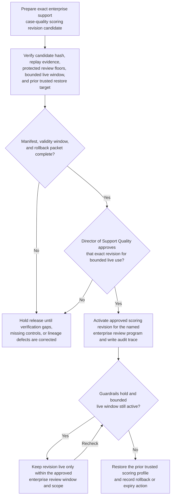
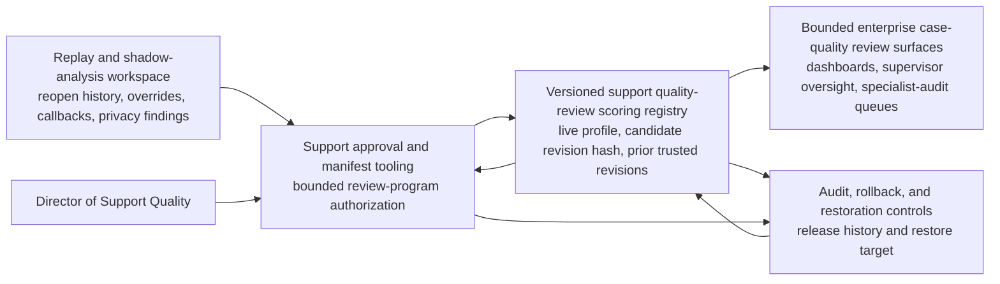

# Enterprise support case-quality review scoring revision approved for live use

## Linked pattern(s)

- `approval-gated-optimization-state-release`

## Domain

Support.

## Scenario summary

A support quality governance lead has prepared one exact case-quality review scoring revision for enterprise support after replay shows that the current live profile underweights privacy-sensitive escalations, executive-visibility reopen clusters, and complex outage-recovery follow-ups when specialist review capacity tightens. The candidate revision increases sensitivity to those protected review factors, tightens cooldown handling for low-yield routine closure cohorts, and names a restore target if supervisor overrides, fairness drift, or escaped-quality defects rise. The workflow must release that exact scoring revision into bounded live use only after the Director of Support Quality confirms the manifest, validity window, and rollback packet, while staying centered on governed optimization-state release rather than ticket routing, severity adjudication, staffing, customer communication, or downstream case execution.

## Target systems / source systems

- Versioned support quality-review scoring registry with the current live profile, candidate revision hash, protected review floors, and prior trusted revisions
- Replay and shadow-analysis workspace with reopen history, supervisor overrides, complaint callbacks, privacy-review findings, and executive-escalation audit results
- Support approval and manifest tooling used by quality leadership to authorize one bounded live scoring revision for the named enterprise review program
- Audit, rollback, and restoration controls that can re-activate the prior profile if protected-case handling, fairness posture, or escaped-quality risk worsens
- Case-quality review dashboards, supervisor oversight surfaces, and specialist-audit queues that consume the active scoring policy

## Why this instance matters

This grounds the pattern in support where the released object is a versioned review-scoring revision, not a ticket disposition or live queue command. The reusable problem is governing one exact optimization-state revision with explicit approval, validity timing, rollback readiness, and audit lineage before it changes how future enterprise support cases are surfaced for human quality review. That keeps the instance family-safe by ending at bounded optimization-state release rather than recommendation adjudication, queue reprioritization, staffing control, or direct case handling.

## Likely architecture choices

- Approval-gated execution fits because the scoring revision can be technically ready in the registry while activation remains blocked until a named support quality owner approves that exact version and bounded review-program scope.
- Human-in-the-loop review remains necessary because accountable support leaders must accept the trade-offs among escaped-quality risk, privacy-sensitive coverage, and specialist-review load before bounded live use begins.
- A governed release agent can compare revision hashes, verify replay evidence, register expiry and rollback conditions, and write the audit trace, but it should not reroute tickets, assign reviewers to individual cases, or send customer-facing actions.

## Governance notes

- Approval should bind to one exact scoring revision, one named enterprise support review-program scope, and one validity window so later tuning edits cannot inherit stale authority.
- Protected review floors for privacy-sensitive escalations, executive-visibility reopen clusters, and outage-recovery follow-ups should remain explicit release conditions in the manifest.
- Expiry should restore the prior trusted profile automatically unless the Director of Support Quality explicitly renews the revision after reviewing live override, fairness, and escaped-defect signals.
- Rollback triggers should include unusual supervisor override spikes, worsening complaint callback rates, reduced review coverage for protected cohorts, or degraded handling of privacy-sensitive cases.
- Audit records should preserve the approved and prior revision ids, replay evidence windows, approver identity, validity timing, rollback criteria, restore target, and any extension or restore action.
- The workflow must not reprioritize live customer queues, change ticket severity, decide escalation outcomes, or launch agent coaching; it only governs release of the scoring revision used by human case-quality review surfaces.

## Evaluation considerations

- Reduction in escaped-quality defects, supervisor overrides, and late complaint callbacks after the approved scoring revision becomes live
- Accuracy of manifest binding among the approved revision hash, protected review floors, and activated enterprise review-program scope
- Reliability of automatic expiry or rollback when fairness, privacy-sensitive coverage, or specialist-load assumptions breach the approved guardrails
- Time required for support quality leaders to inspect one revision, approve bounded live use, and verify safe restoration to the prior trusted profile
