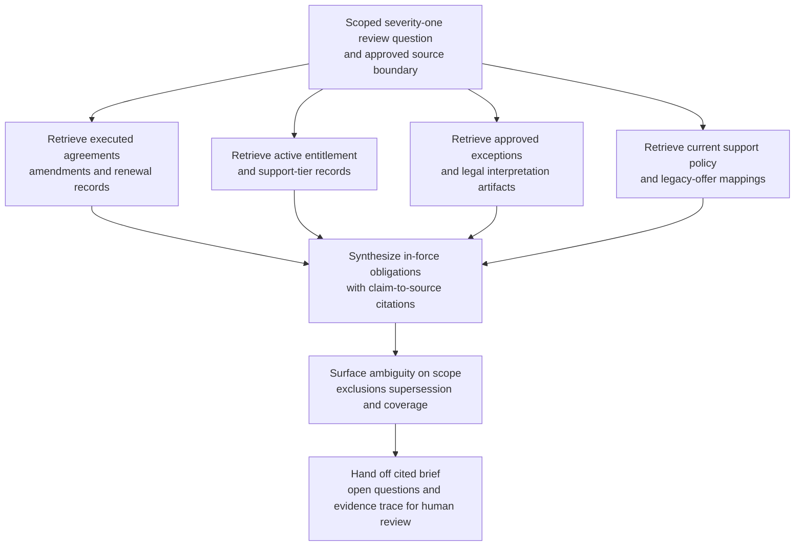

# Enterprise support obligation synthesis for severity-one review

## Linked pattern(s)

- `research-synthesis-with-citation-verification`

## Domain

Support.

## Scenario summary

An enterprise support duty manager is preparing a severity-one account review after a major customer reports that a production identity integration outage should be covered by premium support commitments. Before anyone promises update cadence, service credits, named-engineer coverage, or contractual response obligations, the workflow needs a grounded synthesis of which support terms are actually in force across the master services agreement, order form, premium support addendum, renewal amendment, approved exception register, and current product-entitlement records. The goal is a cited obligations brief that separates verified commitments from ambiguity about scope, exclusions, or legacy carve-outs so downstream customer communication, legal interpretation, and concession decisions start from inspectable evidence rather than memory.

## Target systems / source systems

- Controlled support review workspace where the cited synthesis brief and evidence trace are stored
- Contract lifecycle management repository containing the executed master agreement, order forms, support exhibits, amendments, and renewal notices
- CRM account record and entitlement system showing active SKUs, support tier, named contacts, and service-window metadata
- Support policy library for current standard severity definitions, communication cadence rules, and legacy-offer mappings
- Approved commercial-exception register and legal memo archive for non-standard support commitments or carve-outs
- Historical severity-one case archive and prior service-credit correspondence repository for context on previously invoked terms

## Why this instance matters

This grounds the gather/synthesize pattern in a support workflow where the highest-value output is a source-backed obligations brief, not a recommendation about remediation or customer concessions. Enterprise support teams often rely on CRM flags or institutional memory for entitlement questions, but active obligations can shift across renewals, non-standard addenda, sunset clauses, and approved exceptions. The instance shows why evidence retrieval, source precedence, and citation verification matter before account teams make binding statements during a high-pressure escalation.

## Likely architecture choices

- A tool-using single agent can retrieve the active contract stack, support-policy references, entitlement records, and approved exception artifacts, then assemble a reviewable synthesis with claim-to-source mappings.
- Human-in-the-loop review should remain mandatory for ambiguous product-scope questions, interpretation of non-standard clauses, and any synthesis that will inform customer-facing commitments or legal escalation.
- The workflow should preserve an evidence trace that distinguishes binding executed terms, current standard support policy, approved account-specific exceptions, and unresolved coverage questions.
- Retrieval should stay inside approved support, legal, and revenue-operations repositories; unsupported inference about goodwill concessions, fault, or future credits should be blocked.

## Governance notes

- Executed agreements, amendments, and formally approved exception records should outrank CRM notes, slide decks, chat messages, or copied case commentary when sources disagree.
- Effective dates, renewal supersession, product-scope definitions, and sunset language for legacy premium offerings should be explicit so stale entitlement assumptions do not leak into the brief.
- The synthesis should clearly separate verified support obligations, standard-policy defaults, prior-case precedent, and unresolved interpretation questions instead of flattening them into one narrative.
- Access to contract text, legal memos, and prior credit correspondence should follow least-privilege rules, with copied excerpts minimized to what reviewers need to inspect each cited claim.

## Evaluation considerations

- Percentage of material response-time, update-cadence, entitlement, exclusion, and notice-window claims backed by inspectable citations to the current effective source set
- Reviewer correction rate for contract precedence, support-tier mapping, or citation mismatch during severity-one account review
- Rate at which expired addenda, missing exceptions, or ambiguous product-scope coverage are surfaced explicitly before customer-facing commitments are made
- Usefulness of the open-questions section for accelerating support leadership, legal, and account-team review without requiring them to reconstruct the source corpus from scratch
