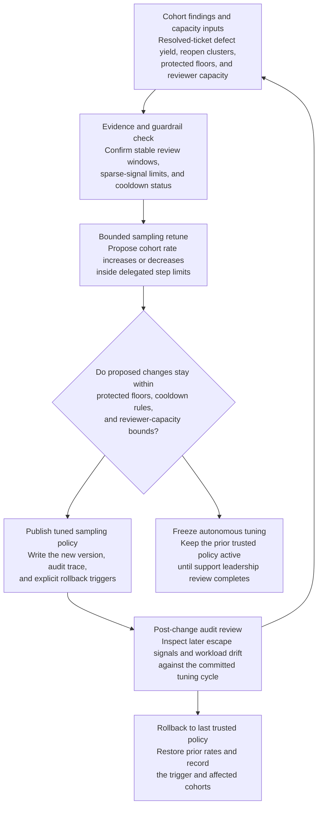

# Enterprise support quality-review sampling-rate tuning

## Linked pattern(s)

- `adaptive-review-sampling-rate-tuning`

## Domain

Support.

## Scenario summary

A premium support quality team reviews resolved enterprise tickets, transcript excerpts, bridge summaries, and escalation notes to catch coaching issues, mishandled severity judgments, and repeatable remediation mistakes before they compound. The current fixed sampling policy over-reviews routine low-risk closures while under-covering post-outage identity-recovery cases, security-adjacent escalations, and complex multi-team incidents that later reopen or trigger customer complaints. The workflow must autonomously retune bounded quality-review sampling rates so cohorts with rising escape risk or defect yield receive more spot checks, while preserving protected minimum coverage for sensitive escalation classes, respecting reviewer-capacity ceilings, minimizing copied customer detail, and keeping a fast rollback path if the tuning loop starts chasing noisy short-term findings.

## Target systems / source systems

- Support QA configuration store with the active sample policy, protected-cohort floors, and prior policy versions
- Ticketing and transcript systems with resolved-case metadata, escalation paths, incident linkage, and candidate records for spot checks
- Quality-review findings store with coaching defects, reopen data, complaint callbacks, and manager override history
- Reviewer-capacity dashboard showing available QA analysts, restricted-review cohorts, and current audit backlog
- Governance and audit workspace used by support leadership to inspect sampled tuning runs, freeze autonomous changes, and restore the last trusted policy

## Why this instance matters

This grounds the pattern in a support workflow where the change is a governed oversight-coverage artifact, not a live ticket queue or operational action. A naive loop could reduce review on quieter weeks, miss quality regressions in complex outage recovery work, or overload reviewers by reacting to every local spike. The instance stays family-safe because the output is only a reversible sampling-policy update plus audit trace; it does not reprioritize customer tickets, assign agents, decide coaching outcomes, or trigger remediation.

## Likely architecture choices

- Event-driven monitoring should trigger reevaluation when quality findings cluster, reopened escalations rise, or reviewer-capacity changes materially.
- A tool-using single agent can compare bounded sampling moves against protected-class floors and reviewer-load ceilings, apply the approved policy change, and append the audit record.
- Autonomous-with-audit fits because in-policy sampling changes can happen automatically, while support leaders review sampled runs and freeze the loop if escaped issues or fairness concerns rise.
- Support governance owners should remain able to backfill review coverage and restore the prior trusted sample policy when a recent decrease proves too aggressive.

## Governance notes

- Security-adjacent escalations, executive-visibility incidents, and regulated support commitments should keep protected sample floors that the tuning loop cannot lower autonomously.
- Audit logs should capture the findings window, reviewer-capacity assumptions, blocked moves, rollback triggers, and the prior and new rates for each sampling cycle.
- Privacy controls should keep customer names, tenant identifiers, and sensitive transcript excerpts out of general tuning logs unless a restricted annex is required for authorized review.
- The workflow must not change ticket severity, case routing, or agent coaching decisions; it only changes how much quality-review coverage different support cohorts receive.

## Evaluation considerations

- Change in meaningful defect yield per review hour after tuned sampling rates are applied
- Escaped-issue or reopen trends for protected support cohorts after autonomous decreases in coverage
- Frequency of leadership freezes, backfill sweeps, or rollbacks that indicate the loop is overreacting to noisy findings
- Reviewer-load stability, including whether bounded tuning reduces wasted review effort without creating blind spots
