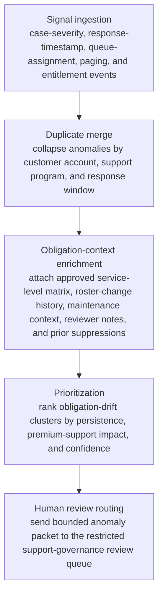

# Enterprise support response obligation drift anomaly review

## Linked pattern(s)

- `anomaly-detection-review`

## Domain

Support.

## Scenario summary

An enterprise support operations team monitors case-severity changes, first-response timestamps, named-escalation roster updates, premium-support queue assignments, after-hours paging events, and entitlement snapshots to detect mid-severity obligation-drift anomalies before they harden into customer-escalation failures or contractual disputes. The workflow must collapse duplicate anomalies tied to the same customer account, support program, and response window; enrich each case with the approved service-level matrix, roster-change history, maintenance context, recent reviewer notes, and prior suppressions; and then prioritize which clusters deserve support-governance review. A cluster should enter the review queue when, for example, a premium customer repeatedly lands in a standard response lane despite an unchanged entitlement snapshot, named escalation contacts disappear from multiple linked cases during a roster sync, or after-hours paging is skipped for several severity-two cases even though the obligation profile still requires a governed handoff. The goal is an explainable anomaly review packet for support operations leads or service-governance reviewers, not to interpret contract language, contact the customer, retroactively promise credits, declare an incident, or reassign live case ownership automatically.

## Target systems / source systems

- Support ticketing, chat, and case-routing platforms with severity history, queue assignments, response timestamps, paging events, and escalation notes
- CRM, entitlement, and support-program systems with approved response-obligation profiles, named-escalation rosters, account tier metadata, and effective-date snapshots
- Workforce-management, on-call, and roster-sync systems with support coverage calendars, paging rotations, schedule exceptions, and roster change logs
- Restricted review queues used by support operations leads, service-governance reviewers, and premium-support program owners
- Audit-grade evidence storage preserving anomaly lineage, duplicate suppression decisions, routed packets, reviewer actions, and governing policy versions

## Why this instance matters

This grounds `anomaly-detection-review` in support work where the early-warning problem is spotting drift between approved response obligations and actual routing behavior before a high-touch enterprise account experiences a visible support-governance failure. A weak workflow would either flood reviewers with every benign queue fluctuation and roster update or miss the recurring anomaly pattern showing that obligation snapshots, paging rules, or named-escalation governance are no longer lining up with live case handling. The instance stays inside monitor/detect/triage because the agentic work is anomaly detection, bounded context assembly, duplicate suppression, prioritization, and routing into human review rather than contract interpretation, customer communication, compensation decisions, manual case takeover, or root-cause investigation.

## Likely architecture choices

- Event-driven monitoring should continuously ingest case-routing changes, response-timer breaches, roster-sync events, paging logs, and entitlement-snapshot updates, then reopen or merge anomaly clusters as fresh evidence arrives.
- A tool-using single agent can correlate account, support-program, and escalation identifiers across support, CRM, and roster systems; attach bounded obligation context; and publish a prioritized review packet with explicit anomaly drivers.
- Bounded delegation fits because routine mid-severity obligation-drift packets can route into a preapproved support-governance review queue without case-by-case authorization, while uncertain or higher-consequence cases still escalate to accountable humans.
- Contract interpretation, live case reassignment, customer outreach, service-credit decisions, or deeper incident analysis should remain outside the workflow and under explicit human control.

## Governance notes

- Review packets should show which anomaly features fired, which raw routing or paging events were merged, what entitlement or roster snapshot was consulted, and why the case was routed to a particular restricted queue.
- Sensitive customer identifiers, named contact details, contract metadata, and support transcript excerpts should be minimized in broad queue views and retained only in the restricted evidence path needed for authorized reviewers.
- Reversibility should stay explicit: queue placement and packet contents can be recomputed as late roster-sync corrections or entitlement updates arrive, but missed review windows may be only partially recoverable once response obligations are breached or executive escalation begins.
- Approval boundaries must remain firm: only authorized support-operations leads, premium-support owners, or service-governance reviewers may decide whether the anomaly becomes a manual case intervention, a policy correction request, a customer-facing action, or a closed false positive.
- Auditability should preserve source timestamps, anomaly thresholds, duplicate handling, reviewer overrides, and routing history so later controls review can reconstruct why response-obligation drift was or was not surfaced promptly.

## Evaluation considerations

- Recall of historically meaningful response-obligation drift anomalies that should have reached human review before customer escalation or internal support-governance failure
- Reduction in duplicate reviewer work from merged account-and-window anomaly clusters without lowering capture of genuinely important obligation-drift patterns
- Median time from first anomalous routing or paging signal to a review packet containing obligation context, roster-change history, prior notes, and routing rationale
- Reviewer override rate for anomaly packets that were over-ranked because ordinary staffing variance was misread or under-ranked because cross-system obligation context was not assembled clearly enough
- Auditability of suppression, merge, and routing decisions during premium-support controls testing or support-governance retrospectives
