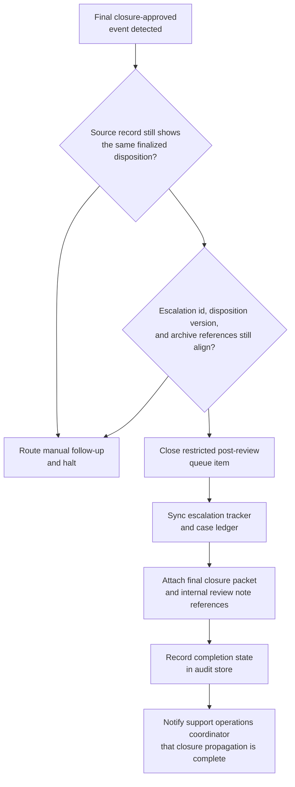
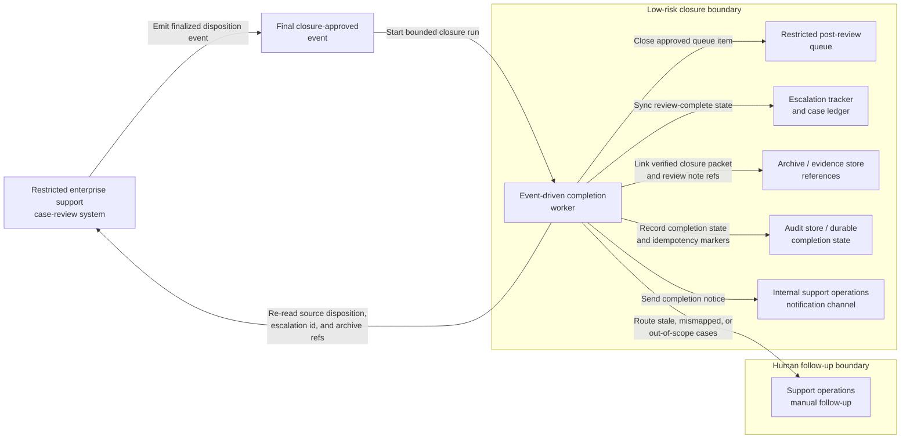

# Finalized enterprise support case-review closure and escalation-tracker synchronization

## Linked pattern(s)

- `workflow-hand-off-and-completion`

## Domain

Support.

## Scenario summary

A restricted enterprise support case-review board has already recorded a final closure-approved disposition for a severity-one escalation in the authoritative internal review system after the upstream judgment about the case is complete. That disposition is final for this workflow and must not be reopened, reinterpreted, or extended into customer messaging, service-credit handling, refund posting, or live remediation execution. The remaining execute step is limited to low-risk closure bookkeeping: detect the final-disposition event, recheck that the escalation identifier, disposition version, and approved archive references still match the source record, close the restricted post-review queue item, sync the escalation tracker and case ledger to the recorded review-complete state, attach archive references for the final closure packet and internal review note, record completion state in the audit store, and notify the internal support operations coordinator that closure propagation is complete. If the case was reopened, the disposition changed, or the tracker points to a different escalation episode, the workflow should stop and route manual follow-up instead of guessing.

## Target systems / source systems

- Restricted enterprise support case-review system that records the final closure-approved disposition and emits the authoritative state-change event
- Escalation tracker or support case ledger that needs the review-complete state reflected
- Restricted post-review queue holding the escalation until closure bookkeeping finishes
- Archive or evidence store containing the final closure packet, internal review note, and linked record references
- Internal support operations notification channel plus audit store for completion traces, idempotency markers, and manual follow-up records

## Why this instance matters

This grounds the pattern in support where the consequential review decision is already over and the remaining work is safe completion propagation across internal systems. Enterprise support teams often accumulate drift when a case is definitively closed in the review system but still appears open in the escalation tracker, remains in a restricted follow-up queue, or lacks linked archival references for later audit. The example shows why execute-automate is useful for authoritative post-decision closure, replay-safe synchronization, and explicit auditability while keeping customer commitments, refund handling, remediation dispatch, and live incident action outside scope.

## Likely architecture choices

- An event-driven completion worker can subscribe to final closure-approved disposition events from the support review system and start the closure sequence only for approved post-decision states.
- The worker should re-read the current source record before writing anywhere so a reopened case, superseded disposition, or changed archive reference is not propagated from a stale event.
- Durable completion state should track queue closure, tracker synchronization, archive linkage, notification delivery, and skipped idempotent actions because duplicate events or partial retries are normal operational conditions.
- Human follow-up should trigger when the escalation-episode mapping is missing, the archive reference no longer matches the finalized closure packet, or a requested next step would cross into customer communication, credits, or live remediation work.

## Governance notes

- The workflow should copy only the escalation identifiers, final closure state, archive references, and timestamps needed for internal record synchronization rather than customer transcripts, concession notes, or reviewer discussion.
- Audit traces should record the source event id, verified disposition version, queue item closed, tracker records updated, archive references attached, notification target, and whether any step was skipped because it had already completed.
- Every automatic update should be reversible and idempotent so replay does not create duplicate queue cleanup, conflicting closure timestamps, or repeated archive attachments.
- The automation must not send customer updates, authorize credits, post refunds, reopen the escalation, verify remediation sufficiency, assign live responder actions, or change any active service state.

## Evaluation considerations

- Percentage of finalized enterprise support case-review dispositions that reach queue closure, tracker synchronization, archive linkage, and coordinator notification without manual bookkeeping repair
- Rate of stale, duplicate, or mismapped final-disposition events detected before incorrect closure state is propagated across restricted support systems
- Completeness of audit traces linking the authoritative disposition event to queue, tracker, archive, and notification updates
- Reliability of replay-safe recovery when one target is already updated or temporarily unavailable while other closure steps remain pending
