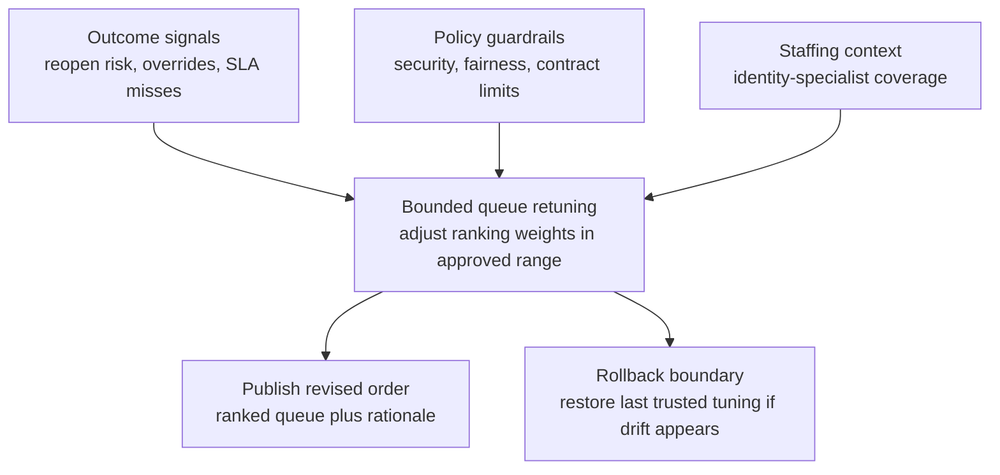
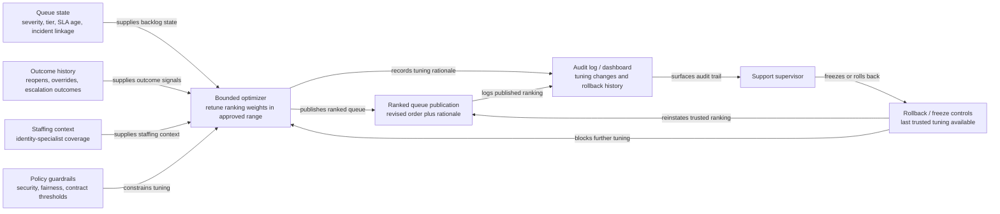

# Post-outage enterprise ticket queue reprioritization

## Linked pattern(s)

- `queue-prioritization-optimization`

## Domain

Support.

## Scenario summary

After an overnight authentication outage, a support operations supervisor inherits a backlog of enterprise tickets covering login failures, delayed SSO reprovisioning, duplicate account lockouts, and unrelated routine admin requests. The support queue already contains severity, contract tier, elapsed SLA time, and incident linkage, but recent reopen data shows that tickets closed quickly without validating tenant-specific identity mappings are coming back and consuming senior engineer time. The optimization workflow must retune the ranked queue so outage-related tickets with high reopen risk or executive-visibility signals rise appropriately, while preserving hard guardrails for security-sensitive cases, aged contractual obligations, and fairness across customers that were not affected by the outage.

## Target systems / source systems

- Support ticketing platform with backlog state, severity, customer tier, SLA timers, and incident linkage
- Historical outcome store with reopen rates, time-to-resolution, escalation outcomes, and supervisor override history
- Workforce and shift-planning view showing which identity-specialist engineers are on hand for the current queue window
- Policy rules for protected-priority security cases, contractual response obligations, and manual escalation thresholds
- Queue audit log or analytics dashboard used by supervisors to review tuning changes and rollback decisions

## Why this instance matters

This grounds the optimization pattern in a support setting where queue order directly shapes customer experience and engineer load during a volatile recovery period. A naive reprioritization could overfavor premium accounts, bury security-adjacent cases, or optimize for quick closures that simply generate more reopens. The instance makes the feedback loop concrete: the system learns from recent resolution quality and override behavior, but it must do so inside visible service and fairness constraints.

## Likely architecture choices

- Event-driven monitoring should trigger reevaluation when outage-linked tickets arrive, SLA bands are crossed, reopen rates spike, or supervisors repeatedly override the current ranking.
- A tool-using single agent can recompute bounded prioritization weights, generate a revised ranked queue with rationale, and publish a review packet without changing the underlying business policy.
- Exception-gated autonomy fits because small in-policy tuning changes can be applied automatically, but larger shifts that alter protected-priority handling or materially change queue behavior should require supervisory approval.
- Human supervisors should remain able to freeze optimization updates and fall back to the last trusted policy if outcome signals become sparse or contradictory during incident recovery.

## Governance notes

- Security-sensitive tickets, suspected account compromise, and contractual breach-risk cases should remain protected classes that cannot be demoted by throughput-oriented optimization.
- The audit trail should capture which feedback signals, guardrails, manual overrides, and staffing assumptions drove each tuning change so later review can distinguish justified adaptation from metric chasing.
- Customer-identifying details used in optimization features should be minimized to what is required for prioritization quality and contractual review.
- The workflow should surface fairness drift, such as repeated deprioritization of lower-tier but outage-impacted tenants, rather than silently absorbing that bias into future queue weights.

## Evaluation considerations

- Reduction in preventable reopen volume and executive escalations after tuned queue ordering is applied during outage recovery
- Change in SLA misses or aged-ticket breaches for both outage-related and routine enterprise support work
- Frequency of supervisor overrides that indicate the optimized ranking still missed protected-priority or fairness requirements
- Speed and clarity of rollback when new tuning degrades queue stability or conflicts with updated incident-response policy
