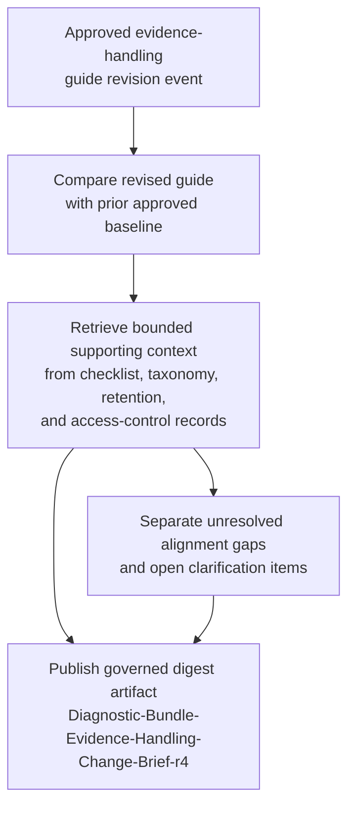

# Premium support diagnostic-bundle evidence-handling guidance change digest for support lead briefing

## Linked pattern(s)

- `change-triggered-context-briefing`

## Domain

Support.

## Scenario summary

A premium support organization maintains an approved diagnostic-bundle evidence-handling guide covering intake labeling, checksum verification, restricted-field tagging, chain-of-custody note requirements, secure-upload quarantine handling, retention-clock start rules, and approved analyst-access caveats for customer-provided bundles. When that guide is revised, support leads need one bounded digest artifact, `Diagnostic-Bundle-Evidence-Handling-Change-Brief-r4`, that explains what changed in the newly approved guidance, which prior evidence-handling expectations still carry forward from the superseded baseline, and which adjacent controlled context records remain aligned or unresolved before the next lead briefing. Source precedence is explicit: the newly approved evidence-handling guide and its publication metadata are authoritative, the prior approved baseline is the only comparison anchor for carry-forward statements, and adjacent controlled context records such as the chain-of-custody checklist, secure-upload retention schedule, restricted-field taxonomy, and analyst-access control matrix may clarify continuity but cannot override the changed guidance. The workflow must stop at informational briefing handoff for support leads; it must not recommend escalation routing, adjudicate diagnostic readiness, approve evidence exceptions, direct customer communication, or execute any evidence-handling step.

## Target systems / source systems

- Evidence-handling guidance repository containing the newly approved diagnostic-bundle guide revision, the superseded baseline version, revision metadata, and controlled publication status
- Prior baseline archive preserving the last approved evidence-handling guide and earlier digest lineage used to distinguish new instructions from carried-forward expectations
- Chain-of-custody checklist library defining the approved custody fields, transfer-note requirements, and evidence-receipt checkpoints referenced by the revised guide
- Secure-upload retention schedule and quarantine-control register covering approved retention clocks, temporary hold rules, purge checkpoints, and upload-lane identifiers for diagnostic bundles
- Restricted-field taxonomy and redaction-reference table defining the current approved evidence classes, masking labels, and prohibited free-text categories that remain in force around the changed guide
- Analyst-access control matrix and reviewer-role roster that describe the approved support-lead, specialist, and restricted-review access boundaries cited by the digest
- Support governance briefing workspace where `Diagnostic-Bundle-Evidence-Handling-Change-Brief-r4`, source links, and unresolved questions are posted for support leads
- Change notification feed that emits the authoritative evidence-handling guide publication event and triggers digest refresh only after the revised guide is approved

## Why this instance matters

This grounds the pattern in a support workflow centered on revised evidence-handling guidance rather than escalation-path changes, diagnostic readiness judgments, or recommendation packets. Support leads often inherit bundle-handling expectations through habit and scattered control references, so a raw guide update does not clearly show which custody, retention, and restricted-field assumptions still stand and which adjacent records need follow-up before teams rely on the revision. The instance shows how a bounded change digest can improve governance continuity for diagnostic evidence handling while remaining clearly outside routing, adjudication, customer communication, and operational execution.

## Likely architecture choices

- Event-driven monitoring fits because the digest should refresh from the authoritative guide publication event instead of waiting for manual policy review or ad hoc lead questions.
- A tool-using single agent can compare the revised guide with the prior approved baseline, retrieve the narrow surrounding control set, and assemble `Diagnostic-Bundle-Evidence-Handling-Change-Brief-r4` with claim-to-source traceability.
- Bounded delegation works because support governance can predefine the allowed source boundary, digest template, and audience while humans remain responsible for any downstream evidence-handling interpretation or case-specific action.
- The digest should preserve an explicit split between changed evidence-handling instructions, unchanged carry-forward context from the prior baseline, and unresolved alignment gaps in checklist, taxonomy, retention, or access-control records.

## Governance notes

- Only the approved evidence-handling guide repository, prior approved baseline, controlled checklist library, retention and quarantine register, restricted-field taxonomy, analyst-access matrix, briefing workspace, and authoritative change notification feed should drive the digest; draft comments, case chatter, or informal reviewer interpretations remain out of scope.
- `Diagnostic-Bundle-Evidence-Handling-Change-Brief-r4` should cite only the excerpts, identifiers, and context needed for support-lead briefing so customer-sensitive bundle details, analyst identities, or upload-lane specifics are not copied more broadly than necessary.
- Visible unresolved blockers and open questions should remain in the briefing artifact, including the still-unmapped `RF-27` restricted-field label in the redaction table, a retention schedule entry that still references the retired `secure-upload-usw2-legacy` bucket, an unsigned checksum-verification appendix update for emergency bundle splits, and a pending access-matrix clarification on whether temporary malware-review coverage inherits the new custody-note wording.
- If the revised guide conflicts with the current chain-of-custody checklist, references a retention control that is not yet updated, or depends on a taxonomy or access-control record with stale lineage, the workflow should surface that mismatch explicitly rather than smoothing it over.
- Audit records should preserve the triggering guide revision id, prior baseline id, cited checklist, taxonomy, retention, and access-matrix versions, plus any human clarification appended before the digest is shared with support leads.
- The workflow boundary ends at the informational briefing artifact; evidence exception approval, bundle intake triage, escalation routing, customer messaging, and live evidence handling remain outside this pattern.

## Evaluation considerations

- Percentage of approved diagnostic-bundle evidence-handling guide revisions that produce `Diagnostic-Bundle-Evidence-Handling-Change-Brief-r4` with complete version, source-boundary, and provenance traceability
- Reviewer correction rate for changed-guidance summaries, carried-forward evidence-handling context, or unresolved-question framing during support-lead briefing review
- Rate at which checklist, retention, taxonomy, or access-control mismatches are surfaced explicitly before support leads rely on the digest
- Usefulness of the digest for helping support leads understand what changed and what still applies without forcing them to reconstruct the guide revision and adjacent controls manually
