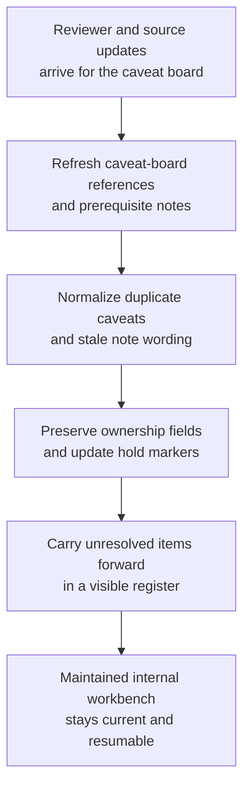

# Premium support diagnostic-runbook caveat board shared workbench upkeep

## Linked pattern(s)

- `shared-workbench-orchestration`

## Domain

Support.

## Scenario summary

A premium support operations team maintains an internal diagnostic-runbook caveat board while product support engineers, incident coordinators, service reliability liaisons, and tooling reviewers continuously refine notes attached to recurring escalation diagnostics. Small updates arrive throughout the week: one engineer links a superseding log-query example, an incident coordinator flags a stale environment prerequisite, a tooling reviewer marks one capture script as deprecated for one tenant tier, and a support lead reassigns ownership of an unresolved data-retention caveat. The agent keeps that internal workbench usable by refreshing linked source references, normalizing duplicate caveat notes, preserving accepted ownership assignments, and carrying unresolved hold states forward in a visible register. Humans remain responsible for deciding which diagnostic steps are officially approved for runbook use, whether any caveat changes support posture, whether a step should be executed during a live case, and when any material should move into separate execution, customer communication, approval, or publication workflows.

## Target systems / source systems

- Shared diagnostic-runbook caveat board with step groups, owner fields, hold tags, and revision history
- Internal support runbook workspace containing draft diagnostic procedures, prerequisite notes, and step-level source links
- Product observability or log-query reference library with current query templates, signal definitions, and tool deprecation notes
- Escalation review annotation surface where support engineers, incident coordinators, and tooling reviewers add small edits, cautions, and handoff notes
- Support operations ownership directory tracking current runbook stewards, backup reviewers, and approved escalation contacts for the maintained board

## Why this instance matters

This grounds the pattern in a support setting that is materially different from workaround-article staging because the maintained artifact is an internal diagnostic caveat board rather than a draft knowledge article. The useful work is keeping one bounded workbench current, inspectable, and resumable as many small source and ownership changes arrive from several collaborators. That makes the workflow about internal upkeep, provenance, normalization, and explicit hold-state management instead of publishing instructions, choosing an escalation path, or executing remediation steps.

## Likely architecture choices

- Event-driven monitoring fits because upkeep should react when runbook notes, observability references, reviewer comments, or board fields change.
- A tool-using single agent can refresh source links, normalize duplicate caveat wording, and keep ownership plus hold markers synchronized inside one bounded board.
- Human-in-the-loop review remains necessary when a note would reinterpret support guidance, remove a caveat still under dispute, or make the board sound like approved execution guidance for a live incident.
- Bounded delegation works because support owners can predefine allowable field updates, source boundaries, and hold conditions without delegating incident execution, customer messaging, or official runbook approval.

## Governance notes

- The board should clearly separate confirmed internal diagnostic references, reviewer proposals, deprecated-step cautions, and unresolved hold items so upkeep never implies that a diagnostic step is approved for live use.
- Log-query links, tool-version notes, prerequisite tags, and owner assignments should be revalidated before a row is marked current or a hold is cleared.
- The agent may normalize structure and merge overlapping caveat notes, but it should not decide whether a runbook step is safe to execute, whether a caveat changes support policy, or remove a hold that a human reviewer accepted.
- If a requested update would trigger operational execution, recommend a response path, publish runbook guidance, or communicate with customers or bridge participants, the workflow should stop and hand off to the appropriate adjacent pattern.

## Evaluation considerations

- Percentage of board refreshes that preserve correct observability links, prerequisite notes, owner assignments, and unresolved-hold state across repeated update cycles
- Reviewer correction rate for merged caveat notes, refreshed query references, or automatically updated hold markers
- Rate at which execution-adjacent or communication-adjacent edits are held for human review instead of being silently folded into the internal board
- Usefulness of the maintained workbench for helping support engineers and incident reviewers resume diagnostic-runbook upkeep without reconstructing stale context by hand
