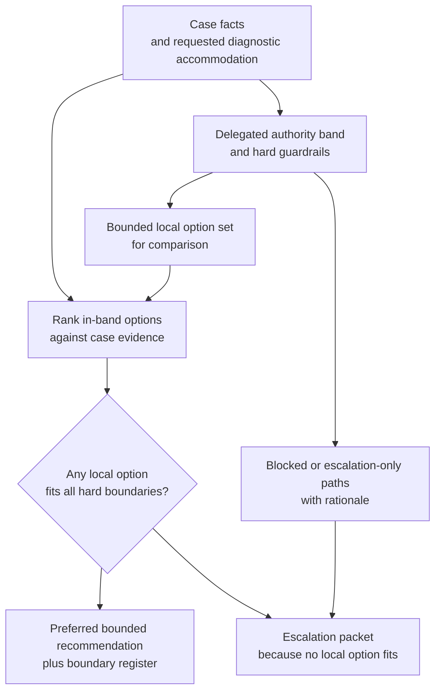
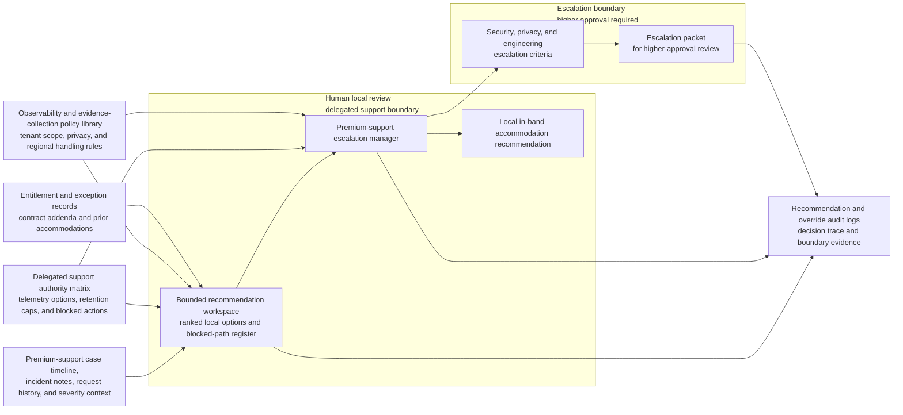

# Premium-support diagnostic telemetry accommodation option recommendation

## Linked pattern(s)

- `delegated-authority-option-ranking`

## Domain

Support.

## Scenario summary

An enterprise premium-support escalation manager is reviewing a recurrent authentication-latency case for a regulated customer that wants broader diagnostic collection before it approves the next troubleshooting step. The manager has a documented delegated authority band that allows recommendation of only a narrow local option menu, such as a tenant-scoped twenty-four-hour verbose logging extension, a one-time secure upload window for approved diagnostic artifacts, or continuation under the standard evidence-collection path, while broader packet capture, production database snapshots, indefinite retention overrides, or direct engineering debugging access require higher approval. The workflow must rank the viable in-band diagnostic accommodation options, show which requested paths are blocked by privacy, data-access, retention, and support-authority guardrails, and package escalation only if no locally permissible option can cover the case before anyone enables extra telemetry, changes retention settings, or requests privileged infrastructure access.

## Target systems / source systems

- Premium-support case timeline, incident notes, diagnostic request history, and current severity or business-impact summary
- Delegated support authority matrix covering approved telemetry extensions, artifact-collection options, retention caps, and blocked data-access actions
- Observability and evidence-collection policy library, including tenant-scoping rules, privacy controls, and regional data-handling constraints
- Customer entitlement record, prior exception log, contract addenda, and earlier diagnostic accommodations on the same account
- Security, privacy, and engineering escalation criteria plus recommendation and override audit logs

## Why this instance matters

This grounds the pattern in support through a bounded diagnostic-accommodation recommendation problem rather than a concession package or service-credit decision. The value is narrowing the case to the safe local options that stay inside support authority, keeping blocked data-access requests explicit, and escalating only when the permitted menu cannot responsibly cover the customer's troubleshooting need.

## Likely architecture choices

- A tool-using single agent can retrieve the authority matrix, current case evidence, data-handling guardrails, prior exceptions, and entitlement context and turn them into one bounded ranking of diagnostic accommodation options.
- Human-in-the-loop review still matters because the support escalation manager or duty lead decides whether to accept the recommended in-band option locally or send the case upward for broader data-access approval.
- Read-only integration with case, observability, entitlement, privacy, and escalation systems is preferable so the workflow cannot silently enable telemetry, extend retention, or request privileged engineering access.

## Governance notes

- The output should distinguish allowed local accommodations, conditionally allowed options that depend on refreshed privacy or tenancy-scope evidence, and blocked requests such as cross-tenant capture, indefinite retention changes, or infrastructure-level debug access.
- Prior exceptions, customer tier, and incident severity may influence ranking inside the delegated band but should never erase hard privacy, retention, or privileged-access guardrails.
- Diagnostic artifacts, tenant identifiers, and any notes about sensitive data classes should remain visible only to authorized support, privacy, security, and escalation reviewers under normal role and retention controls.
- Recommendation packets should preserve requested options, threshold inputs, evidence freshness, blocked-option rationale, and any override request so later review can reconstruct why one bounded accommodation was recommended or escalated.

## Evaluation considerations

- Rate at which accepted recommendations stay inside delegated support diagnostic authority without later privacy, security, or engineering correction
- Time to produce a bounded accommodation option packet after the broader diagnostic request enters local review
- Frequency with which blocked data-access or retention requests are surfaced before telemetry or artifact-collection settings are changed
- Stability of option ranking when customer impact, tenancy scope, or data-sensitivity evidence changes during the same support review
