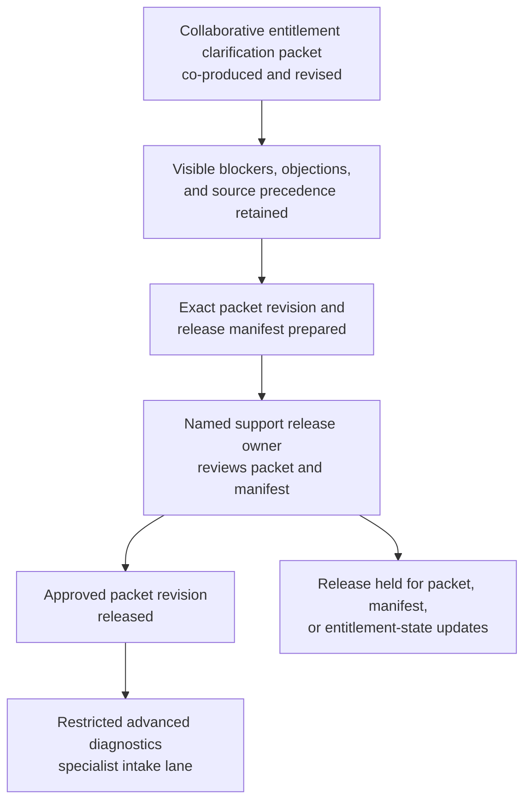

# Premium support escalation and entitlement clarification packet approved for restricted advanced diagnostics specialist intake

## Linked pattern(s)

- `approval-gated-collaborative-artifact-release`

## Domain

Support.

## Scenario summary

A premium support escalation manager, an entitlement operations analyst, and an advanced diagnostics duty lead are co-producing one governed premium support escalation and entitlement clarification packet because an enterprise customer has requested entry into a restricted advanced diagnostics specialist lane while the case record still contains conflicting signals about named-contact standing, premium addendum scope, sovereign-support rider limits, and which attached environments are actually entitled for that level of review. Agents help reconcile the signed enterprise order form, current premium support addendum, approved renewal amendment, entitlement ledger snapshot, specialist-intake policy excerpts, case chronology, approved diagnostic inventory, and reviewer objections into the shared packet while preserving exact source precedence and keeping unresolved caveats visible. The workflow ends only when Elena Park, Director of Premium Support Escalation Governance, approves that exact collaborative artifact revision, `PSE-Entitlement-Clarification-Packet-v3`, for one bounded restricted advanced diagnostics specialist intake lane, where downstream specialists may decide whether the case is intake-ready or needs narrower scope and fresher support. It does not adjudicate entitlement, promise specialist assignment, communicate with the customer, change account status, classify the incident, or trigger live diagnostic execution.

## Target systems / source systems

- Governed support collaboration workspace holding the premium support escalation and entitlement clarification packet, revision history, objection ledger, and release-manifest state
- Contract, renewal, and entitlement systems providing the signed enterprise order form, current premium support addendum, renewal-amendment ingestion status, entitled product and environment scope, and named-contact eligibility records
- Case-management, secure-upload approval, and diagnostic inventory systems supplying authoritative escalation chronology, approved artifact references, environment metadata, and prior hold history
- Restricted advanced diagnostics specialist intake-routing and approval systems used to release one approved packet revision into the bounded internal specialist lane
- Audit, retention, and access-governance systems preserving superseded packet revisions, accepted residual objections, blocked-release reasons, and downstream handoff traceability

## Why this instance matters

This grounds the pattern in support through a governed escalation-and-entitlement clarification artifact rather than an outage disclosure packet, a service-credit recommendation, or a transformed vendor intake. The reusable challenge is collaborative stewardship of one exact support packet whose revision must be approved before it can cross into one restricted specialist intake lane, while source precedence across the signed order form and current premium support addendum over renewal-ingestion state, entitlement ledger snapshots, and lower-precedence CRM account notes remains explicit instead of being implied. The example also keeps prerequisite entitlement and policy state visible, including the premium support addendum being in force, the named-contact register being current, the secure-upload approval still valid, and the active advanced-diagnostics intake SOP version attached, while blockers such as an un-ingested renewal amendment, one disputed sovereign-support rider mapping, overdue named-contact re-attestation, and an expiring secure-upload authorization stay inspectable through the lineage from `PSE-Entitlement-Clarification-Packet-v1` to `PSE-Entitlement-Clarification-Packet-v3`. The example stays inside the pattern boundary because entitlement adjudication, specialist staffing commitment, customer communication, account changes, incident classification, and diagnostic execution remain separate downstream workflows.

## Likely architecture choices

```mermaid
flowchart LR
    CRE["Contract, renewal, and<br>entitlement systems"]
    CASE["Case-management, secure-upload approval,<br>and diagnostic inventory systems"]
    RO["Elena Park<br>Director of Premium Support<br>Escalation Governance"]
    RT["Restricted advanced diagnostics specialist<br>intake-routing and approval systems"]
    RL["Bounded restricted advanced diagnostics<br>specialist intake lane"]
    AR["Audit, retention, and<br>access-governance systems"]
    SB["Collaborative artifact release boundary<br>stops before entitlement adjudication,<br>specialist assignment, or live diagnostics"]

    subgraph WS["Governed support collaboration workspace"]
        PK["Premium support escalation and<br>entitlement clarification packet"]
        RH["Revision history"]
        OL["Objection ledger"]
        RM["Release-manifest state"]
    end

    CRE -->|"signed order form, premium addendum,<br>renewal status, entitlement scope,<br>and named-contact records"| PK
    CASE -->|"case chronology, approved artifact references,<br>environment metadata, secure-upload state,<br>and diagnostic inventory"| PK
    PK -->|"records updates"| RH
    PK -->|"preserves unresolved caveats"| OL
    PK -->|"binds exact revision"| RM
    RH -->|"superseded packet revisions"| AR
    OL -->|"accepted residual objections"| AR
    RM -->|"blocked-release reasons<br>and downstream traceability"| AR
    PK -->|"exact packet revision"| RO
    RM -->|"release manifest"| RO
    RO -->|"approves one bounded release"| RT
    RT -->|"routes approved packet revision"| RL
    RL -->|"workflow stops here"| SB
```

- Approval-gated execution fits because the clarification packet can be collaboration-ready while still blocked from restricted advanced diagnostics specialist intake until the human release owner approves the exact revision with its accepted residual caveats.
- Human-in-the-loop control is required because only accountable support governance owners may accept residual ambiguity about entitlement scope, named-contact authority, and specialist-lane audience without that approval being treated as specialist assignment or entitlement adjudication.
- Agents may compare contract snapshots, refresh policy citations, normalize objection wording, and maintain revision lineage and release trace, but they must not decide whether the customer is ultimately entitled, promise specialist coverage, alter account status, or trigger live diagnostics.

## Governance notes

- The release manifest should bind one exact packet revision, `PSE-Entitlement-Clarification-Packet-v3`, the named restricted advanced diagnostics specialist intake lane, signer identities, entitled environment scope, and any residual objections Elena Park accepted explicitly.
- Conflicting interpretations of premium addendum scope, sovereign-support rider applicability, named-contact standing, diagnostic inventory eligibility, and specialist-lane policy language should remain visible in the packet or boundary ledger rather than being normalized into a single clean entitlement story before release.
- Audience scope should stay limited to the approved restricted specialist lane; reuse of the packet for customer communications, account-team commitment setting, billing or concession review, incident declaration, or live diagnostic work should require separate downstream approval.
- If contract ingestion state, named-contact verification, secure-upload approval, attached-environment coverage, or reviewer-scope assignments change materially during approval review, the workflow should hold release and supersede the prior packet revision rather than carrying stale approval forward.

## Evaluation considerations

- Rate at which restricted advanced diagnostics specialist intake accepts the released packet without discovering hidden entitlement-scope drift, stale policy references, or audience-boundary mistakes
- Time required to keep one collaborative escalation-and-entitlement clarification packet synchronized as order-form amendments, named-contact status, secure-upload approvals, and diagnostic inventory change
- Reliability of binding between the released artifact revision, accepted residual disagreement, entitled environment scope, and the bounded restricted advanced diagnostics specialist intake lane
- Frequency with which humans reject agent-assisted edits because they drifted into entitlement adjudication, specialist staffing promises, customer communication, account changes, incident classification, or live diagnostic execution
