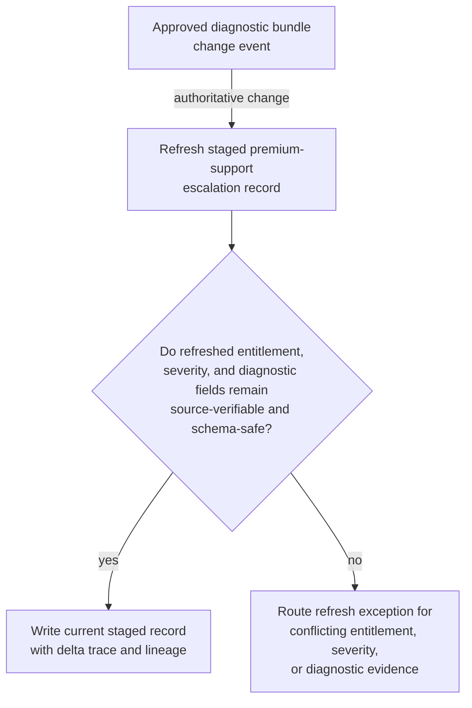
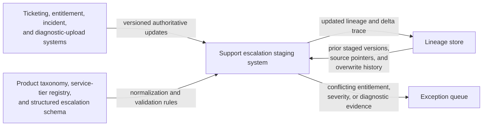

# Premium support escalation record refresh after diagnostic bundle change

## Linked pattern(s)

- `change-triggered-representation-refresh`

## Domain

Support.

## Scenario summary

A premium support organization stages a structured escalation record for high-touch cases so duty managers, product specialists, and service-account teams can review one current package containing incident context, entitlement state, environment metadata, reproduction status, artifact pointers, and customer-approved logs. After the record is first assembled, the underlying source state often changes quickly: new diagnostic bundles arrive, entitlement corrections are posted, linked incidents are reclassified, environment snapshots are refreshed, and customer ticket updates clarify reproduction steps. Each authoritative change should trigger re-materialization of the staged escalation record, preserving a delta trace and source lineage while routing exceptions whenever conflicting severity, entitlement, or diagnostic evidence would make the refreshed package unsafe for downstream review.

## Target systems / source systems

- Support escalation staging system used by duty managers and specialist reviewers
- Ticketing, entitlement, incident, and diagnostic-upload systems emitting versioned authoritative updates for the case
- Product taxonomy, service-tier registry, and structured escalation schema used to normalize fields and validate refresh results
- Lineage store capturing prior staged package versions, source pointers, and field-level overwrite history
- Exception queue for support operations or specialist review before the refreshed package is treated as current

## Why this instance matters

This grounds the pattern in support work where teams need a current structured escalation package, not an informational digest or automated case action. When diagnostic and entitlement state shift rapidly, a stale staged record can waste specialist time or hide conflicts between account state and technical evidence. The instance shows how the pattern stays in transform scope by refreshing the downstream-safe representation and its lineage, while leaving triage prioritization, customer commitments, and remediation execution out of bounds.

## Likely architecture choices

- Event-driven monitoring should trigger refresh on approved ticket, entitlement, incident-link, and diagnostic-bundle updates tied to the staged escalation record.
- A tool-using single agent can usually compare the previous staged package to current source state, rebuild the structured record, and emit a human-readable delta trace plus machine-usable lineage updates.
- Automatic refresh should be allowed for stable field updates, but conflicting severity signals, unclear entitlement corrections, or corrupted log uploads should move to exception review.
- The workflow should update only the staged escalation package and its trace, not queue priority, remediation actions, or customer messaging.

## Governance notes

- Every consequential field, especially service tier, incident linkage, reproduction status, environment version, and diagnostic artifact pointer, should retain source-version lineage across refreshes.
- Refresh should halt when customer-approved evidence is replaced by unapproved uploads, when entitlement data is inconsistent across systems, or when incident status conflicts with the current case boundary.
- The delta trace should make it obvious which fields changed because of new diagnostics versus routine ticket-note carry-forward.
- Support operations owners should review recurring exceptions before expanding automatic overwrite rules for newly onboarded source systems.

## Evaluation considerations

- Percentage of authoritative support-source changes that produce one current escalation record with complete lineage and delta trace
- Rate of entitlement conflicts, corrupted diagnostics, or severity mismatches correctly routed to exception review before specialist use
- Reviewer ability to understand what changed in the staged escalation package without reopening every ticket update or log bundle
- Refresh reliability when source events arrive rapidly, linked incidents change classification midstream, or the escalation schema adds a new required field
