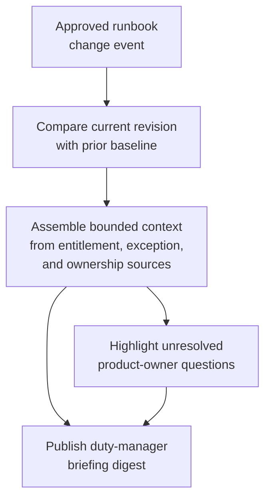

# Premium support escalation runbook change digest for duty manager briefing

## Linked pattern(s)

- `change-triggered-context-briefing`

## Domain

Support.

## Scenario summary

An enterprise support organization maintains a controlled severity-one escalation runbook for premium customers that is revised when paging paths, ownership boundaries, incident-communication checkpoints, or approved product-specific exceptions change. When a new runbook revision is published, the on-call duty manager needs a grounded digest that shows which escalation steps changed, which entitlement and account-context assumptions still apply, and which product-owner clarifications remain open. The workflow should stop at an informational handoff brief for the duty manager and support leads; it should not recommend customer concessions, route live cases, or declare incident severity.

## Target systems / source systems

- Support runbook repository containing the current approved premium-escalation playbook, prior revision history, and publication metadata
- CRM and entitlement system with active premium-support tier records, named-customer requirements, and product-scope metadata referenced by the runbook
- Known-issue and product-ownership registry that links named escalation paths to current services and exception notes
- Controlled support handoff workspace where duty-manager digests, source links, and unresolved questions are posted
- Approved exception register for account-specific handling carve-outs, contractual notification variants, or temporary staffing overlays
- Change notification feed or release log that emits the authoritative runbook-publication event

## Why this instance matters

This grounds the pattern in a support workflow where the real need is rapid context assembly around a source change, not alert triage or contractual obligation research from scratch. Duty managers often receive revised runbooks during rotations, but a raw document update does not clearly show which prior operating assumptions still hold for premium accounts. The instance shows how a bounded change-triggered digest can improve handoff quality while staying distinct from customer-facing decision support or live incident routing.

## Likely architecture choices

- Event-driven monitoring fits because the digest should refresh when the approved runbook revision lands, not only after a human remembers to check the repository.
- A tool-using single agent can compare runbook versions, retrieve linked entitlement and ownership context, and publish a concise handoff brief with claim-to-source mappings.
- Bounded delegation works well because support operations can predefine the source boundary and template while humans still decide how any live escalation should be handled.
- The digest should preserve a visible split between changed escalation steps, unchanged premium-support assumptions, and unresolved product or ownership questions that need manual follow-up.

## Governance notes

- Only published runbook revisions, approved entitlement records, and controlled exception notes should feed the digest; draft notes or informal channel messages should remain out of scope unless formally linked.
- Customer-sensitive entitlement or exception details should be minimized in the handoff brief, with citations preferred over copied contract or case text when possible.
- If the new runbook revision references an ownership mapping that conflicts with the current product registry, the workflow should flag the mismatch explicitly instead of guessing the correct responder path.
- Auditability should include the runbook revision id, prior baseline, linked account-context snapshot, and any human clarification appended before the digest was shared to the on-call channel.

## Evaluation considerations

- Percentage of published premium-support runbook changes that produce a digest with complete provenance and carry-forward context
- Reviewer correction rate for revised escalation-step summaries, entitlement assumptions, or ownership mappings during duty-manager handoff review
- Rate at which ambiguous account carve-outs, stale ownership data, or unsupported customer-impact assumptions are surfaced before a live case needs the runbook
- Usefulness of the digest for reducing handoff ambiguity without drifting into incident prioritization or concession guidance
